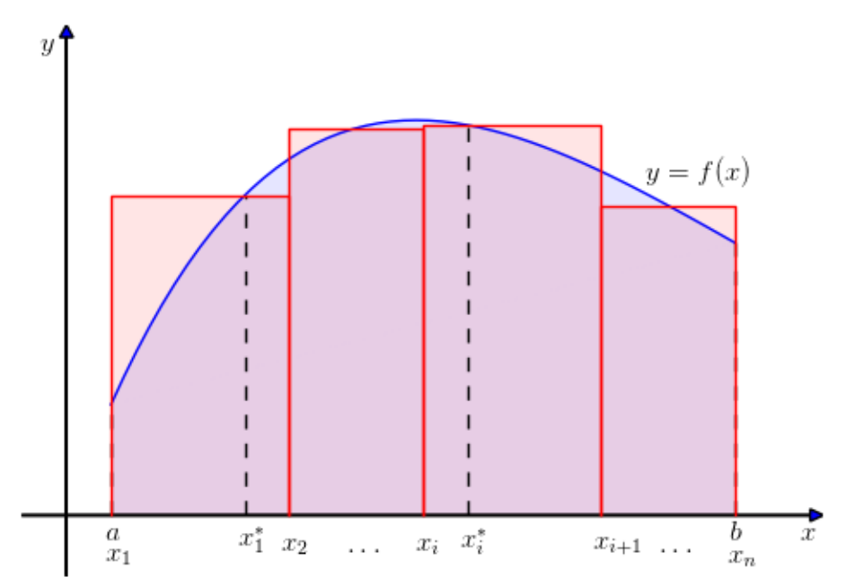
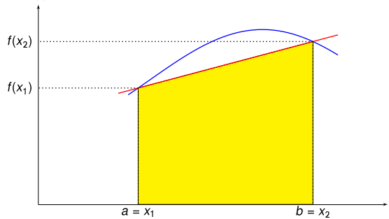
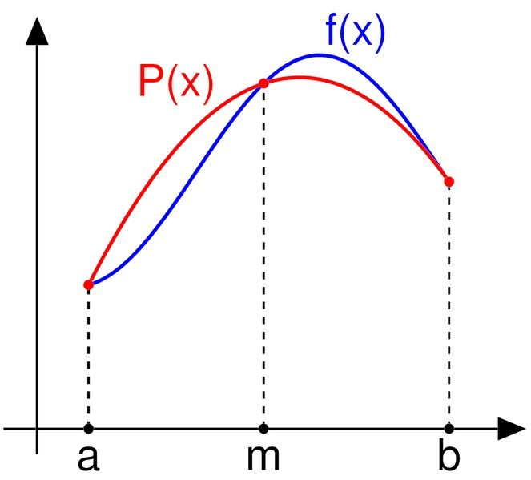
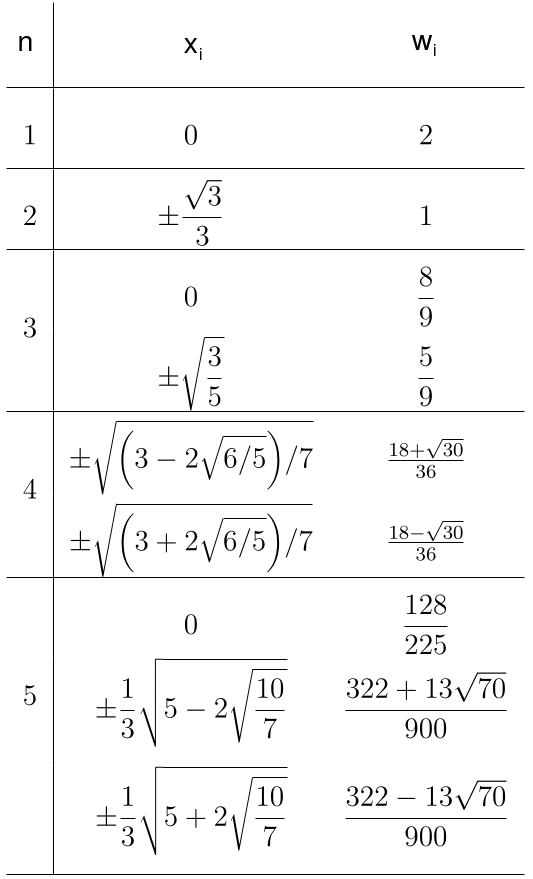

# ⚠️ AVISO

Esta aula foi elaborada como parte do meu primeiro estágio de docência do doutorado. Originalmente, este texto foi escrito em *latex*, na forma de apresentação *beamer*. A versão que estou apresentando aqui foi convertida automaticamente de latex para *markdown* pelo programa *pandoc*, e pode conter erros de formatação.

### Integração Numérica

-   Considere a seguinte integral: $$I = \int_a^b f(x) dx$$

-   Geometricamente, calcular $I$ consiste em calcular a área (com
    sinal) entre o gráfico da função e o eixo $x$.

-   Uma maneira de aproximar $I$ numericamente é dividir o intervalo
    $[a,b]$ em $n$ sub intervalos a partir de $n+1$ pontos ordenados
    tais que $a = x_1 < \dots < x_{n+1} = b$. Sendo assim,
    $$I = \int_a^b f(x) dx = \int_{x_1}^{x_{2}} f(x) dx + \dots + \int_{x_{n}}^{x_{n+1}} f(x) dx = \sum_{i=1}^{n} \int_{x_i}^{x_{i+1}} f(x) dx.$$
    Para cada intervalo $[x_i, x_{i+1}]$ escolha $x_i^*$ neste mesmo
    intervalo. Podemos fazer a seguinte aproximação:
    $$\int_{x_i}^{x_{i+1}} f(x) dx \approx f(x_i^*) h_i,$$ onde $h_i$ é
    o comprimento do intervalo $[x_i, x_{i+1}]$.

    Isso equivale a aproximar a área entre o gráfico de $f$ e o eixo $x$
    no intervalo $[x_i, x_{i+1}]$ por um retângulo de base $h_i$ e
    altura $f(x_i^*)$ (observe que esta altura pode ser negativa).

Neste caso, $$I \approx \sum_{i=1}^{n-1} f(x_i^*) h_i.$$

Quando os subintervalos $[x_i, x_{i+1}]$ forem muito pequenos, esta
aproximação é razoavelmente boa.

**Exemplo** Aproxime a integral $\int_{0}^2 (x^2 + 1) dx$ por 4 intervalos
de comprimento $0.5$ e escolhendo $x_1^* = 0.2$, $x_2^* = 0.9$,
$x_3^* = 1.3$ e $x_4^* = 1.8$.

Temos que $f(0.2) = 1.04$, $f(0.9) = 1.81$, $f(1.3) = 2.69$ e
$f(1.8) = 4.24$. Assim,
$$\int_{0}^2 (x^2 + 1) dx \approx \sum_{i=1}^{n} f(x_i^*) h_i$$
$$= 1.04 \cdot 0.5 + 1.3 \cdot 0.5 + 2.69 \cdot 0.5 + 4.24 \cdot 0.5$$
$$= 4.635.$$

-   Considere a seguinte aproximação:
    $$\int_a^b f(x) dx \approx \sum_i f(x_i) w_i,$$ onde os pontos $x_i$
    são pontos ordenados como anteriormente e $w_i$ são seus respectivos
    pesos. Aproximações neste formato são chamadas **quadraturas
    numéricas**, sendo a aproximação discutida anteriormente um Exemplo.

### Somas de Riemman à esquerda

-   Nas somas de Riemman à esquerda, nós padronizamos a escolha dos
    pontos $x_i^*$'s como sendo o ponto **à extrema esquerda** do
    intervalo $[x_i, x_{i+1}]$, isto é, $x_i^* = x_i$.

-   Além disso, tomamos todos os intervalos $[x_i, x_{i+1}]$ com o mesmo
    comprimento, ou seja, $h_i = (b-a)/n$, onde $n$ é o número de
    subdivisões do intervalo $[a, b]$.

-   Neste caso, faremos a seguinte aproximação:
    $$\int_a^b f(x) dx \approx \sum_{i=1}^{n} f(x_i) h,$$ onde
    $h = (b-a)/n$.

### Somas de Riemman à direita

-   Alternativamente, poderíamos padronizar $x_i^*$ como sendo o ponto
    **à extrema direita** do intervalo $[x_i, x_{i+1}]$, obtendo a
    seguinte aproximação:
    $$\int_a^b f(x) dx \approx \sum_{i=1}^{n} f(x_{i+1}) h.$$

### Regra do Ponto Médio

-   Podemos também considerar $x_i^*$ como sendo o ponto médio do
    intervalo $[x_i, x_{i+1}]$, obtendo
    $$\int_a^b f(x) dx \approx \sum_{i=1}^{n} f(\xi_i) h,$$ onde
    $\xi_i = (x_{i} + x_{i+1})/2$.

### Regras de Newton-Cotes

-   Considere $x_1, x_2, \dots, x_n$ dois a dois distintos.

    
    **Definição (Polinômio de Lagrange de grau $n-1$)** Dado
    $i \in \{1, 2, \dots, n\}$, dizemos que $L_i (x)$ é um polinômio de
    Lagrange de grau $n-1$ se

    1.  $L_i (x_i) = 1$;

    2.  $L_i (x_j) = 0$, se $i \neq j$.
    

### Regras de Newton-Cotes

**Observação** Se $n = 1$, $$L_i (x) = 1.$$ Para $n > 1$,
$$L_i (x) = \dfrac{(x - x_1)(x - x_2) \cdots (x - x_{i-1})(x - x_{i+1}) \cdots (x - x_n)}{(x_i - x_1)(x_i - x_2)\cdots (x_i - x_{i-1}) (x_i - x_{i+1}) \cdots (x_i - x_{n})}.$$

### Regras de Newton-Cotes

-   Faça $y_i = f(x_i)$, para todo $i \in \{1, 2, \dots, n\}$. Vamos
    interpolar $f$ pelo polinômio de Lagrange, obtendo
    $$f(x) \approx p_n (x) = \sum_{i=1}^n f(x_i) L_i (x) = \sum_{i=1}^n y_i L_i (x).$$
    Assim,
    $$I = \int_a^b f(x) dx \approx \int_a^b \sum_{i=1}^n y_i L_i (x) dx = \sum_{i=1}^n \int_a^b y_i L_i (x) dx$$
    $$= \sum_{i=1}^n y_i \int_a^b L_i (x) dx = \sum_{i=1}^n A_i y_i,$$
    onde $A_i = \int_a^b L_i (x) dx$.

Então, a fórmula para a aproximação da integral $I$ pelo método de
Newton-Cotes é a seguinte:
$$I = \int_a^b f(x) dx \approx \sum_{i=1}^n A_i y_i,$$ onde
$A_i = \int_a^b L_i (x) dx$.

### Regra do Ponto Médio

-   Se considerarmos $n = 1$ na Regra de Newton-Cotes, e
    $x_1 = (a + b)/2$ teremos que o polinômio $L_1$ será constante igual
    à $1$, e portanto $$A_1 = \int_a^b L_1 (x) = (b - a).$$ Neste caso,
    $$I = \int_a^b f(x) dx \approx A_1 y_1 = A_1 f(x_1) = (b-a)\ f\left(\frac{a + b}{2}\right)$$
    $$= h_1 f(\xi_1),$$ onde $\xi_1 = (a + b)/2$ e $h_1 = b-a$.

    Portanto, a regra do Ponto Médio para um único intervalo é uma
    quadratura de Newton-Cotes com $n=1$.

### Regra do Trapézio

-   Se considerarmos $n=2$ na Regra de Newton-Cotes, $x_1 = a$ e
    $x_2 = b$, estaremos aproximando $f$ por um polinômio da seguinte
    forma: $$f(x) \approx y_1 L_1(x) + y_2 L_2(x).$$ Como cada $L_i$ tem
    grau 1, isto equivale a aproximar $f$ por uma reta que passa por
    $(x_1, y_1)$ e $(x_2, y_2)$. Calculemos $A_1$:
    $$A_1 = \int_a^b L_1 (x) dx =  \int_a^b \dfrac{(x - x_2)}{x_1 - x_2} dx = \dfrac{1}{x_1-x_2}\int_a^b x -x_2 dx$$
    $$= - \dfrac{1}{b - a} \left[\dfrac{(b - x_2)^2}{2} - \dfrac{(a - x_2)^2}{2} \right] = \dfrac{1}{b - a} \dfrac{(a - b)^2}{2}$$
    $$= \dfrac{1}{b - a} \dfrac{(b - a)^2}{2} = \dfrac{b-a}{2}.$$

Analogamente, temos que $A_2 = (b-a)/2$. Sendo assim, podemos aproximar
$I$ da seguinte forma:
$$I = \int_a^b f(x) dx \approx A_1 y_1 + A_2 y_2 = \dfrac{b-a}{2} f(x_1) + \dfrac{b-a}{2} f(x_2).$$
Fazendo $h = b-a$, temos que
$$I = \int_a^b f(x) dx \approx \left( \dfrac{1}{2} f(a) + \dfrac{1}{2} f(b)\right) h.$$

Geometricamente, o que estamos fazendo é aproximar a área entre o
gráfico de $f$ e o eixo $x$ pela área de um trapézio, como mostra a
Figura abaixo.

**Exemplo** Use a Regra do Trapézio para aproximar a integral
$$\int_0^1 e^{-x^2} dx.$$

Temos que $h = 1 - 0 = 1$, $f(0) = e^{-0^2} = 1$ e
$f(1) = e^{-1^2} = e^{-1} \approx 0.367879$. Então,
$$\int_0^1 e^{-x^2} dx \approx \left( \dfrac{1}{2} \cdot 1 + \dfrac{1}{2} \cdot 0.367879 \right) \cdot 1 = 0.6839395.$$

### Regra de Simpson

-   Considere $n = 3$ na Regra de Newton-Cotes, e os pontos $x_1 = a$,
    $x_2 = (a+b)/2$ e $x_3 = b$.

    Neste caso, $f$ será aproximada por um polinômio de grau 2 da
    seguinte forma: $$f(x) \approx A_1 y_1 + A_2 y_2 + A_3 y_3.$$
    Calculando as integrais $A_i$, e procedendo como anteriormente,
    podemos obter a seguinte aproximação para $I$:
    $$I = \int_a^b f(x) dx \approx \left( \dfrac{1}{3} f(a) + \dfrac{4}{3} f\left( \dfrac{a + b}{2} \right) + \dfrac{1}{3} f(b) \right)h,$$
    onde $h = (b-a)/2$.

Geometricamente, aproximar $f$ por um polinômio de grau 2 é aproximar
$f$ por uma parábola.

Sendo assim, a integral aproximada consiste na área da região entre a
parábola e o eixo $x$.

**Exemplo** Use a Regra de Simpson para aproximar a integral
$$\int_0^1 e^{-x^2} dx.$$

Temos que $h = (1-0)/2 = 0.5$, $f(0) = e^{-0^2} = 1$,
$f\left( \dfrac{1+ 0}{2} \right) = f(0.5) \approx 0.778801$ e
$f(1) = e^{-1^2} = e^{-1} \approx 0.367879$. Então,
$$\int_0^1 e^{-x^2} dx \approx \left( \dfrac{1}{3} \cdot 1 + \dfrac{4}{3} \cdot 0.778801 + \dfrac{1}{3} \cdot 0.367879 \right) \cdot 0.5 \approx 0.74718.$$

### Erro na Integração Numérica

-   No método de Newton-Cotes, fizemos a seguinte aproximação:
    $$f(x) \approx P_n(x),$$ onde $P_n$ é o polinômio interpolador de
    Lagrange. Formalmente, o erro na interpolação de $f$ por $P_n$ é
    definido como:
    $$E_n^{LAG} (x) = \dfrac{f^{(n)}(\xi )}{n!} \prod_{i=1}^n (x - x_i), \xi \in (a, b).$$
    Deste modo, temos que $$f(x) = P_n(x) +E_n^{LAG} (x).$$

Calculando novamente $I$, temos
$$I = \int_a^b f(x) dx = \int_a^b P_n(x) + E_n^{LAG} (x) dx = \int_a^b P_n(x) dx + \int_a^b E_n^{LAG} (x) dx.$$
Vimos anteriormente que $\int_a^b P_n(x) dx = \sum_{i=1}^{n} A_i y_i$,
logo
$$I = \int_a^b f(x) dx = \sum_{i=1}^{n} A_i y_i + \int_a^b E_n^{LAG} (x) dx.$$
Sendo assim, o erro na aproximação de $I$ pelo método de Newton-Cotes é
$$E_n = \int_a^b E_n^{LAG} (x) dx = \int_a^b \dfrac{f^{(n)}(\xi )}{n!} \prod_{i=1}^n (x - x_i) dx$$
$$= \dfrac{f^{(n)}(\xi )}{n!} \int_a^b \prod_{i=1}^n (x - x_i) dx.
%= \int_a^b \dfrac{f^{(n)}(\xi )}{n!} \prod_{i=1}^n (x - x_i) dx = \dfrac{f^{(n)}(\xi )}{n!} \int_a^b \prod_{i=1}^n (x - x_i) dx.
$$

### Erro na Regra do Trapézio
$$
E_2 = \dfrac{f^{''}(\xi )}{2} \int_a^b (x - x_1)(x - x_2) dx = \dfrac{f^{''}(\xi )}{2} \int_a^b (x - a)(x - b) dx
$$
$$
=  \dfrac{f^{''}(\xi )}{2} \int_a^b x^2 - bx -ax +ab dx = \dfrac{f^{''}(\xi )}{2} \left[ \dfrac{x^3}{3} - (a + b) \dfrac{x^2}{2} + ab x \right]_a^b
$$
$$
= \dfrac{f^{''}(\xi )}{2} \left[ \dfrac{x^3}{3} - (a + b) \dfrac{x^2}{2} + ab x \right]_a^b
$$
$$
= \dfrac{f^{''}(\xi )}{2} \left[ \dfrac{b^3 - a^3}{3} - (a + b) \dfrac{b^2 - a^2}{2} + ab (b - a) \right]
$$
$$
= \dfrac{f^{''}(\xi )}{2} \left[ \dfrac{ 2 (b^3 - a^3) - 3(a + b) (b^2 - a^2) + 6 ab (b - a) }{6} \right]
$$
$$
= \dfrac{f^{''}(\xi )}{2} \left[ \dfrac{
-b^3 + a^3 - 3 ab^2 + 3 a^2 b + 6ab^2 - 6 a^2b
}{6} \right]
$$

$$
= \dfrac{f^{\prime \prime}(\xi )}{2} \left[ \dfrac{-b^3 + a^3 + 3 ab^2-3a^2b}{6} \right] = \dfrac{f^{\prime \prime}(\xi )}{12} (a - b)^3
$$
$$
= - \dfrac{f^{''}(\xi )}{12} (b-a)^3 = - \dfrac{f^{''}(\xi )}{12} h^3.
$$
Portanto, $$E_2 = -\dfrac{h^3 f^{''}(\xi )}{12}.$$

### Erro na Regra de Simpson

Procedendo de maneira análoga para a Regra de
Simpson, podemos obter $$E_3 = -\dfrac{h^5 f^{(4)}(\xi )}{90}.$$

### Regras Compostas

-   Para aumentar a precisão de nossas aproximações, podemos subdividir
    o intervalo $[a,b]$ em $n$ subintervalos da forma $[x_i, x_{i+1}]$,
    onde $a = x_1 < x_2 < \cdots < x_{n+1} = b$. Como
    $$\int_a^b f(x) dx = \int_{x_1}^{x_2} f(x) dx + \cdots + \int_{x_{n}}^{x_{n+1}} f(x) dx,$$
    podemos aplicar as regras estudadas anteriormente em cada intervalo
    $[x_i, x_{i+1}]$.

-   Quando o comprimento de cada intervalo $[x_i, x_{i+1}]$ for o mesmo,
    vamos ter que $x_i = a + (i-1)h$, onde $h = (b-a)/n$.

### Método Composto dos Trapézios

-   Considere uma subdivisão de $[a, b]$ em intervalos $[x_i, x_{i+1}]$
    de mesmo comprimento $h = (b-a)/n$. Aplicando a regra do trapézio em
    cada intervalo, temos
    $$\int_a^b f(x) dx = \sum_{i=1}^n \int_{x_i}^{x_{i+1}} f(x) dx \approx \sum_{i=1}^n \left( \dfrac{1}{2} f(x_i) + \dfrac{1}{2} f(x_{i+1})\right) h$$
    $$= \dfrac{h}{2} (f(x_1) + f(x_{n+1})) + h \sum_{i=2}^{n} f(x_i).$$

-   O erro na aproximação composta se resume a soma dos erros em cada
    intervalo, isto é,
    $$E(n) = - \sum_{i=1}^n \dfrac{ h^3 f^{''}(\xi_i )}{12}.$$

Podemos estimar $|E(n)|$ da seguinte forma: $$|E(n)| = \begin{vmatrix}
\sum_{i=1}^n \dfrac{ h^3 f^{''}(\xi_i )}{12}
\end{vmatrix} \leq \sum_{i=1}^n \dfrac{ h^3 |f^{''}(\xi_i )|}{12} \leq \sum_{i=1}^n \dfrac{ h^3 M}{12} \leq
n \dfrac{ h^3 M}{12},$$ onde $M = \max_{x \in [a,b]} |f^{''}(x)|$.

### Método Composto de Simpson

-   Novamente, considere intervalos $[x_i, x_{i+1}]$ de mesmo
    comprimento $(b-a)/n$.

-   Procedendo de maneira análoga, obtemos que
    $$\int_{a}^b f(x) dx \approx \dfrac{h}{3} \left[ f(x_1) + 2 \sum_{i=1}^{n-1} f(x_{2i+1}) + 4 \sum_{i=1}^n f(x_{2i}) + f(x_{2n+1}) \right],$$
    onde $h = (b-a)/(2n)$.

-   Além disso, o erro da aproximação será
    $$E(n) = - \sum_{i=1}^n \dfrac{h^5 f^{(4)}(\xi_i )}{90},$$ podendo
    ser estimado por
    $$|E(n)| \leq n \dfrac{h^5 M}{90},\ M = \max_{x \in [a,b]} |f^{(4)}(x)|.$$

### Aproximação com $k$ casas decimais corretas

-   Para que a nossa aproximação para a integral $\int_a^b f(x) dx$
    tenha precisão de $k$ casas decimais, isto é, tenha $k$ casas
    decimais corretas, é suficiente que o erro satisfaça a seguinte
    desigualdade: $$|E(n)| < 0.5 \cdot 10^{-k}.$$

**Definição** A **ordem de precisão** ou ordem de exatidão de uma quadratura
é o maior inteiro positivo $n$ tal que
$$\int_a^b x^k dx = \sum_{i=1}^n w_i x_i^k,\ k = 0, 1, \dots, n.$$

**Observação** Dizer que a ordem de uma quadratura é $n$ é o mesmo que dizer
que se $f$ for um polinômio de grau até $n$, então a quadratura calcula
a integral $\int_a^b f(x) dx$ de forma exata.

:
### Quadratura de Gauss-Legendre

**Definição** Para $n = 0, 1, 2, \dots$, defina $$P_0^L (x) = 1$$ e
$$P_n^L (x) = \dfrac{1}{2^n n!} \dfrac{d^n}{dx^n} (x^2 - 1)^n,\ n > 0.$$
O polinômio $P_n^L (x)$ é chamado polinômio de Legendre de grau $n$.

:

-   Na Quadratura de Gauss-Legendre, estamos interessados em aproximar
    integrais da seguinte forma: $$I = \int_{-1}^1 f(x) dx,$$ fazendo
    $$I = \int_{-1}^1 f(x) dx \approx \sum_{i=1}^n w_i f(x_i).$$

-   A Quadratura de Gauss-Legendre tem ordem de precisão de $2n+1$.

-   Note que temos $n$ coeficientes $w_i$ e $n$ pontos $x_i$ para
    determinar, de modo que a quadratura tenha tal ordem de precisão. O
    problema de encontrar os $n$ pesos e $n$ $x_i$'s é equivalente a um
    sistema não linear com $2n$ equações e $2n$ incógnitas.

-   Pode-se mostrar que este problema sempre tem solução e que a solução
    é única se $x_1 < x_2 < \dots < x_n$.

-   Os pontos $x_i$'s são chamados **nós**, e são determinados pelas
    raízes do polinômio de Legendre, $P_n^L (x)$.

-   Os pesos são dados por
    $$w_i = \dfrac{2}{(1 - x_i^2) [(P_n^L)' (x_i)]^2}.$$

Na tabela a seguir, temos os pesos da Quadratura de Gauss-Legendre para
$n=1, 2, 3, 4, 5$.

Se quisermos aproximar uma integral num intervalo $[a,b]$ qualquer por
meio da Quadratura de Gauss-Legendre, devemos fazer a seguinte mudança
de variáveis: $$u = \alpha x + \beta,$$ onde $\alpha = (b-a)/2$ e
$\beta = (b+a)/2$. Neste caso,
$$\int_a^b f(x) dx = \int_{-1}^1 f(u) \dfrac{b-a}{2} du \approx \sum_{i=1}^n w_i f(u_i) \dfrac{b-a}{2}.$$

:

**Exemplo** Aproxime a integral $$I = \int_{-1}^1 \sqrt{1 + x^2} dx$$
utilizando a Quadratura de Gauss-Legendre para $n = 3$.

Da tabela de pesos, temos que $x_1 = 0$, $x_2 \approx 0.774596$ e
$x_3 \approx -0.774596$. Além disso, $f(x_1) = 1$,
$f(x_2) \approx 1.264911$ e $f(x_3) \approx 1.264911$. Logo, $$
I = \int_{-1}^1 \sqrt{1 + x^2} dx \approx \sum_{i=1}^3 w_i f(x_i) = \dfrac{8}{9} \cdot 1 + \dfrac{5}{9} \cdot 1.264911 + \dfrac{5}{9} \cdot 1.264911$$
$$= 2.294345.$$
:

:
### **Atividade**

**Exercício** Considere a seguinte integral:
$$I = \int_0^{1.5} e^x cos\ x\ dx.$$ a) Aproxime a integral $I$
utilizando Somas de Riemman à Esquerda para $n = 6$.

b\) Aproxime a integral $I$ utilizando Somas de Riemman à Direita para
$n = 6$.

c\) Aproxime a integral $I$ utilizando o Método Composto dos Trapézios
para $n = 6$.

d\) Aproxime a integral $I$ utilizando a Regra do Ponto Médio para
$n = 6$.

e\) Aproxime $I$ utilizando o Método Composto de Simpson para $n = 6$.

f\) Estime o menor número $n$ de subdivisões do intervalo $[a, b]$
necessárias para aproximar $I$ com 8 casas decimais corretas através do
Método Composto de Simpson. Dica: lembre-se que $h = (b-a)/(2n)$.

