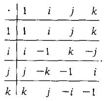
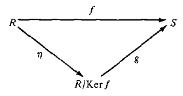

# ⚠️ AVISO

Este resumo foi feito durante o meu mestrado, e eu o fiz com o intuito de estudar para o exame de qualificação da disciplina de Grupos e Anéis. Originalmente, este texto foi escrito em *latex*. A versão que estou apresentando aqui foi convertida automaticamente de latex para *markdown* pelo programa *pandoc*, e pode conter erros de formatação.  As informações que se encontram aqui foram retiradas do livro:

BHATTACHARYA, Phani Bhushan; JAIN, Surender Kumar; NAGPAUL, S. R. Basic
abstract algebra. Cambridge University Press, 1994.

Qualquer informação que gere dúvidas, pareça estar incorreta ou imprecisa pode ser checada neste livro.

## Seção 1: Semigrupos e Grupos {#seção-1-semigrupos-e-grupos .unnumbered}

**Definição 1.1** (Semigrupo). *Um conjunto não vazio $S$ com uma
operação binária é dito um semigrupo, se a operação binária é
associativa.*

**Definição 1.2** (Identidade). *Seja $S$ um semigrupo. Se existir
$e \in S$ tal que $$e x = x = x e, \forall x \in S,$$ então $e$ é dito
identidade de $S$.*

-   Podemos definir identidade a esquerda e à direita.

-   Se $e$ for uma identidade de ambos os lados, então $e$ é a única
    identidade de ambos os lados.

**Definição 1.3** (Inverso). *Seja $S$ um semigrupo com unidade $e$.
Seja $a \in S$. Se existir $a' \in S$ tal que $$a'a = e = a a',$$ então
$a'$ é chamado inverso de $a$, e $a$ é chamado
[invertível]{.underline}.*

-   Também podemos definir inverso à esquerda e a direita.

-   Se $e$ é uma identidade de ambos os lados, e $a$ tem $b$ como
    inverso à esquerda e $c$ à direita, então $b = c$.

**Definição 1.4** (Grupo). *Um conjunto $G$ com uma operação binária
$\cdot$ é dito um grupo se os seguintes axiomas forem satisfeitos:*

1.  *$a(bc) = (ab)c, \forall a,b,c \in G$.*

2.  *Existe $e \in G$ tal que $e a = a, \forall a \in G$.*

3.  *Para todo $a \in G$, existe $a' \in G$ tal que $a'a = e$.*

**Observação 1.5**. *A definição acima é equivalente a definição que
fazemos normalmente para grupos, porém colocam-se menos hipóteses. Note
que os elementos identidade e inverso são garantidos (a princípio)
apenas à esquerda. Porém, como foi feito no livro, usando esses mesmos
axiomas, podemos obter os itens 2 e 3 para o lado direito, de onde
seguirá a equivalência afirmada com a definição usual de grupos.*

Seja $S$ um semigrupo e $a \in S$. Então, caso exista identitade
$e \in S$, definimos $a^0 = e$. Além disso, para todo inteiro positivo
$n$, definimos $$a^n = \prod_{i=1}^n a.$$ Caso $a \in S$ admita inverso
$a^{-1} \in S$, definimos $$a^{-n} = (a^{-1})^n.$$ Em caso de notação de
soma, usaremos $na =\sum_{i=1}^n a$, e as definições serão feitas de
forma análoga.

**Teorema 1.6**. *Um semigrupo $G$ é um grupo se, e somente se, $ax =b$
e $ya=b$ possuem solução $x,y \in G$, para todo $a,b \in G$.*

**Teorema 1.7**. *Um semigrupo $G$ [finito]{.underline} é grupo se, e
somente se, a lei do cancelamento é válida pra todo elemento de $G$,
isto é,
$$ab =ac \Rightarrow b = c \text{ e } ba = ca \Rightarrow b = c,$$
$\forall a,b,c \in G$.*

## Seção 2: Homomorfismos {#seção-2-homomorfismos .unnumbered}

**Observação 1.8**. *O autor usa 1-1 para dizer que a função é injetora,
e "onto" pra dizer que é sobrejetora.*

**Definição 1.9**. *Sejam $G, H$ grupos. Uma aplicação
$\varphi : G \to H$ é dita um homomorfismo se
$$\varphi(xy)= \varphi(x) \varphi(y), \forall x,y \in G.$$*

**Observação 1.10**. *Nomes de homomorfismos especiais:*

-   *Monomorfismo: Quando $\varphi$ é um homomorfismo injetor.*

-   *Epimorfismo: Quando $\varphi$ é um homomorfismo sobrejetor.*

-   *Endomorfismo: Quando $\varphi$ é um homomorfismo de $G$ em $G$.*

-   *Isomorfismo: Quando $\varphi$ é um homomorfismo bijetor.*

-   *Automorfismo: Quando $\varphi$ é um [isomorfismo]{.underline} de
    $G$ em $G$.*

**Observação 1.11**. *O autor também usa "into" para falar que uma
função injetora é bijetora sobre sua imagem. Normalmente aparece algo
como "$\varphi$ é um isomorfismo de $G$ into $H$".*

Se $\varphi : G \to H$ é um homomorfismo sobrejetor, $H$ é dito imagem
homomorfica de $G$, e também $G$ é dito homomorfico à $H$.

Se $\varphi : G \to H$ for um homomorfismo injetor, $G$ é dito
"mergulhavel" (checar essa tradução!!) (Notação $G$ "simbolo da skol"
$H$)

**Observação 1.12**. *Note que na definição de homomorfismo está sendo
utilizada a notação de produto, embora as operações de $G$ e $H$ possam
ser distintas!*

Um exemplo importante:

O **automorfismo interno** $I_a : G \to G$, onde $a \in G$, tal que
$$I_a(g) = a g a^{-1}.$$

**Teorema 1.13**. *Sejam $G$ e $H$ grupos com identidades $e$ e $e'$,
respectivamente, e seja $\varphi : G \to H$ um homomorfismo. Então,
temos que:*

1.  *$\varphi(e) = e'$*

2.  *$\varphi(x^{-1}) = (\varphi(x))^{-1}$, $\forall x \in G$.*

**Definição 1.14**. *Sejam $G$ e $H$ grupos, e $\varphi: G \to H$ um
homomorfismo. Definimos o núcleo de $\varphi$ como sendo o conjunto
$$ker\ \varphi = \{ x \in G | \varphi(x) = e' \}.$$*

**Observação 1.15**. *O núcleo (ou kernel) de $\varphi$ nunca é vazio,
pois $\varphi(e) = e'$, logo $e \in ker\ \varphi$.*

**Teorema 1.16**. *Um homomorfismo $\varphi: G \to H$ é injetor se, e
somente se, $ker \varphi = \{e\}$.*

## Seção 3: Subgrupos e Classes Laterais {#seção-3-subgrupos-e-classes-laterais .unnumbered}

**Definição 1.17**. *Seja $(G, \cdot)$ um grupo e $H \subset G$. $H$ é
dito subgrupo de $G$, e denotado por $H < G$, se $(H, \cdot)$ for um
grupo.*

**Observação 1.18**. *Eu já usei desde o começo do resumo um abuso de
notação no qual eu digo que um conjunto $G$ é um grupo, quando na
verdade $(G, \cdot)$ é um grupo (o conjunto $G$ munido com a operação
$\cdot$ é um grupo). Nessa definição eu preferi não abusar da notação
para que ficasse mais claro que $H$ precisa ser grupo com a mesma
operação subentendita para $G$.*

**Observação 1.19**. *Os subgrupos triviais de um grupo $G$ são $\{e\}$
e o próprio $G$. Além disso, a identidade de qualquer subgrupo coincide
com a identidade do grupo.*

**Teorema 1.20**. *Seja $G$ um grupo. Um subconjunto não vazio $H$ de
$G$ é um subgrupo de $G$ se, e somente se, qualquer uma das afirmações a
seguir for verdadeira:*

1.  *$\forall a,b \in H, \text{ } ab \in H, \text{ e } a^{-1} \in H.$*

2.  *$\forall a,b \in H, \text{ } ab^{-1} \in H.$*

**Teorema 1.21**. *Seja $G$ um grupo. Um subconjunto não vazio
[finito]{.underline} $H$ de $G$ é um subgrupo de $G$ se, e somente se,
$ab \in H, \forall a,b \in H$.*

**Teorema 1.22**. *Sejam $G$ e $H$ grupos, e $\varphi : G \to H$ um
homomorfismo. Então, $ker\ \varphi < G$ e $Im\ \varphi < H$.*

**Definição 1.23**. *Seja $G$ um grupo. Definimos o centro de $G$ como
sendo o conjunto
$$Z(G) = \{ a \in G\ |\ ax = xa,\ \forall x \in G \}.$$*

**Teorema 1.24**. *O centro de $G$ é um subgrupo de $G$, isto é,
$$Z(G) < G.$$*

Alguns subgrupos importantes:

1.  Dado $a \in G$, $[a] = \{a^k | k \in \mathbb{Z}\}$ é um subgrupo de
    $G$, chamado de *subgrupo cíclico de $G$ gerado por $a$* ($a$ é dito
    gerador desse subgrupo). Se $G = [a]$, então $G$ é chamado de grupo
    cíclico.

2.  Sejam $H$ e $K$ subgrupos de $G$. Então $H \cap K < G$. Mais
    geralmente, a interseção arbitrária de subgrupos é um subgrupo de
    $G$. Observe, no entanto, que $H \cup K$ não necessariamente é
    subgrupo de $G$. Na verdade, $H \cup K$ é subgrupo de $G$ se, e
    somente se, $H \subset K$ ou $K \subset H$.

Dados $A, B \subset G$, definimos
$$AB = \{ab\ |\ a \in A\ \text{e}\ b \in B\},$$ ou
$$A + B = \{a + b\ |\ a \in A\ \text{e}\ b \in B\},$$ de acordo com a
notação usada para a operação em $G$.

**Teorema 1.25**. *Sejam $H, K < G$. Então, $HK < G$ se, e somente se,
$HK = KH$.*

**Observação 1.26**. *Se $G$ é abeliano, então por este teorema, dados
$H, K < G$, temos que $HK < G$.*

Note que $H \cap K$ é o maior subgrupo de $G$ contido em $H$ e $K$, isto
é, dado um subgrupo $L$ de $G$ contido em $H$ e $K$,
$L \subset H \cap K$.

Também podemos encontrar o menor subgrupo de $G$ que contém $H$ e $K$.
No caso em que $HK = KH$, temos que $HK$ é o menor subgrupo de $G$
contendo $H$ e $K$. Em um caso mais geral, precisamos definir alguns
conceitos para poder determinar tal subgrupo.

Seja $S \subset G$. Considere o conjunto $\mathcal{C}$ formado por todos
os subgrupos de $G$ que contém $S$, isto é,
$$\mathcal{C} = \{ A \subset G\ |\ A < G \text{ e } S \subset A \}.$$

Então, $[S] = \cap_{A \in \mathcal{C}} A$ é um subgrupo de $G$, e mais,
é o menor subgrupo de $G$ contendo $S$. O subgrupo $[S]$ é chamado
subgrupo de $G$ gerado por $S$. Se $G = [S]$, então $S$ é chamado um
conjunto de geradores de $G$, e caso $S$ seja finito, dizemos que $G$ é
finitamente gerado.

**Observação 1.27**. *Se $S = \emptyset$, então $[S] = \{e\}$. Além
disso, $G$ é sempre gerador de si mesmo, isto é, $G = [G]$.*

Dessa forma, o menor subgrupo contendo $H$ e $K$ será o subgrupo
$[H \cup K]$, o qual também é denotado por $H \vee K$.

**Teorema 1.28**. *Seja $S$ um subconjunto não vazio de um grupo $G$.
Então, o subgrupo gerado por $S$ é o cunjunto $M$ formado por todos os
produtos finitos da forma $x_1 \cdots x_n$, onde para cada $i$,
$x_i \in S$ ou $x_i^{-1} \in S$.*

Segue desse teorema que $[\{a\}] = \{a^k \ |\ k \in \mathbb{Z}\} = [a]$,
onde $a$ é um elemento fixado de $G$.

**Definição 1.29**. *Seja $G$ um grupo, e $a \in G$. Se existir um menor
inteiro positivo $m$ tal que $a^m = e$, então $m$ é chamado a ordem de
$a$, e denotado por $o(a)$. Se tal $m$ não existir, diremos que
$o(a) = \infty$.*

**Teorema 1.30**. *Seja $G$ um grupo e $a \in G$.*

1.  *Se $a^n = e$, para algum inteiro $n \neq 0$, então $o(a) | n$.*

2.  *Se $o(a) = m$, então para todo inteiro $i$, $a^i = a^{r(i)}$, onde
    $r(i)$ é o resto da divisão de $i$ por $m$.*

3.  *$[a]$ tem ordem $m$ se, e somente se, $o(a) = m$.*

**Teorema 1.31**. *Se $G$ for um grupo finito, então existe um inteiro
positivo $k$ tal que $x^k = e$, $\forall x \in G$.*

**Definição 1.32**. *Seja $H < G$. Dado $a \in G$, o conjunto
$$aH = \{ ah\ |\ h \in H \}$$ é chamado classe lateral à esquerda de $H$
determinada por $a$. Um subconjunto $C$ de $G$ é chamado classe lateral
à esquerda de $H$ em $G$ se $C = aH$, para algum $a \in G$. O conjunto
de todas as classes laterais à esquerda de $H$ em $G$ é denotado por
$G/H$.*

*Classes laterais à direita são definidos de forma análoga (notação
$Ha$), onde $H \backslash G$ será o conjunto de todas essas classes.*

:
**Observação 1.33**. *Temos as seguintes equivalências:\
$$aH = bH \Leftrightarrow a^{-1}b \in H$$*

*e*

*$$Ha = Hb \Leftrightarrow ab^{-1} \in H$$*
:

**Observação 1.34**. *As cardinalidades de $G/H$ e $H\backslash G$ são
iguais, isto é, o número de classes laterais à esquerda e à direita
coincidem.*

**Definição 1.35**. *Seja $H$ um subgrupo de $G$. A cardinalidade do
conjunto de classes laterais à esquerda (ou a direita) de $H$ em $G$
será chamada de índice de $H$ em $G$, e denotada por $[G:H]$.*

Vamos denotar o subgrupo trivial $\{e\}$ por $1$.

:
**Observação 1.36**. *Temos que: $$[G:1] = |G|$$*

*e*

*$$[G:G] = 1.$$*
:

Um fato interessante sobre o grupo $(\mathbb{Z}, +)$ é que todo subgrupo
$K$ é da forma $n\mathbb{Z}$, para algum $n \in \mathbb{Z}$.

**Teorema 1.37** (Lagrange). *Seja $G$ um grupo finito. Então a ordem de
qualquer subgrupo de $G$ divide a ordem de $G$.*

**Observação 1.38**. *Da demonstração do Teorema de Lagrange, segue que:
$$[G:1] = [G:H]\cdot[H:1].$$*

**Teorema 1.39**. *Seja $G$ um grupo finito de ordem $n$. Então, para
qualquer $a \in G$, temos que $o(a) | n$, e consequentemente, $a^n = e$.
Assim, todo grupo de ordem prima será ciclico, e consequentemente,
abeliano.*

Exemplos do livro que deveriam ser resultados:

**Exemplo 1.40**. *Todo grupo de ordem menor que 6 é abeliano.*

**Exemplo 1.41**. *Sejam $a$ e $m$ inteiros, com $m > 0$. Se
$(a, m) = 1$, então $a^{\phi(m)} \equiv 1 (mod\ m)$, onde $\phi$ é a
função de Euler.*

**Exemplo 1.42** (Teorema de Poincaré). *A interseção de dois subgrupos
de índice finito tem índice finito.*

**Exemplo 1.43**. *Sejam $a,b \in G$ tais que $ab = ba$. Se $o(a) = m$,
$o(b) = n$ e $(m, n) = 1$, então $o(ab) = mn$.*

**Exemplo 1.44**. *Seja $G$ um grupo finito, e $S,T < G$. Então,
$$|ST| = \frac{|S||T|}{|S \cap T|}.$$*

## Seção 4: Grupos Cíclicos {#seção-4-grupos-cíclicos .unnumbered}

Como foi dito anteriormente, $G$ é um grupo ciclico se existir $a \in G$
tal que $G = [a]$.

**Teorema 1.45**. *Todo grupo cíclico é isomorfo a $\mathbb{Z}$ ou a
$\mathbb{Z}/(n)$, para algum $n \in \mathbb{N}$.*

**Teorema 1.46**. *Quaisquer dois grupos cíclicos de mesma ordem (finita
ou infinita) são isomorfos.*

**Teorema 1.47**. *Todo subgrupo de um grupo cíclico é cíclico.*

A recíproca do Teorema e Lagrange não vale em geral, contudo, para
grupos cíclicos, temos o seguinte teorema:

**Teorema 1.48**. *Seja $G$ um grupo cíclico finito de ordem $n$, e $d$
um divisor positivo de $n$. Então, $G$ possui exatamente um subgrupo de
ordem $d$.*

Mais um exemplo importante:

**Exemplo 1.49**. *Sejam $H = [a]$ e $K = [b]$ grupos cíclicos de ordem
$m$ e $n$, respectivamente, tais que $(m, n) = 1$. Então, $H \times K$ é
um grupo cíclico de ordem $mn$.*

## Seção 5: Grupos de Permutação {#seção-5-grupos-de-permutação .unnumbered}

**Definição 1.50**. *Seja $X$ um conjunto não vazio. O grupo de todas as
permutações de $X$ pela composição de aplicações é chamado grupo
simétrico e é denotado por $S_X$. Um subgrupo de $S_X$ é chamado um
grupo de permutação em $X$.*

**Observação 1.51**. *Uma bijeção entre $X$ e $Y$ induz naturalmente um
isomorfismo entre $S_X$ e $S_Y$. Além disso, se $|X| = n$, então $S_X$
será denotado por $S_n$, e chamado grupo simétrico de grau $n$.*

Uma permutação $\sigma \in S_n$ pode ser denotada da seguinte forma:

$$
\begin{pmatrix}
    1 & 2 & \cdots & n\\
    \sigma(1) & \sigma(2) & \cdots & \sigma(n)
\end{pmatrix}.
$$

**Definição 1.52**. *Seja $\sigma \in S_n$. Se houver uma lista de
inteiros distintos $x_1, x_2, \cdots, x_r \in \{1, 2, \dots, n\}$, tais
que $$\begin{matrix}
        \sigma(x_i) = x_{i+1},\ i = 1, 2, \dots, r-1\\
        \sigma(x_r) = x_1\\
        \sigma(x) = x,\ \text{se } x \notin \{x_1, x_2, \dots, x_r\},
    \end{matrix}$$ então $\sigma$ é chamada um ciclo de comprimento $r$,
e denotado por $\begin{pmatrix}
        x_1 & x_2 & \cdots & x_r
    \end{pmatrix}$. Um ciclo de comprimento 2 é chamado transposição.*

**Observação 1.53**. *A notação em uma linha para ciclos não informa o
grau $n$, o qual deve ser entendido pelo contexto.*

Duas permutações $\sigma$ e $\tau$ em $S_n$ são ditas **disjuntas** se
$\forall x \in \{1, 2, \dots, n\}$, $\sigma(x) = x$ ou $\tau(x) = x$ (Em
outras palavras, ambas não podem mover o mesmo número).

Um subgrupo de um grupo $S_X$ é chamado grupo de permutação.

**Teorema 1.54** (Cayley). *Todo grupo é isomorfo a um grupo de
permutação.*

**Observação 1.55**. *Na demonstração do teorema de Cayley, aparece o
seguinte isomorfismo: $$\begin{matrix}
        \varphi & : & G & \to & S_G\\
                &   & a & \mapsto &  f_a 
    \end{matrix}\ ,$$ onde $f_a: G \to G$ é tal que $f_a(x) = ax$. Este
isomorfismo é chamado **representação regular à esquerda** de $G$.*

**Definição 1.56**. *Uma permutação $\sigma \in S_X$ é dita uma simetria
se $$d(\sigma(x),\sigma(y)) = d(x, y), \forall x,y \in X,$$ onde
$d(x, y)$ é a distância entre $x$ e $y$. Em outras palavras, uma
simetria preserva a distância entre quaisquer dois pontos.*

Vamos denotar por $T_X$ o conjunto de todas as simetrias de $X$.

**Observação 1.57**. *$T_X$ é um subgrupo de $S_X$.*

**Definição 1.58**. *O grupo das simetrias de um polígono regular $P_n$
de $n$ lados é chamado grupo diedral de grau $n$, e denotado por $D_n$.*

**Teorema 1.59**. *O grupo diedral $D_n$ é um grupo de ordem $2n$ gerado
por dois elementos $\sigma$ e $\tau$ satisfazendo
$\sigma^n = e = \tau^n$ e $\tau \sigma = \sigma^{n-1} \tau$, onde*

$$
\sigma = \begin{pmatrix}
        1 & 2 & \cdots & n
        \end{pmatrix}\ \text{e}\ \tau = \begin{pmatrix}
        1 & 2 & 3 & \cdots & n\\
        1 & n & n-1 & \cdots & 2
    \end{pmatrix}.
$$

**Observação 1.60**. *Geometricamente, $\sigma$ é uma rotação do
polígono regular $P_n$ em um ângulo de $\frac{2\pi}{n}$ em seu próprio
plano, e $\tau$ é uma reflexão do polígono em torno do vértice 1 (ou
então, imagine uma reta que passa pelo vértice 1, dividindo o polígono
$P_n$ em duas partes simétricas. Depois, rotacione o polígono em torno
dessa reta, em 180 graus. Os vértices vão ficar \"refletidos\" com
relação a esta reta, em comparação com suas posições iniciais).*

**Definição 1.61**. *O grupo diedral $D_4$ é chamado \"octic group\".*

**Exemplo 1.62**. *O grupo das simetrias de um retângulo é o 4-grupo de
Klein.*

# 

## Seção 1: Subgrupos Normais e Grupos Quocientes {#seção-1-subgrupos-normais-e-grupos-quocientes .unnumbered}

Uma vez que a operação de multiplicação de grupos é associativa, temos
que a multiplicação de conjuntos
($AB = \{ab\ |\ a \in A\ \text{e}\ b \in B\}$) também é associativa.

**Observação 2.1**. *Se $A = \{a\}$ ou $B = \{b\}$, temos que
$$\{a\}B = aB\ \text{ou}\ A\{b\} = Ab.$$*

**Definição 2.2**. *Seja $G$ um grupo. Um subgrupo $N$ de $G$ é chamado
subgrupo normal de $G$, e escrito $N \triangleleft G$, se
$xNx^{-1} \subset N, \forall x \in G$.*

**Observação 2.3**. *Os subgrupos normais triviais são $\{e\}$ e $G$.
Além disso, se $G$ for abeliano, então todo subgrupo é normal (não vale
a recíproca). De modo parecido, o centro de $G$ é normal em G.*

**Observação 2.4**. *Se $\varphi: G \to H$ for um homomorfismo, então
$ker\ \varphi \triangleleft G$.*

**Teorema 2.5**. *Seja $N$ um subgrupo de $G$. Então, as seguintes
afirmações são equivalentes:*

1.  *$N \triangleleft G$;*

2.  *$xNx^{-1} = N, \forall x \in G$;*

3.  *$xN = Nx, \forall x \in G$;*

4.  *$(xN)(yN) = (xy)N, \forall x,y \in G$.*

**Observação 2.6**. *Quando $N \triangleleft G$, as classes laterais à
esquerda e à direita coincidem, e portanto não precisamos fazer
distinção entre elas.*

**Teorema 2.7**. *Seja $N \triangleleft G$. Então $G/N$ é um grupo com a
multiplicação. Além disso, a aplicação $\varphi : G \to G/N$, dada por
$x \mapsto xN$, é um homomorfismo sobrejetor, e $ker\ \varphi = N$.*

**Definição 2.8**. *Seja $N \triangleleft G$. O grupo $G/N$ é chamado
grupo quociente de $G$ por $N$. O homomorfismo $\varphi : G \to G/N$,
dada por $x \mapsto xN$, é chamado homomorfismo natural (ou canônico) de
$G$ em $G/N$.*

**Definição 2.9**. *Seja $G$ um grupo, e $S$ um subconjunto não vazio de
$G$. O normalizador de $S$ em $G$ é o conjunto
$$N(S) = \{x \in G\ |\ xSx^{-1} = S\}.$$ O normalizador de um conjunto
unitário $\{a\}$ é escrito $N(a)$.*

**Teorema 2.10**. *Seja $G$ um grupo. Para qualquer subconjunto não
vazio $S$ de $G$, $N(S)$ é um subgrupo de $G$. Além disso, para qualquer
subgrupo $H$ de $G$,*

1.  *$N(H)$ é o maior subgrupo de $G$ no qual $H$ é normal;*

2.  *Se $K$ é um subgrupo de $N(H)$, então $H \triangleleft KH$.*

**Definição 2.11**. *Seja $G$ um grupo. Para quaisquer $a,b \in G$,
$aba^{-1}b^{-1}$ é chamado um comutador em $G$. O subgrupo de $G$ gerado
pelo conjunto de todos os comutadores em $G$ é chamado o subgrupo
comutador de $G$ (ou o grupo derivado de $G$), e denotado por $G'$.*

**Teorema 2.12**. *Seja $G$ um grupo,e seja $G'$ o grupo derivado de
$G$. Então,*

1.  *$G' \triangleleft G$;*

2.  *$G/G'$ é abeliano;*

3.  *Se $H \triangleleft G$, então $G/H$ é abeliano se, e somente se,
    $G' \subset H$.*

**Exemplo 2.13**. *Se $A < G$ e $B \triangleleft G$, então
$A \cap B \triangleleft A$ e $AB < G$.*

**Exemplo 2.14**. *Se $G$ é um grupo e $H < G$ de índice 2, então
$H \triangleleft G$.*

**Exemplo 2.15**. *Se $N, M \triangleleft G$ com $N \cap M = \{e\}$,
então $mn = nm, \forall n \in N$ e $\forall m \in M$.*

**Exemplo 2.16**. *Seja $G$ um grupo finito e $N \triangleleft G$ com
$(|N|, |G/N|) = 1$. Então, $N$ é o único subgrupo de $G$ com ordem
$|N|$.*

**Exemplo 2.17**. *Se $G$ é um grupo tal que $G/Z(G)$ é ciclico, então
$G$ é abeliano.*

## Seção 2: Teoremas do Isomorfismo {#seção-2-teoremas-do-isomorfismo .unnumbered}

**Teorema 2.18** (Primeiro Teorema do Isomorfismo). *Seja
$\varphi : G \to G'$ um homomorfismo de grupos. Então,
$$G/Ker\ \varphi \simeq Im\varphi.$$ Em particular, se $\varphi$ é
sobrejetora, então $$G/Ker\ \varphi \simeq G'.$$*

**Corolário 2.19**. *Qualquer homomorfismo de grupos
$\varphi : G \to G'$ pode ser fatorado como
$$\varphi = j \cdot \psi \cdot \eta,$$ onde
$\eta : G \to G/ker\ \varphi$ é o homomorfismo natural,
$\psi : G/ker\ \varphi \to Im\ \varphi$ tal que
$xK \mapsto \varphi (x)$, em que $K = ker\ \varphi$, e
$j : Im\ \varphi \to G'$ é a aplicação inclusão ($x \mapsto x$).*

**Teorema 2.20** (Segundo Teorema do Isomorfismo). *Sejam $H$ e $N$
subgrupos de $G$, e $N \triangleleft G$. Então,
$$H/H\cap N \simeq HN/N.$$*

**Observação 2.21**. *Esse teorema é conhecido também como teorema do
diamante.*

**Teorema 2.22** (Terceiro Teorema do Isomorfismo). *Sejam $H$ e $K$
subgrupos normais de $G$, e $K \subset H$. Então,
$$(G/H)/(H/K) \simeq G/H.$$ Esse teorema é conhecido como teorema do
isomorfismo do quociente duplo.*

**Teorema 2.23**. *Sejam $G_1$ e $G_2$ grupos, e
$N_1 \triangleleft G_1$, $N_2 \triangleleft G_2$. Então,
$$(G_1 \times G_2)/(N_1 \times N_2) \simeq (G_1/N_1) \times (G_2/N_2).$$*

**Teorema 2.24** (Teorema da Correspondência). *Seja
$\varphi : G \to G'$ um homomorfismo sobrejetor de um grupo $G$ em um
grupo $G'$. Então, as seguintes afirmações são verdadeiras:*

1.  *$H < G \Rightarrow \varphi(H) < G'$.*

2.  *$H' < G' \Rightarrow \varphi^{-1}(H') < G$.*

3.  *$H \triangleleft G \Rightarrow \varphi(H) \triangleleft G'$.*

4.  *$H' < G' \Rightarrow \varphi^{-1}(H') < G$.*

5.  *$H \supset ker\ \varphi \Rightarrow H = \varphi^{-1} \varphi(H)$.*

6.  *A aplicação $H \mapsto \varphi(H)$ é uma correspondência biunívoca
    entre a família dos subgrupos de $G$ contendo $ker\ \varphi$ e a
    família dos subgrupos de $G'$; além disso, subgrupos normais de $G$
    correspondem a subgrupos normais de $G'$.*

**Observação 2.25**. *O Teorema da Correspondência permanece válido para
qualquer homomorfismo (não sobrejetor), se trocarmos $G'$ por
$Im \varphi$.*

**Corolário 2.26**. *Seja $N \triangleleft G$. Dado um subgrupo $H'$ de
$G/N$, existe um único subgrupo $H$ de $G$ tal que $H' = H/N$. Além
disso, $H \triangleleft G$ se, e somente se, $H/N \triangleleft G/N$.*

**Definição 2.27**. *Seja $G$ um grupo. Um subgrupo normal $N$ de $G$ é
chamado subgrupo normal maximal se*

1.  *$N \neq G$;*

2.  *Se $H \triangleleft G$ e $N \subset H$, então $H = N$ ou $H = G$.*

**Definição 2.28**. *Um grupo $G$ é dito simples se não tiver subgrupos
normais próprios, isto é, os únicos subgrupos normais são $\{e\}$ e
$G$.*

**Corolário 2.29**. *Seja $N$ um subgrupo normal próprio de $G$. Então,
$N$ é subgrupo normal maximal de $G$ se, e somente se, $G/N$ é simples.*

**Corolário 2.30**. *Sejam $H$ e $K$ subgrupos de $G$ que são subgrupos
normais maximais distintos. Então, $H \cap K$ é subgrupo normal maximal
tanto de $H$ quanto de $K$.*

**Exemplo 2.31**. *Seja $G$ um grupo tal que para algum inteiro fixado
$n > 1$, $(ab)^n = a^n b^n$, para todo $a,b \in G$. Denote
$G_n = \{a \in G \ |\ a^n = e\}$ e $G^n = \{ a^n \ |\ a \in G \}$.
Então,
$$G_n \triangleleft G,\ G^n \triangleleft G,\ \text{e}\ G/G_n \simeq G^n.$$*

**Exemplo 2.32**. *Um grupo não abeliano de ordem 6 é isomorfo a $S_3$.*

## Seção 3: Automorfismos {#seção-3-automorfismos .unnumbered}

Vamos denotar por $In(G)$ o conjunto de todos os automorfismos internos,
isto é, o conjunto das aplicações $I_g : G \to G$ tal que
$x \mapsto gxg^{-1}$, com $g \in G$.

**Teorema 2.33**. *O conjunto $Aut(G)$ de todos os automorfismos de $G$
é um grupo com a composição de aplicações, e
$In(G) \triangleleft Aut(G)$. Mais ainda, $$G/Z(G) \simeq In(G).$$*

Segue do teorema que se $Z(G) = \{e\}$, então $G \simeq In(G)$.

**Definição 2.34**. *Um grupo $G$ é dito **completo**, se $Z(G) = \{e\}$
e todo automorfismo de $G$ é um automorfismo interno, isto é,
$$G \simeq In(G) = Aut(G).$$*

**Exemplo 2.35**. *O grupo simétrico $S_3$ tem centro trivial $\{e\}$.
Consequentemente, $S_3 \simeq In(S_3)$.*

**Exemplo 2.36**. *Um grupo finito $G$ tendo mais do que dois elementos
com a condição de que $x^2 \neq e$ precisa ter um automorfismo não
trivial.*

**Exemplo 2.37**. *Seja $G = [a]$ um grupo cíclico de ordem $n$. Então,
a aplicação $\sigma : G \to G$ tal que $a \mapsto a^m$ é um automorfismo
se, e somente se, $(m, n) = 1$.*

# 

## Seção 1: Decomposição Cíclica {#seção-1-decomposição-cíclica .unnumbered}

**Teorema 3.1**. *Qualquer permutação $\sigma \in S_n$ é o produto de
ciclos dois a dois disjuntos. Essa fatoração é única a menos da ordem na
qual os cíclos são escritos e da inclusão ou omissão de cíclos de
comprimento 1.*

**Corolário 3.2**. *Toda permutação pode ser escrita como um produto de
transposições.*

**Exemplo 3.3**. *Vamos fatorar o cíclo $(1\ 2\ 3\ 4\ 5)$ usando algumas
estratégias: $$\begin{matrix}
            (1\ 2\ 3\ 4\ 5) &=& (1\ 5)(1\ 4)(1\ 3)(1\ 2)\\
                            &=& (4\ 5)(3\ 5)(2\ 5)(1\ 5)
        \end{matrix}$$*

**Observação 3.4**. *O número de transposições poderá mudar de acordo
com a fatoração. No entanto, será sempre par, ou ímpar, como veremos
mais adiante.*

Considere uma permutação $\sigma \in S_n$. Escreva uma decomposição de
$\sigma$ em cíclos disjuntos, incluindo os cíclos de comprimento 1. Além
disso, escreva os fatores na ordem crescente de comprimento. Suponha que
$\sigma = \gamma_1 \cdots \gamma_k$, e os cíclos
$\gamma_1, \dots, \gamma_k$ tem comprimentos $n_1, \dots, n_k$,
respectivamente. Então, $n_1 \leq \cdot \leq n_k$, e
$n_1 + \cdot + n_k = n$. Dessa forma, $\sigma$ determina uma partição
$(n_1, \dots, n_k)$ de $n$, a qual é chamada **estrutura cíclica de
$\sigma$**.

Reciprocamente, dada uma partição $(n_1, \dots, n_k)$ de $n$, existe
(não é única) uma permutação $\sigma \in S_n$ cuja estrutura cíclica é
$(n_1, \dots, n_k)$, pois basta tomar quaisquer cíclos disjuntos em
$S_n$ com os comprimentos correspondentes e fazer o produto.

**Teorema 3.5**. *Se $\alpha, \sigma \in S_n$, então
$\tau = \alpha \sigma \alpha^{-1}$ é a permutação obtida por aplicar
$\alpha$ aos símbolos em $\sigma$. Consequentemente, quaisquer duas
permutações conjugadas em $S_n$ tem a mesma estrutura cíclica.*

*Reciprocamente, quaisquer permutações em $S_n$ com mesma estrutura
cíclica são conjugadas.*

**Observação 3.6**. *Uma classe conjugada associada a uma permutação
$\sigma \in S_n$ é o conjunto
$\{ \alpha \sigma \alpha^{-1}\ |\ \alpha \in S_n \}$.*

**Corolário 3.7**. *Existe uma correspondência biunívoca entre o
conjunto das classes conjugadas de $S_n$ e o conjunto das partições de
$n$.*

## Seção 2: Grupo Alternado $A_n$ {#seção-2-grupo-alternado-a_n .unnumbered}

**Teorema 3.8**. *Se uma permutação $\sigma \in S_n$ é o produto de $r$
transposições, e também é o produto de $s$ transposições, então $r$ e
$s$ são ambos pares ou ambos ímpares.*

**Definição 3.9**. *Uma permutação em $S_n$ é dita par (ímpar) se for o
produto de um número par (ímpar) de transposições.*

O sinal de uma permutação $\sigma$, $sgn(\sigma)$ ou $\epsilon(\sigma)$,
é definido como 1 ou -1, caso $\sigma$ seja par ou ímpar. A seguir,
definimos o sinal de uma aplicação $\varphi: \mathbf{n} \to \mathbf{n}$
qualquer (onde $\mathbf{n}$ denota o conjunto $\{1,2,\dots, n\}$).

**Definição 3.10**. *Seja $\varphi: \mathbf{n} \to \mathbf{n}$. Então,*

$$
\epsilon(\varphi) = \left\{ \begin{matrix}
            +1, & \text{se $\varphi$ for uma permutação par}\\
            -1, & \text{se $\varphi$ for uma permutação ímpar}\\
            0, & \text{se $\varphi$ não for uma permutação}
    \end{matrix}\right.
$$

**Lema 3.11**. *Sejam $\varphi, \psi$ aplicações de $\mathbf{n}$ para
$\mathbf{n}$. Então,
$$\epsilon(\varphi \psi) = \epsilon(\varphi) \epsilon(\psi).$$
Consequentemente, para toda permutação $\sigma \in S_n$, temos que
$\epsilon(\sigma) = \epsilon(\sigma^{-1})$.*

Vamos denotar o conjunto $A_n$ como sendo o conjunto das permutações
pares de $S_n$.

**Teorema 3.12**. *$A_n$ é um subgrupo normal de $S_n$. Se $n > 1$,
$A_n$ tem índice $2$ em $S_n$, e consequentemente,
$$|A_n| = \frac{n!}{2}.$$*

**Definição 3.13**. *O subgrupo $A_n$ formado por todas as permutações
pares de $S_n$ é chamado o grupo alternado de grau $n$.*

**Exemplo 3.14**. *Se $n > 3$, então $A_n$ não é abeliano.*

**Exemplo 3.15**. *As únicas permutações pares de $S_4$ são os 3-ciclos
e produtos de duas transposições, junto com a identidade.*

**Observação 3.16**. *Duas permutações de $A_n$ podem ser conjugadas em
$S_n$, mas não serem conjugadas em $A_n$.*

**Exemplo 3.17**. *$A_4$ tem um único subgrupo normal próprio, o 4-grupo
de Klein. Consequentemente, $A_4$ não tem um subgrupo de ordem 6.(Este
exemplo mostra que a recíproca do Teorema de Lagrange não é
verdadeira.)*

## Seção 3: Simplicidade do $A_n$ {#seção-3-simplicidade-do-a_n .unnumbered}

**Lema 3.18**. *O grupo alternado $A_n$ é gerado pelo conjunto de todos
os 3-cíclos de $S_n$.*

**Lema 3.19**. *O grupo derivado de $S_n$ é o $A_n$.*

**Teorema 3.20**. *O grupo alternado $A_n$ é simples se $n > 4$.
Consequentemente, $S_n$ não é solúvel se $n > 4$.*

**Observação 3.21**. *Creio que a parte do "solúvel" não cai, no
entanto, é necessário saber que $A_n$ é simples se $n > 4$.*

**Exemplo 3.22**. *$A_n$, com $n > 4$, é o único subgrupo normal não
trivial de $S_n$.*

# 

## Seção 1: Produto Direto {#seção-1-produto-direto .unnumbered}

**Teorema 4.1**. *Seja $H_1, H_2, \dots, H_n$ uma família de subgrupos
de um grupo $G$, e $H = H_1 H_2 \cdots H_n$. Então as seguintes
afirmações são equivalentes:*

1.  *$H_1 \times \cdots \times H_n \simeq H$ pelo homomorfismo canônico
    $(x_1, \dots, x_n) \mapsto x_1 \cdots x_n$.*

2.  *$H_i \triangleleft H$, e cada elemento $x \in H$ pode ser
    unicamente expresso como $x = x_1 \cdots x_n$, com $x_i \in H_i$.*

3.  *$H_i \triangleleft H$, e
    $x_1 \cdots x_n = e \Rightarrow x_i = e, \forall i=1,\dots,n$.*

4.  *$H_i \triangleleft H$,
    $H_i \cap (H_1 \cdots H_{i-1} H_{i+1} \cdots H_n) = \{e\}, \forall i =1, \dots, n$.*

**Observação 4.2**. *Se quaisquer uma das afirmações do teorema anterior
é verdadeira, dizemos que $H$ é um produto direto interno de
$H_1, \dots, H_n$. Já o produto $H_1 \times \cdots \times H_n$ é dito
produto direto externo. Em nosso estudo, vamos omitir as palavras
interno e externo, graças ao isomorfismo que temos neste teorema.*

**Observação 4.3**. *Se o grupo for aditivo, usamos a notação
$H_1 \oplus \dots \oplus H_n$ para o produto direto interno, e chamamos
de soma direta de $H_1, \dots, H_n$.*

**Exemplo 4.4**. *Se cada elemento $g \in G$, com $g \neq e$, de um
grupo finito $G$ tem ordem $2$, então $|G| = 2^n$ e
$G \simeq C_1 \times \cdots \times C_n$, onde cada $C_i$ é ciclico de
ordem 2.*

**Exemplo 4.5**. *Um grupo $G$ de ordem 4 ou é cíclico, ou é da forma
$G \simeq C_1 \times C_2$, um produto direto de dois grupos cíclicos de
ordem 2.*

**Exemplo 4.6**. *Se $G$ é um grupo de ordem $pq$, onde $p$ e $q$ são
primos distintos, a se $G$ tem um subgrupo normal $H$ de ordem $p$ e
outro subgrupo normal $K$ de ordem $q$, então $G$ é cíclico.*

**Exemplo 4.7**. *Se $G$ é cíclico de ordem $mn$, com $(m,n) = 1$, então
$G \simeq H \times K$, onde $H$ é um subgrupo de ordem $m$ e $K$ de
ordem n.*

**Exemplo 4.8**. *Se $G$ é cíclico finito de ordem
$n = p_1^{e_1} \cdots p_k^{e_k}$, $p_i$ primos distintos, então $G$ é o
produto direto de grupos cíclicos de ordens $p_i^{e_i}$, com
$1 \leq i \leq k$.*

## Seção 2: Grupos Abelianos Finitamente Gerados {#seção-2-grupos-abelianos-finitamente-gerados .unnumbered}

**Teorema 4.9** (Teorema Fundamental dos Grupos Abelianos Finitamente
Gerados). *Seja $A$ um grupo abeliano finitamente gerado. Então $A$ pode
ser decomposto como soma direta de um número finito de grupos cíclicos
$C_i$. Mais precisamente, $$A = C_1 \oplus \cdots \oplus C_k,$$ tal que
$C_1, \dots, C_k$ são todos infinitos, ou para algum $j \leq k$,
$C_1, \dots, C_j$ são de ordens $m_1, \dots, m_k$, com
$m_1 | m_2 | \cdots | m_j$, e $C_{j+1}, \dots, C_k$ são todos
infinitos.*

## Seção 3: Invariantes de um Grupo Abeliano Finito {#seção-3-invariantes-de-um-grupo-abeliano-finito .unnumbered}

**Teorema 4.10**. *Seja $A$ um grupo abeliano finito. Então existe uma
única lista de inteiros $m_1, \dots, m_k$ (todos $> 1$), tal que
$$|A|= m_1 \cdots m_k, \text{    } m_1|m_2|\cdots|m_k,$$ e
$A = C_1 \oplus \cdots \oplus C_k$, onde $C_1, \dots, C_k$ são subgrupos
cíclicos de $A$, de ordens $m_1, \dots, m_k$, respectivamente.
Consequentemente,
$$A \simeq \mathbb{Z}_{m_1} \oplus \cdots \oplus \mathbb{Z}_{m_k}.$$*

**Definição 4.11**. *Seja $A$ um grupo abeliano finito. Se
$$A \simeq \mathbb{Z}_{m_1} \oplus \cdots \oplus \mathbb{Z}_{m_k}, \text{ onde } m_1 | m_2 | \cdots | m_k,$$
então $A$ é dito ser do tipo $(m_1, \dots, m_k)$, e os inteiros
$m_1, \dots, m_k$ são chamados os invariantes de $A$.*

**Definição 4.12**. *Uma partição de um número inteiro $k$ é uma
$r$-upla $(k_1, \dots, k_r)$ de números inteiros positivos tal que
$k = \sum_{i=1}^r k_i$, e cada $k_i \leq k_{i+1}$.*

**Lema 4.13**. *Existe uma correspondência biunívoca entre a família $F$
dos grupos abelianos não isomorfos de ordem $p^e$, com $p$ primo, e o
conjunto $P(e)$ das partições de $e$.*

**Lema 4.14**. *Seja $A$ um grupo abeliano finito de ordem
$p_1^{e_1} \cdots p_k^{e_k}$, $p_i$ primos distintos, $e_i > 0$. Então,
$$A = S(p_1) \oplus \cdots \oplus S(p_k), \text{ onde } |S(p_i)| = p_i^{e_i}.$$
Esta decomposição de $A$ é única, isto é, se
$$A = H_1 \oplus \cdots \oplus H_k, \text{ onde } |H_i| = p_i^{e_i},$$
então $H_i = S(p_i)$.*

**Teorema 4.15**. *Seja $n = \prod_{j=1}^k p_j^{f_j}$, com $p_j$ primos
distintos. Então, o número de grupos abelianos não isomorfos de ordem
$n$ é $\prod_{j=1}^k |P(f_j)|$.*

## Seção 4: Teoremas de Sylow {#seção-4-teoremas-de-sylow .unnumbered}

**Definição 4.16**. *Seja $G$ um grupo abeliano finito, e seja $p$ um
primo. Seja $p^m \mid |G|$ e $p_{m+1} \nmid |G|$, com $m > 0$. Então,
todo subgrupo de $G$ de ordem $p^m$ é dito um $p$-subgrupo de Sylow de
$G$.*

**Definição 4.17**. *Seja $p$ um primo. Um grupo $G$ é chamado um
$p$-grupo se a ordem de cada elemento de $G$ é uma potência de $p$. De
modo análogo, um subgrupo $H$ de $G$ é dito um $p$-subgrupo de $G$ se a
ordem de cada elemento de $H$ for uma potência de p.*

**Lema 4.18** (Teorema de Cauchy para Grupos Abelianos). *Seja $A$ um
grupo abeliano finito, e seja $p$ um primo. Se $p \mid |A|$, então $A$
tem um elemento de ordem $p$.*

**Teorema 4.19** (Primeiro Teorema de Sylow). *Seja $G$ um grupo finito,
e seja $p$ um primo. Se $p^m$ divide $|G|$, então $G$ tem um subgrupo de
ordem $p^{m}$.*

**Corolário 4.20**. *Se a ordem de um grupo finito $G$ é divisivel por
um número primo $p$, então $G$ tem um elemento de ordem $p$.*

**Corolário 4.21**. *Um grupo finito $G$ é um $p$-grupo se, e somente
se, sua ordem é uma potência de $p$.*

**Teorema 4.22** (Segundo e Terceiro Teorema de Sylow). *Seja $G$ um
grupo finito, e $p$ um número primo. Então todos os $p$-subgrupos de
Sylow de $G$ são conjugados, e seu número $n_p$ divide $|G|$, e satisfaz
$n_p \equiv 1 (mod\ p)$.*

**Corolário 4.23**. *Um $p$-subgrupo de Sylow de um grupo finito $G$ é
único se, e somente se, ele é normal.*

**Observação 4.24**. *A seguir, serão apresentados os exemplos da parte
dos teoremas de Sylow. As resoluções desses exemplos serão anexadas
neste resumo. É recomendado fortemente que as resoluções desses exemplos
sejam vistas, pois não são exercícios triviais.*

**Exemplo 4.25**. *Se um grupo de ordem $p^n$ contém exatamente um
subgrupo de cada uma das ordens $p, p^2, \dots, p^{n-1}$, então ele é
cíclico.*

(Ver resolução no livro!)

**Exemplo 4.26**. *Se $d$ é um divisor da ordem $n$ de um grupo abeliano
finito $A$, então $A$ contém um subgrupo de ordem $d$.*

(Ver resolução no livro!)

**Exemplo 4.27**. *Prove que não existem grupos simples de ordens 63, 56
e 36.*

(Ver resolução no livro!)

**Exemplo 4.28**. *Seja $G$ um grupo de ordem 108. Mostre que existe um
subgrupo normal de ordem 27 ou 9.*

(Ver resolução no livro!)

**Exemplo 4.29**. *Se $H$ é um subgrupo normal de um grupo finito $G$, e
o índice de $H$ em $G$ é primo com relação a $p$, então $H$ contém todo
$p$-subgrupo de Sylow de $G$.*

(Ver resolução no livro!)

**Exemplo 4.30**. *Seja $G$ um grupo de ordem $pq$, onde $p$ e $q$ são
primos tais que $p > q$ e $q \nmid (p-1)$. Então $G$ é cíclico.*

(Ver resolução no livro!)

**Exemplo 4.31**. *Qualquer grupo de ordem 15 é cíclico.*

*Solução. Segue de um dos exemplos anteriores.*

**Exemplo 4.32**. *Existem apenas dois grupos não abelianos de ordem 8.*

(Ver resolução no livro!)

## Seção 5: Grupos de ordens $p^2$, $pq$ {#seção-5-grupos-de-ordens-p2-pq .unnumbered}

Lembremos que existem grupos cíclicos de todas as possíveis ordens, e
que dois grupos cíclicos de mesma ordem são isomrfos. Além disso, um
produto direto de grupos cíclicos é sempre abeliano. Também, um
$p$-grupo $P$ satisfaz as seguintes propriedades:

1.  $Z(P)$ é não trivial.

2.  Se $H$ é um subgrupo próprio de $P$, então $H \nsubseteq N(H)$.

3.  Se $|P| = p^n$, então todo subgrupo $M$ de ordem $p^{n-1}$ é normal.

Ao longo dessa seção, assuma que $p$ e $q$ são primos distintos.

**Exemplo 4.33** (Grupos de ordem $p^2$). *Vimos que grupos de ordem
$p^2$ são abelianos. Sendo assim, existem 2, e apenas 2 grupos de ordem
$p^2$:*

1.  *Grupo abeliano do tipo $(p^2)$, e*

2.  *Grupo abeliano do tipo $(p,p)$.*

**Exemplo 4.34** (Grupos de ordem $pq$, com $q > p$). *Existem no máximo
2 grupos de ordem $pq$:*

1.  *O grupo cíclico de ordem $pq$.*

2.  *O grupo não abeliano gerado por $a$ e $b$ com as "relações
    definitivas" $a^p = 1 = b^q$, $a^{-1}ba = b^r$,
    $r^p \equiv 1 (mod\ q)$, $r \not\equiv 1 (mod\ q)$, dado que $p$
    divide $q-1$.*

(Ver a explicação no livro!)

# 

## Seção 1: Definição e Exemplos (de Anéis) {#seção-1-definição-e-exemplos-de-anéis .unnumbered}

**Definição 5.1**. *Um conjunto não vazio $R$ com duas operações
binárias $+$ e $\cdot$, chamadas de adição e multiplicação (ou produto),
é dito um anél se*

1.  *$(R, +)$ é um grupo abeliano aditivo.*

2.  *$(R, \cdot)$ é um semigrupo multiplicativo.*

3.  *A multiplicação é distributiva (de ambos os lados) sobre a adição,
    isto é, para quaisquer $a, b, c \in R$,
    $$a \cdot (b + c) = a \cdot b + a \cdot c, \hspace{1cm} (a+b) \cdot c = a \cdot c + b \cdot c$$
    (As duas leis distributivas são respectivamente chamadas lei da
    distributividade à esquerda e lei da distributividade à direita.)*

**Observação 5.2**. *Normalmente escrevemos $ab$ ao invés de
$a \cdot b$. Além disso, denotamos a identidade da soma como $0$, e
chamamos de elemento zero. Também, o inverso aditivo de $a \in R$ será
denotado por $-a$, e somas do tipo $a+ (-b)$ serão simplesmente escritas
como $a - b$.*

**Exemplo 5.3**. *Se definirmos $(f+g)(x) = f(x) + g(x)$ e
$(fg)(x) = f(x)g(x)$, os seguintes conjuntos são exemplos de anéis:
$C[0, 1]$: o anel de todas as funções contínuas do intervalo $[0, 1]$ em
$\mathbb{R}$. $R^X$: o anél de todas as funções de um conjunto não vazio
$X$ em $\mathbb{R}$.*

**Exemplo 5.4**. *Um exemplo de anel trivial $R$ é quando definimos
$a + b = 0$ e $ab = 0$, $\forall a,b \in R$.*

**Observação 5.5**. *Dizemos que $R$ é comutativo se
$ab = ba, \forall a,b \in R$.*

**Observação 5.6**. *Um anel com unidade $R$ é um anel cujo semigrupo
multiplicativo $(R, \cdot)$ possui um elemento identidade, isto é,
existe $e \in R$ tal que $e a = a = a e, \forall a \in R$. O elemento
$e$ é chamado unidade, ou identidade, de $R$, e geralmente denotado por
$1$.*

## Seção 2: Propriedades Elementares dos Anéis {#seção-2-propriedades-elementares-dos-anéis .unnumbered}

**Teorema 5.7**. *Seja $R$ um anel. Então, para todo $a, b, c \in R$,*

1.  *$a0 = 0 = 0a$*

2.  *$a(-b) = -(ab) = (-a)b$*

3.  *$a(b-c) = ab - ac,\ (a-b)c = ac - bc$.*

Sejam $a_1, \dots, a_n$ em um anel $R$. Definimos o produto de forma
indutiva: $$\prod_{i=1}^1 a_i = a_1,$$
$$\prod_{i=1}^n a_i = \left(\prod_{i=1}^{n-1} a_i \right) a_n,\ n > 1.$$

**Teorema 5.8**.
*$$\left( \prod_{i=1}^m a_i \right)\left( \prod_{j=1}^n a_{m+j} \right) = \prod_{i=1}^{m+n} a_i,$$
para todos $a_1, \dots, a_n$ em um anel $R$.*

**Observação 5.9**. *Este resultado é chamado de generalização da lei da
associatividade.*

**Teorema 5.10** (Lei da distributividade Generalizada). *Temos que:*

*$(a_1 + \cdots + a_m)(b_1 + \cdots + b_n) = a_1 b_1 + a_1 b_2 + \cdots a_1b_n + a_2b_1 + \cdots + a_2 b_n + \cdots + a_m b_1 + \cdots + a_m b_n$,
para todos $a_1, \dots, a_m$ e $b_1, \dots, b_n$ em $R$.*

Se $a \in R$ e $m$ é um inteiro positivo, escerevemos
$$a^m = \underbrace{a \cdot a \cdots a}_{\text{$m$ vezes}} \text{ e } ma = \underbrace{a + a + \cdots + a}_{\text{$m$ vezes}}.$$
Se $m$ for um inteiro negativo, então
$$\underbrace{(-a) + (-a) + \cdots + (-a)}_{\text{$-m$ vezes}}.$$ Se
$a \in R$ possui um inverso $a_{-1} \in R$, então $a^{-m} = (a^{-1})^m$.
Se $1 \in R$, então $a^0 = 1$. Também definimos $0a = 0$.

**Teorema 5.11**.

1.  *Para todos os inteiros positivos $m$ e $n$, e para todo $a$ em um
    anel $R$, temos:*

    1.  *$a^m a^n = a^{m+n}$.*

    2.  *$(a^m)^n = a^{mn}$.*

2.  *Para todos os inteiros $m$ e $n$, e para todo $a,b$ em um anel $R$,
    vale o seguinte:*

    1.  *$ma + na = (m+n) a$.*

    2.  *$m(na) = (mn)a$.*

    3.  *$(ma)(nb) = (mn) (ab) = (na)(mb)$.*

## Seção 3: Tipos de Anéis {#seção-3-tipos-de-anéis .unnumbered}

**Definição 5.12**. *Um anel $R$ tal que seus elementos não nulos formam
um grupo com a multiplicação é chamado anel com divisão. Se, ainda, $R$
for comutativo, então $R$ é chamado corpo.*

**Exemplo 5.13**. *O anel dos quatérnios reais é um exemplo de anel com
divisão que não é corpo. O livro não deixa claro, mas pelo discurso
parece que o anel dos quatérnios é o conjunto $H$ das matrizes
$2 \times 2$ da forma $$\begin{pmatrix}
            a & b \\
            -\overline{b} & \overline{a}
        \end{pmatrix},$$ onde $a,b \in \mathbb{C}$.*

*(Como tive que concluir isso da minha cabeça, guarde apenas como
exemplo de um anel com divisão que não é comutativo)*

**Definição 5.14**. *Um anel $R$ é chamado um domínio de integridade se
$xy = 0$, com $x,y \in R$, implica $x = 0$ ou $y = 0$.*

**Observação 5.15**. *Todo corpo é domínio de integridade. Contudo, um
domínio de integridade não precisa ser um anel com divisão, nem um
corpo. Por exemplo, o anel $\mathbb{Z}$ não é nenhum dos dois.*

**Definição 5.16**. *Um elemento $x$ em um anel $R$ é chamado divisor de
zero à direita, se existir um elemento não nulo $y \in R$ tal que
$yx = 0$.*

Analogamente definimos este conceito à esquerda. Quando um elemento for
divisor de zero de ambos os lados, ele será chamado de divisor de zero.

**Observação 5.17**. *Um anel $R$ é domínio de integridade se, e somente
se, o único divisor de zero à esquerda (ou à direita) é o próprio zero.*

Vejamos alguns exemplos importantes de anéis:

**Exemplo 5.18** (Anel das matrizes). *O conjunto $R_n$ formado pelas
matrizes $n \times n$ com entradas em $R$ é um anel com a adição e
multiplicação usual de matrizes. Se $n > 1$, e $R_n$ não é um anel
trivial, então $R_n$ não é comutativo.*

*Se $1 \in R$, vamos denotar $e_{ij}$ a matriz cujas entradas são todas
nulas, exceto a entrada $(i,j)$, que valerá 1. As matrizes $e_{ij}$
serão chamadas "matrizes unitárias" (checar tradução!!!). Temos que
$$e_{ij}e_{kl} = 0,\ \text{se $j \neq k$, e } e_{ij} e_{kl} = e_{il},\ \text{se $j = k$}.$$
Se $A = (a_{ij}) \in \mathbb{R}_n$, então $A$ pode ser unicamente
expressa como uma combinação linear dos $e_{ij}$'s, isto é
$$A = \sum_{1 \leq i,j \leq n} a_{ij} e_{ij},\ a_{ij} \in R.$$ Esta
representação das matrizes em termos das matrizes unitárias
frequentemente é útil em problemas envolvendo manipulações algébricas.*

**Exemplo 5.19** (Anel das Matrizes Triangulares Superiores). *O
conjunto $S$ das matrizes triangulares superiores é um anel com respeito
a adição e multiplicação usual de matrizes. Analogamente, as matrizes
triangulares inferiores também formam um anel.*

**Exemplo 5.20** (Anel dos Polinômios). *Seja $R$ um anel. Um polinômio
de coeficientes em $R$ é uma expressão formal da seguinte forma:
$$a_0 + a_1 x + a_2 x^2 + \cdots + a_m x^m,\ a_i \in R.$$ Dois
polinômios $a_0 + a_1 x + a_2 x^2 + \cdots + a_m x^m$ e
$b_0 + b_1 x + b_2 x^2 + \cdots + b_n x^n$ são ditos iguais se $n = m$ e
$a_i = b_i$, para todo $i = 1, 2, \dots, n$. Sejam
$f(x) = a_0 + a_1 x + a_2 x^2 + \cdots + a_m x^m$ e
$g(x) = b_0 + b_1 x + b_2 x^2 + \cdots + b_n x^n$. Defina as seguintes
operações: $$f(x) + g(x) = (a_0 + b_0) + (a_1 + b_1) x + \cdots$$
$$f(x)g(x) = c_0 + c_1 x + c_2 x^2 + \cdots + c_{n+m}x^{n+m},$$ onde
$c_i = \sum_{j + k = i} a_j b_k$, com $0 \leq i \leq m+n$.*

*Com essas operações, o conjunto de todos os polinômios com coeficientes
em $R$ na indeterminada $x$, denotado por $R[x]$, é um anel.*

*Podemos também ver um polinômio
$a_0 + a_1 x + a_2 x^2 + \cdots + a_m x^m$ como uma sequência de termos
$a_i \in R$ da seguinte forma: $$(a_0, a_1, \dots, a_m, 0, 0, \dots),$$
onde todos os termos da sequência são nulos, exceto possivelmente um
número finito deles.*

*Note que a aplicação de $R \to R[x]$ tal que
$a \mapsto (a, 0, 0, \dots)$ é um homomorfismo injetor, e portanto,
$R[x]$ contém uma cópia de $R$ dentro de si. Por um abuso de notação, o
conjunto $R$ será considerado como um subanel de $R[x]$.*

**Exemplo 5.21** (Anel dos Endomorfismos de um Grupo Abeliano). *Seja
$M$ um grupo abeliano aditivo. Seja $End(M)$ (ou $Hom(M, M)$) o conjunto
de todos os endomorfismos do grupo $M$ nele mesmo. Defina a adição e
multiplicação em $End(M)$ da seguinte forma:*

1.  *(f+g)(x) = f(x) + g(x),*

2.  *(fg)(x) = f(g(x)),*

*para todos $f, g \in End(M)$, $x \in M$.*

*Com essas operações, $End(M)$ é um anel.*

**Exemplo 5.22** (Anel Booleano). *Seja $\mathcal{B}$ o conjunto de
todos os subconjuntos de um conjunto não vazio $A$. Se
$a, b \in \mathcal{B}$, definimos $$a + b = (a \cup b) - (a \cap b),$$
$$ab = a \cap b.$$ Então, $\mathcal{B}$ é um anel comutativo com
unidade. O elemento zero deste anel é o conjunto vazio, e a unidade
$A$.*

*Uma propriedade importante desse anel é que $a^2 = a$ e $2a = 0$, para
todo $a \in \mathcal{B}$. Um anel $R$ é dito anel Booleano se $x^2 = x$,
$\forall x \in R$. É facilmente demonstrável que esta condição implica
$2x = 0$.*

## Seção 4: Subanéis e Característica de um Anel {#seção-4-subanéis-e-característica-de-um-anel .unnumbered}

**Definição 5.23**. *Seja $(R, +, \cdot)$ um anel, e seja $S$ um
subconjunto não vazio de $R$. Então, $S$ é chamado um subanel se
$(S, +, \cdot)$ for um anel.*

**Observação 5.24**. *De modo análogo podemos definir um anel com
subdivisão de um anel com divisão e um subcorpo de um corpo.*

**Observação 5.25**. *Todo anel possui dois subgrupos triviais, o $(0)$,
ou simplesmente 0, e o próprio $R$.*

**Observação 5.26**. *Um subanel pode ter uma unidade diferente do anel
todo.*

**Teorema 5.27**. *Um subconjunto não vazio $S$ de um anel $R$ é um
subanel se, e somente se, para todo $a,b \in S$, temos que $a-b \in S$ e
$ab \in S$.*

**Definição 5.28**. *Seja $R$ um anel. Então o conjunto
$Z(R) = \{a \in R\ |\ xa = ax,\ \forall x \in R\}$ é chamado centro do
anel $R$.*

**Teorema 5.29**. *O centro de um anel é um subanel.*

**Definição 5.30**. *Seja $S$ um subconjunto de um anel $R$. Então, o
menor subanel de $R$ contendo $S$ é chamado o subanel gerado por $S$.*

**Observação 5.31**. *O subanel gerado por $S$ é exatamente a interseção
de todos os subanéis de $R$ contendo $S$.*

**Observação 5.32**. *O subanel gerado por um conjunto vazio é o subanel
trivial $(0)$. Além disso, o subanel gerado por um único elemento
$a \in R$ é o conjunto de todos os elementos da forma
$$n_1 a + n_2 a^2 + n_3 a^3 + \cdots + n_k a^k,\ n_i \in \mathbb{Z},\ k \text{ um inteiro positivo.}$$*

**Definição 5.33**. *Se existe um inteiro positivo $n$ tal que $na = 0$,
para cada $a \in R$, então o menor inteiro positivo com essa propriedade
é chamado característica de $R$. Se tal inteiro positivo não existir,
$R$ é dito ter característica zero. A característica de $R$ é denotada
por $char\ R$.*

**Teorema 5.34**. *Seja $F$ um corpo. Então, a característica de $F$ ou
é 0, ou é um número primo $p$.*

**Definição 5.35**. *Um elemento $a$ em um anel $R$ é chamado nilpotente
se existir um inteiro positivo $n$ tal que $a^n = 0$.*

**Observação 5.36**. *Se $R$ for um domínio de integridade, então $R$
não possui elementos nilpotentes não nulos.*

**Definição 5.37**. *Um elemento $e$ em um anel $R$ é dito idempotente
se $e = e^2$.*

**Definição 5.38**. *Seja $A$ um anel arbitrário, e $F$ um corpo. Então,
dizemos que $A$ é uma álgebra sobre $F$ se existir uma aplicação
$(\alpha, x) \mapsto \alpha x$ de $F \times A$ em $A$, tal que*

1.  *$(\alpha + \beta)x = \alpha x + \beta x,\ \alpha,\beta \in F,\ x \in A$;*

2.  *$\alpha (x + y) = \alpha x + \alpha y,\ \alpha \in F,\ x,y \in A$;*

3.  *$(\alpha \beta)x = \alpha (\beta x),\ \alpha, \beta \in F,\ x \in A$;*

4.  *$1x = x,\ 1 \in F,\ x \in A$;*

5.  *$\alpha(xy) = (\alpha x) y = x (\alpha y),\ \alpha \in F,\ x,y \in A$.*

*O elemento $\alpha x$ é chamado multiplicação escalar de $\alpha$ e
$x$.*

Qualquer corpo $F$ pode ser considerado como uma álgebra sobre si mesmo
definindo a multiplicação por escalar como a multiplicação de elementos
em $F$. De modo mais geral, se $R$ é um anel contendo um subanel
$F \subset Z(R)$ tal que $F$ é um corpo, então $R$ pode ser considerado
como uma álgebra sobre $F$. Sendo assim, o corpo dos números reais
$\mathbb{R}$ pode ser considerado como uma álgebra sobre o corpo dos
números racionais $\mathbb{Q}$. Além disso, o anel dos polinômios
$\mathbb{Q}[x]$ é uma álgebra sobre $\mathbb{Q}$.

Seja $R_i$, com $i=1,2,\cdots$ uma família de anéis. O conjunto
$$R = \{(a_1, a_2, \dots)\ |\ a_i \in R_i\}$$ das sequências
$(a_1, a_2, \dots)$, as quais escrevemos $(a_i)$, é um anel, chamado
*Produto Direto* dos anéis $R_i$, com as seguintes operações:
$$(a_1, a_2, \dots) + (b_1, b_2, \dots) = (a_1 + b_1, a_2 + b_2, \dots)$$
e $$(a_1, a_2, \dots) (b_1, b_2, \dots) = (a_1 b_1, a_2 b_2, \dots).$$
Este anel é normalmente denotado por $\prod_{i} R_i$. Os anéis $R_i$'s
podem ser chamados de anéis componentes desse produto direto. É
conveniente chamar $a_i$ de $i$-ésima componente do elemento
$(a_1, a_2, \dots)$ e nos referirmos as operações de adição e
multiplicação em $R$ como adição e multiplicação elemento a elemento.

O elemento zero de $R$ é o elemento cujas $i$-ésimas componentes são os
zeros de $R_i$, para todo $i=1,2,\dots$. Além disso, $R$ tem unidade, se
todos os $R_i$'s tiverem unidade. O conjunto $R_i^*$ dos elementos da
forma $(0, 0, \dots, a_i, 0, \dots)$ de $R$ formam um subanel de $R$.

Considere o subconjunto $S$ de $R$ tal que se $(a_i) \in S$, então todas
as componentes de $(a_i)$ são nulas, exceto um número finito delas. $S$
é um subanel de $R$, chamado *Soma Direta* da família dos anéis $R_i$'s,
$i = 1, 2, \dots$, e é denotado por $\oplus \sum_i R_i$. Se a família de
$R_i$'s for infinita, então $\oplus \sum_i R_i$ não tem unidade, mesmo
se todos os $R_i$'s tiverem unidade.

Se a família de $R_i$'s for finita, então o produto direto e a soma
direta coincidem.

**Exemplo 5.39**. *Seja $R$ um anel e $x \in R$. Se existir um único
$a \in R$ tal que $xa = x$, então $ax = x$. Em particular, se $R$ tem
uma única unidade à direita $e$, então $e$ é a unidade de $R$.*

**Exemplo 5.40**. *Seja $x$ um elemento não nulo de um anel $R$ com
unidade. Se existir um único $y \in R$ tal que $xyx = x$, então
$xy = 1 = yx$, isto é, $x$ é invertível em $R$.*

**Exemplo 5.41**. *Seja $R$ um anel com unidade. Se um elemento $a$ de
$R$ tem mais do que um inverso à direita, então ele tem uma infinidade
de inversos à direita.*

**Exemplo 5.42**. *Seja $R$ um anel com mais do que um elemento. Se
$ax =  b$ tem uma solução para todo elemento não nulo $a \in R$, e para
todo $b \in R$, então $R$ é um anel com divisão.*

**Exemplo 5.43**. *Seja $R$ um anel tal que $x^3 = x$, para todo
$x \in R$. Então $R$ é comutativo.*

Exemplos adicionais:

**Exemplo 5.44** (Anel das Séries de Potências Formais). *Seja $R$ um
anel e $$R[[x]] = \{(a_i) = (a_0, a_1, \dots)\ |\ a_i \in R\}.$$ Defina
a adição e multiplicação em $R[[x]]$ como em $R[x]$. Então, $R[[x]]$ é
um anel, chamado anel das series de potências formais sobre $R$.*

**Exemplo 5.45** (Anel das Séries de Laurent Formais). *Seja $R$ um
anel, e
$$R \langle x \rangle = \{(\dots, 0, 0, a_{-k}, a_{-k+1}, \dots, a_0, a_1, a_2, \dots)\ |\ a_i \in R\}.$$
Definindo as operações de adição e multiplicação como em $R[x]$, o
conjunto acima é um anel que contém $R[[x]]$ como um subanel.
$R \langle x \rangle$ é chamado anel das séries de potências formais de
Laurent sobre $R$.*

**Exemplo 5.46** (Álgebra de Grupos). *Seja $G$ um grupo, $R$ um anel
com unidade e $R[G]$ o conjunto de todas as aplicações $a \mapsto f(a)$
de $G$ em $R$ tais que $f(a) = 0$, para todos, exceto um número finito
de elementos de $G$. Defina adição, multiplicação, 0 e 1 em $R[G]$ da
seguinte forma: $$(f+g)(a) = f(a) + g(a)$$
$$(fg)(a) = \sum_{bc = a} f(b) g(c)$$ $$0(a) = 0$$
$$1(e) = 1,\ 1(a) = 0,\ \text{se } a \neq e.$$ $R[G]$ é um anel chamado
álgebra de grupo de $G$ sobre $R$. Se $R$ for comutativo, então $R$ está
contido no centro de $R[G]$.*

**Exemplo 5.47** (Quatérnios sobre um Corpo). *Seja $Q$ um espaço
vetorial de dimensão 4 sobre um corpo $K$. Seja $\{1, i, j, k\}$ uma
base de $Q$. Podemos transformar $Q$ em uma álgebra sobre $K$ definindo
a multiplicação dos elementos da base da seguinte forma:*

<figure>

</figure>

*Esta álgebra é chamada álgebra dos quatérnios sobre $K$.*

*Quando $K = \mathbb{R}$, e $$e = \begin{pmatrix}
            1 & 0\\
            0 & 1
        \end{pmatrix},\ 
        i = \begin{pmatrix}
            \sqrt{-1} & 0\\
            0 & \sqrt{-1}
        \end{pmatrix},\ 
        j = \begin{pmatrix}
            0 & 1\\
            -1 & 0
        \end{pmatrix},\ 
        k = \begin{pmatrix}
            0 & \sqrt{-1}\\
            \sqrt{-1} & 0
        \end{pmatrix},$$ temos que $Q$ coincide com a álgebra dos
quatérnios reais $H$, discutido anteriormente.*

*Se $K = \mathbb{C}$, então $Q$ não é um anel com divisão.*

# 

## Seção 1: Ideais {#seção-1-ideais .unnumbered}

**Definição 6.1**. *Um subconjunto não vazio $S$ de um anel $R$ é
chamado um ideal de $R$ se*

1.  *$a, b \in S$ implica $a - b \in S$.*

2.  *$a \in S$ e $r \in R$ implica $ar \in S$ e $ra \in S$.*

**Definição 6.2**. *Um subconjunto $S$ de um anel $R$ é chamado ideal à
direita (esquerda) se*

1.  *$a,b \in S$ implica $a-b \in S$.*

2.  *$ar \in S$ ($ra \in S$) para todo $a \in S$ e $r \in R$.*

**Observação 6.3**. *Todo anel $R$ tem dois ideais triviais, $(0)$ e
$R$.*

**Observação 6.4**. *Todo ideal à esquerda ou a direita é um subanel de
$R$. Um ideal de ambos os lados é um ideal. Em um anel comutativo, todo
ideal de um lado será ideal do outro lado.*

**Exemplo 6.5**. *No anel dos inteiros $\mathbb{Z}$ todo subanel é um
ideal.*

**Exemplo 6.6**. *Os únicos ideais à esquerda e a direita de um anel com
divisão são os ideais triviais.*

**Exemplo 6.7**. *Seja $R$ um anel e $a \in R$. Então,
$$aR = \{ ax\ |\ x \in R \}$$ é um ideal a direita de $R$, e
$$Ra = \{ xa\ |\ x \in R \}$$ é um ideal à esquerda de $R$. Se $R$ for
comutativo, então $aR$ é um ideal de $R$. É importante destacar que $a$
não precisa estar em $aR$. Uma condição suficiente para que isso ocorra
é que $1 \in R$. Neste caso, $aR$ é o menor ideal contendo $a$.*

**Exemplo 6.8**. *Seja $R$ o anel das matrizes $n \times n$ sobre um
corpo $F$. Para todo $1 \leq i \leq n$ seja $A_i$ (ou $B_i$) o conjunto
de matrizes em $R$ cujas linhas (colunas), exceto possivelmente a
$i$-ésima, são nulos. Então, $A_i$ é um ideal à direita direita, e $B_i$
um ideal à esquerda.*

**Exemplo 6.9**. *Seja $R$ o anel das matrizes $2 \times 2$ triangulares
superiores sobre um corpo $F$. Então, o subconjunto $$I = \left\{ 
            \begin{pmatrix}
                0 & a\\
                0 & 0
            \end{pmatrix},\ a \in F
        \right\}$$ é um ideal em $R$.*

**Exemplo 6.10**. *Seja $R$ o anel das funções do intervalo fechado
$[0,1]$ para o corpo dos reais. Seja $c \in [0,1]$ e
$I = \{f \in R \ |\ f(c) = 0\}$. Então, $I$ é um ideal de $R$.*

**Exemplo 6.11**. *Seja $R = F_2$, o anel das matrizes $2 \times 2$
sobre um corpo $F$. Seja $S = \begin{pmatrix}
        F & F\\
        0 & F
        \end{pmatrix}$ o conjunto das matrizes triangulares superiores
sobre $F$. Então $S$ é um subanel de $R$. Se $I = \begin{pmatrix}
        0 & F\\
        0 & 0
    \end{pmatrix}$, então $I$ é um ideal de $S$, mas $I$ não é um ideal
à direita, nem à esquerda, de $R$.*

**Exemplo 6.12**. *Se $A$ é um ideal de $R$, então $A_n$ é um ideal de
$R_n$. A recíproca nem sempre vale.*

**Teorema 6.13**. *Se um anel $R$ tem unidade, então cada ideal $I$ no
anel das matrizes $R_n$ é da forma $A_n$, onde $A$ é algum ideal em
$R$.*

**Observação 6.14**. *Este teorema não necessariamente é válido se $R$
não tiver unidade.*

**Corolário 6.15**. *Se $D$ é um anel com divisão, então $R = D_n$ só
possui ideais triviais.*

**Observação 6.16**. *Se $n > 1$, $D_n$ possui ideais laterais não
triviais.*

**Teorema 6.17**. *Seja $(A_i)_{i \in \gamma}$ uma família de ideais à
direita (esquerda) de um anel $R$. Então, $\cap_{i \in \gamma} A_i$ é
também um ideal à direita (esquerda).*

Seja $R$ um anel. O menor ideal que contém $S$, denotado por $(S)$, é o
conjunto $$(S) = \cap_{A \in \mathcal{A}} A,$$ onde
$A = \{A \subset R\ |\ A\text{ é um ideal de } R \text{ contendo } S\}$.
Dizemos que $(S)$ é o ideal gerado por $S$. Se $S$ for finito, isto é,
$S = \{a_1, \dots, a_n\}$, escrevemos $(a_1, \dots, a_n)$. Analogamente,
define-se os ideais laterais gerados por $S$, denotados por $(S)_r$ (à
direita) e $(S)_l$ (à esquerda).

**Definição 6.18**. *Um ideal à direita $I$ de um anel $R$ é chamado
finitamente gerado se $I = (a_1, \dots, a_m)_r$ para alguns $a_i \in R$,
$1 \leq i \leq m$.*

**Definição 6.19**. *Um ideal à direita $I$ de um anel $R$ é chamado
principal se $I = (a)_r$ para algum $a \in R$.*

De modo análogo, estas definições podem ser feitas para ideais ou ideais
à esquerda.

Temos que: 

$$
(a) = \left\{
        \underbrace{\sum_i }_{\text{soma finita}} r_i a s_i + ra + as + na \ |\ r,s,r_i,s_i \in R,\ n \in \mathbb{Z}
    \right\},
$$ 
$$
(a)_r = \{ ar + na \ |\ r \in R, n \in \mathbb{Z}\},
$$
    
$$
(a)_r = \{ ra + na \ |\ r \in R, n \in \mathbb{Z}\}.
$$

Se $1 \in R$,

$$
(a) = \left\{
        \underbrace{\sum_i }_{\text{soma finita}} r_i a s_i \ |\ r_i,s_i \in R,\ n \in \mathbb{Z}
    \right\},
$$
$$(a)_r = \{ ar \ |\ r \in R\},$$
$$(a)_l = \{ ra \ |\ r \in R\}.$$ Neste caso, os símbolos $RaR$, $aR$ e
$Ra$ também são usados para $(a), (a)_r$ e $(a)_l$, respectivamente.

**Definição 6.20**. *Um anel no qual todos os ideais são principais é
chamado um anel de ideais principais.*

De modo análogo esta definição pode ser feita para ideais laterais.

**Definição 6.21**. *Um domínio de integridade comutativo com unidade
que é um anel de ideais principais é chamado um domínio de ideais
principais (DIP).*

**Exemplo 6.22**. *O anel dos inteiros $\mathbb{Z}$ e dos polinômios
$F[x]$ sobre um corpo $F$ são um anéis de ideais principais.*

Seja $I$ um ideal de um anel $R$. Dados $a, b \in R$, temos a seguinte
relação de equivalência: $$a \equiv b\ (mod\ I)\ \text{se } a-b \in I.$$
Seja $R/I$ o conjunto das classes de equivalência por essa relação, e
$\overline{a}$ a classe de $R/I$ que contém algum elemento $a \in R$. É
facilmente provado que os elementos de $\overline{a}$ são da forma
$a + x$, $x \in I$, e portanto, podemos denotar $\overline{a} = a + I$.
Definindo as seguintes operações, $R/I$ torna-se um anel:
$$\overline{a} + \overline{b} = \overline{a + b},$$
$$\overline{a} \overline{b} = \overline{ab}.$$ Se $1 \in R$, então
$\overline{1}$ é a unidade de $R/I$, e se $R$ for comutativo, $R/I$
também será.

**Definição 6.23**. *Seja $I$ um ideal de um anel $R$. Então o anel
$(R/I, +, \cdot)$ é chamado anel quociente de $R$ módulo $I$.*

**Observação 6.24**. *Se $I=R$, então $R/I$ é o anel nulo $(0)$. Se
$I = (0)$, então, de um modo abstrato, $R/I$ é o mesmo que $R$, se
identificarmos $a + (0)$ com $a$, para todo $a \in R$.*

**Exemplo 6.25**. *Seja $(n) = \{ na \ |\ a \in \mathbb{Z}\}$ um ideal
em $\mathbb{Z}$. Se $n \neq 0$, então o anel quociente $\mathbb{Z}/(n)$
é $\mathbb{Z}_n$, o anel usual dos inteiros módulo $n$. Se $n = 0$,
então $\mathbb{Z}/(n)$ é o mesmo que $\mathbb{Z}$.*

**Exemplo 6.26**. *Seja $R$ um anel com unidade, e $R[x]$ o anel dos
polinômios sobre $R$. Seja $I = (x)$ um ideal de $R[x]$ consistindo dos
multiplos de $x$. Então o anel quociente
$$R/I = \{\overline{a}\ |\ a \in R\}.$$*

**Exemplo 6.27**. *Considere o anel quociente $R[x]/(x^2 + 1)$. Tal anel
é da seguinte forma:
$$R[x]/(x^2 + 1) = \{ \overline{\alpha} + \overline{\beta} \overline{x}\ |\  \alpha, \beta \in R \}.$$
Quando tomamos $R = \mathbb{R}$, temos que o quociente acima coincide
com $\mathbb{C}$, ao identificar $\overline{x}$ com $\sqrt{-1}$.*

**Exemplo 6.28**. *Seja $$R = \begin{pmatrix}
        \mathbb{Z}& \mathbb{Q}\\
        0 & 0
        \end{pmatrix},$$ e seja $$A = \begin{pmatrix}
        0 & \mathbb{Q}\\
        0 & 0
    \end{pmatrix}$$ um ideal em $R$. Então, $$R/A = \left\{
            \overline{\begin{pmatrix}
                    n & 0 \\
                    0 & 0
            \end{pmatrix}}\ |\ n \in \mathbb{Z}
        \right\}.$$*

## Seção 2: Homomorfismos {#seção-2-homomorfismos-1 .unnumbered}

Seja $R$ um anel, e $I$ um ideal de $R$. A aplicação $\eta: R \to R/I$
tal que $a \mapsto \overline{a}$ preserva as operações binárias. Tal
aplicação é conhecida como homomorfismo natural.

**Definição 6.29**. *Seja $f$ uma aplicação de um anel $R$ em um anel
$S$ tal que*

1.  *$f(a+b) = f(a) + f(b),\ a,b \in R$,*

2.  *$f(ab) = f(a) f(b),\ a,b \in R$.*

*Então, $f$ é chamada um homomorfismo de $R$ em $S$.*

**Observação 6.30**. *Todos os nomes mais específicos que vimos para
homomorfismos de grupos se aplicam aqui, de modo análogo (isomorfismo,
endomorfismo, etc). A notação para isomorfismo é $\simeq$ (a mesma de
grupos).*

**Teorema 6.31**. *Seja $f: R \to S$ um homomorfismo de anéis. Então,
vale o seguinte:*

1.  *Se $0$ é o zero de $R$, então $f(0)$ é o zero de $S$.*

2.  *Se $a \in R$, então $f(-a) = - f(a)$.*

3.  *$f(R)$ é um subanel de $S$ chamado imagem homomorfica de $R$ por
    $f$.*

4.  *$ker\ f = \{a \in R\ |\ f(a) = 0\}$ é um ideal em $R$ chamado
    kernel de $f$.*

5.  *Se $1 \in R$, então $f(1)$ é a unidade do subanel $f(R)$.*

6.  *Se $R$ é comutativo, então $f(R)$ é comutativo.*

**Teorema 6.32**. *Seja $f:R \to S$ um homomorfismo de anéis. Então,
$ker\ f = (0) \Leftrightarrow$ $f$ é injetora.*

**Teorema 6.33** (Teorema Fundamental dos Homomorfismos). *Seja $f$ um
homomorfismo de $R$ em $S$ com kernel $N$. Então, $$R/N \simeq Im\ f.$$*

Este teorema também pode ser enunciado da seguinte forma:

**Teorema 6.34** (Teorema Fundamental dos Homomorfismos). *Dado um
homomorfismo $f: R \to S$, existe um único homomorfismo injetor
$g: R/ker\ f \to S$ tal que o diagrama*

<figure>

</figure>

*comuta, isto é, $f = g \eta$, onde $\eta$ é o homomorfismo canônico
(natural).*

**Teorema 6.35** (Teorema da Correspondência). *Seja $f: R \to S$ um
homomorfismo sobrejetor de um anel $R$ para um anel $S$, e $N = ker\ f$.
Então a aplicação $F : A \mapsto f(A)$ define uma correspondência
biunívoca entre o conjunto de todos os ideais (à esquerda, direita) em R
que contém $N$ e o conjunto de todos os ideais (à esquerda, direita) de
$S$. Ela preserva a ordem no seguinte sentido:
$$A \subsetneq B \Leftrightarrow f(A) \subsetneq f(B).$$*

**Teorema 6.36**. *Se $K$ é um ideal de $R$, então cada ideal (à
esquerda ou direita) em $R/K$ é da forma $A/K$, onde $A$ é um ideal (à
esquerda ou direita) de $R$ contendo $K$.*

**Definição 6.37**. *Sejam $R$ e $S$ anéis. Uma aplicação $f : R \to S$
é dita um antihomomorfismo se, para todos $a,b \in R$,*

1.  *$f(x + y) = f(x) + f(y)$,*

2.  *$f(xy) = f(y) f(x)$.*

**Observação 6.38**. *Um antihomomorfismo preserva a adição, mas inverte
a multiplicação. Todos os nomes especiais podem ser adaptados para este
contexto, acrescentando o prefixo "anti" (ex: anti-isomorfismo).*

**Definição 6.39**. *Seja $(R, +, \cdot)$ um anel. Considere a operação
$a \circ b = b \cdot a$, onde $a,b \in R$. O anel $(R, +, \circ)$,
denotado por $R^{op}$, é chamado anel oposto de $R$.*

**Exemplo 6.40**. *Os únicos homomorfismos do anel dos inteiros
$\mathbb{Z}$ para $\mathbb{Z}$ são a identidade e as aplicações nulas.*

**Exemplo 6.41**. *Sejam $A$ e $B$ ideais em $R$ tais que $B \subset A$.
Então, $$R/A \simeq (R/B)/(A/B).$$*

**Exemplo 6.42**. *Qualquer anel $R$ pode ser mergulhado em algum anel
$S$ com unidade.*

**Exemplo 6.43**. *Seja $R$ um anel. Então
$(R_n)^{op} \simeq (R^{op})_n$.*

## Seção 3: Soma e Soma Direta de Ideais {#seção-3-soma-e-soma-direta-de-ideais .unnumbered}

**Definição 6.44**. *Sejam $A_1, A_2, \dots, A_n$ uma família de ideais
à direita em um anel $R$. Então o menor ideal à direita de $R$ contendo
cada $A_i$, $1 \leq i \leq n$ (isto é, a interseção de todos os ideais à
direita que contém cada $A_i$), é chamado a soma de
$A_1, A_2, \dots, A_n$.*

**Teorema 6.45**. *Se $A_1, \dots, A_n$ são ideais à direita em um anel
$R$, então
$S = \{ a_1 + \cdots + a_n\ |\ a_i \in A_i,\ i=1,2,\dots,n \}$ é a soma
dos ideais $A_1, \dots A_n$.*

**Observação 6.46**. *A notação para soma dos ideais a direita (ou
esquerda) $A_1, \dots, A_n$ será $A_1 + \cdots + A_n$, ou apenas
$\sum_{i=1}^n A_i$.*

**Definição 6.47**. *Uma soma $A = \sum_{i=1}^n A_i$ de ideais à direita
(esquerda) de $R$ é chamada soma direta se cada elemento $a \in A$ é
unicamente expresso na forma $\sum_{i=1}^n a_i$, $a_i \in A_i$,
$1 \leq i \leq n$. Se a soma $A = \sum A_i$ for uma soma direta,
escrevemos
$$A = A_1 \oplus \cdots \oplus A_n = \oplus \sum_{i=1}^n A_i.$$*

**Observação 6.48**. *Estes conceitos (soma e soma direta) pode ser
estendido para um número infinito de ideais (não será abordado nesse
capítulo e provavelmente também não cai).*

**Teorema 6.49**. *Sejam $A_1, \dots, A_n$ ideais à direita (esquerda)
de um anel $R$. Então, as seguintes afirmações são equivalentes:*

1.  *$A = \sum_{i=1}^n A_i$ é uma soma direta.*

2.  *Se $0 = \sum_{i=1}^n a_i$, $a_i \in A_i$, então $a_i = 0$,
    $i = 1, \dots, n$.*

3.  *$A_i \cap \sum_{j=1, j \neq i}^n A_j = (0)$, $i=1,2,\dots, n$.*

**Teorema 6.50**. *Seja $R_1, \dots, R_n$ uma família de anéis, e
$R = R_1 \times \cdots \times R_n$ seu produto direto. Seja
$R_i^* = \{(0, 0, \dots, a_i, 0, \dots, 0)\ |\ a_i \in R_i \}$. Então,
$R = \oplus \sum_{i=1}^n R_i^*$ é uma soma direta dos ideais $R_i^*$, e
$R_i^* \simeq R_i$, vistos como anéis. Por outro lado, se
$R = \oplus \sum_{i=1}^n A_i$, uma soma direta de ideais de $R$, então
$R \simeq A_1 \times \cdots \times A_n$, o produto direto dos $A_i$'s,
vistos como anéis.*

**Observação 6.51**. *A notação para soma direta dos anéis
$A_1, dots, A_n$ é $A_1 \oplus \cdots \oplus A_n$, enquanto que a
notação de produto direto é $A_1 \times \cdots \times A_n$.*

**Definição 6.52**. *Um ideal à direita (esquerda) $I$ de um anel $R$ é
chamado minimal se*

1.  *$I \neq (0)$,*

2.  *Se $J$ é um ideal não nulo à direita (esquerda) de $R$ contido em
    $I$, então $J = I$.*

**Observação 6.53**. *Todo ideal à direita minimal $I$ é gerado por
qualquer elemento não nulo de $I$. Além disso, Se $R$ for um anel com
divisão, então $R$ por si só é um ideal minimal à direita (também à
esquerda).*

**Exemplo 6.54**. *Para quaisquer dois ideais $A$ e $B$ de um anel $R$,*

1.  *$\frac{A+B}{B} \simeq \frac{A}{A \cap B}$.*

2.  *$\frac{A+B}{A \cap B} \simeq \frac{A+B}{A} \times \frac{A+B}{B} \simeq \frac{B}{A \cap B} \times \frac{A}{A \cap B}$.*

*Em particular, se $R = A + B$, então
$$\frac{R}{A \cap B} \simeq \frac{R}{A} \times \frac{R}{B}.$$ Mais
geralmente, se $A_1, \dots, A_n$ é uma família de ideais de um anel $R$
com unidade tal que $A_i + A_j = R$, para todo $1 \leq i,j \leq n$,
$i \neq j$, então
$$\frac{R}{\cap_{i=1}^n A_i} \simeq \frac{R}{A_1} \times \cdots \times \frac{R}{A_n}.$$*

**Exemplo 6.55**. *Para qualquer inteiro positivo $n$,
$$Z/(n) \simeq Z/(p_1^{e_1}) \times \cdots \times Z/(p_k^{e_k}),$$ onde
$n = p_1^{e_1} \cdots p_k^{e_k}$, sendo os $p_i$'s primos distintos.*

**Exemplo 6.56**. *Seja $(e_i)$, $1 \leq i \leq n$, uma família de
idempotentes num anel $R$ tal que $e_i e_j = 0$, se $i \neq j$. Então
$A = e_1 R \oplus \cdots \oplus e_n R$ é uma soma direta dos ideais à
direita $e_i R$, $1 \leq i \leq n$. (A família de idempotentes $(e_i)$,
$1 \leq i \leq n$, é chamada família ortogonal de idempotentes se
$e_i e_j = 0$, para $i \neq j$.)*

**Exemplo 6.57**. *Seja $R$ um anel com unidade, e $(A_i)$,
$1 \leq i \leq n$, uma família de ideais à direita de $R$. Suponha que
$R = A_1 \oplus \cdots \oplus A_n$. Então, existe uma família ortogonal
de idempotentes $(e_i)$, $1 \leq i \leq n$, tal que $A_i = e_i R$.*

**Exemplo 6.58**. *Seja $R$ um anel com unidade tal que $R$ é soma
direta finita de ideais minimais à direita (esquerda). Então todo ideal
à direita (esquerda) $A$ de $R$ é da forma $eR$ ($Re$), onde $e$ é um
idempotente.*

## Seção 4: Ideais Primos e Maximais {#seção-4-ideais-primos-e-maximais .unnumbered}

**Definição 6.59**. *Dois ideais $A, B$ em um anel $R$ são chamados
comaximais se $A + B = R$.*

**Definição 6.60**. *Um ideal $A$ em um anel $R$ é chamado maximal se*

1.  *$A \neq R$*

2.  *Para qualquer ideal $B$ tal que $A \subset B$, temos que $B= A$ ou
    $B= R$.*

**Observação 6.61**. *Um ideal $A$ é maximal se, e somente se, o par
$X, A$, para quaisquer ideais $X \subsetneq A$, é comaximal.*

**Teorema 6.62**. *Para qualquer anel $R$ e qualquer ideal $A \neq R$,
as afirmações seguintes são equivalentes:*

1.  *$A$ é maximal.*

2.  *O quociente $R/A$ possui apenas ideais triviais.*

3.  *Para cada elemento $x \in \mathbb{R}$, $x \notin A$,
    $A + (x) = R$.*

**Definição 6.63**. *Um anel $R$ é dito simples se possuir apenas os
ideais triviais ($(0)$ e $R$).*

**Exemplo 6.64**. *Um corpo é um anel simples.*

**Exemplo 6.65**. *$F_n$ é um anel simples não comutativo.*

**Teorema 6.66**. *Em um anel não nulo, comutativo e com unidade, um
ideal $M$ é maximal se, e somente se, $R/M$ é um corpo.*

**Exemplo 6.67**. *Um ideal $M$ no anel dos inteiros $\mathbb{Z}$ é
maximal se, e somente se, $M = (p)$, com $p$ um número primo.*

**Exemplo 6.68**. *Se $R$ é o anel das matrizes $2 \times 2$ sobre um
corpo $F$ da forma $\begin{pmatrix}
        a & b\\
        0 & 0
    \end{pmatrix}$, $a,b \in F$, então o conjunto*

$$
M = \left\{ \begin{pmatrix}
                0 & b\\
                0 & 0
        \end{pmatrix},\ b \in F \right\}
$$

é um ideal maximal de $R$. De fato, claramente, $M$ é um ideal em $R$.
Seja $$M = \left\{ \begin{pmatrix}
            a & 0\\
            0 & 0
    \end{pmatrix},\ a \in F \right\}.$$ Então $S$ é um subanel de $R$
que é isomorfo à $F$ pela aplicação $\begin{pmatrix}
    a & 0\\
    0 & 0
\end{pmatrix} \mapsto a$. *Além disso, a aplicação $f : R \to S$, onde*

$$
f\left(  \begin{pmatrix}
            a & b\\
            0 & 0
        \end{pmatrix}\right) = \begin{pmatrix}
            a & 0\\
            0 & 0
        \end{pmatrix},
$$

*é um homomorfismo sobrejetor, cujo $ker\ f = M$. Pelo Teorema Fundamental dos Homomorfismos, $R/M \simeq S$. Daí, como $S$ é corpo (pois é ismorfmo à $F$), segue que $M$ é maximal.*

**Definição 6.69**. *Sejam $A$ e $B$ ideais à direita (esquerda) em um
anel $R$. Então o conjunto
$$\left\{ \sum_{\text{soma finita}} a_i b_i\ |\ a_i \in A, b_i \in B \right\},$$
o qual é facilmente visto ser um ideal à direita (esquerda) de $R$, é
chamado produto de $A$ e $B$ (nesta ordem) e escrito $AB$.*

**Observação 6.70**. *Se $A$ e $B$ forem ideais em $R$, então $AB$ é um
ideal em $R$.*

**Teorema 6.71**. *Sejam $A, B$ e $C$ ideais à direita (esquerda) em um
anel $R$. Então,*

1.  *$(AB)C = A(BC)$,*

2.  *$A(B+C) = AB + AC$ e $(B+C) A = BA + CA$.*

Se $A_1, \dots A_n$ forem ideais à direita (esquerda) em $R$, seu
produto é definido de forma indutiva, de modo que temos:
$$A_1 \cdots A_n = \left\{ \sum_{\text{soma finita}} a_1 \cdots a_n\ |\ a_i \in A_i \right\}.$$

**Definição 6.72**. *Um ideal $P$ em um anel $R$ é dito primo se possuir
a seguinte propriedeade: Se $A$ e $B$ forem ideais em $R$ tais que
$AB \subset R$, então $A \subset P$ ou $B \subset P$.*

**Observação 6.73**. *Em um domínio de integridade, $(0)$ é um ideal
primo. Na verdade, um anel $R$ comutativo é um domínio de integridade
se, e somente se, $(0)$ é um ideal primo. Para cada inteiro primo $p$, o
ideal $(p)$ em $\mathbb{Z}$ é primo.*

**Teorema 6.74**. *Se $R$ é um anel com unidade, então cada ideal
maximal é primo. Contudo, a recíproca não é válida em geral.*

**Teorema 6.75**. *Se $R$ é um anel comutativo, então um ideal $P$ em
$R$ é primo se, e somente se, $ab \in P$, $a,b\in R$, implica $a \in P$
ou $b \in P$.*

**Teorema 6.76**. *Seja $R$ um anel que é um domínio de ideais
principais comutativo com unidade. Então, cada ideal não nulo $P \neq R$
é primo se, e somente se, ele é maximal.*

**Exemplo 6.77**. *Seja $R$ um anel comutativo com unidade onde cada
ideal é primo. Então $R$ é um corpo.*

**Exemplo 6.78**. *Seja $R$ um anel Booleano. Então cada ideal primo
$P \neq R$ é maximal.*

**Exemplo 6.79**. *Seja $a$ um elemento não nilpotente de um anel $R$, e
seja $S = (a, a^2, a^3, \dots)$. Suponha que $P$ é maximal na família
$F$ de todos os ideais de $R$ que são disjuntos de $S$. Então $P$ é um
ideal primo. (Note que a afirmação não fala que $P$ é maximal em $R$.
Mais precisamente, ela significa que não existe qualquer ideal $X \in F$
tal que $P \subsetneq X$.)*

**Exemplo 6.80**. *Seja $R = C[0,1]$ o anel de todas as funções à
valores reais no intervalo fechado $[0,1]$. Se $M$ é um ideal maximal de
$R$, então existe um numero real $r$, $0 \leq r \leq 1$, tal que
$M =M_r = \{f \in R \ |\ f(r) = 0\}$, e reciprocamente.*

## Seção 5: Ideais "nil" e nilpotentes {#seção-5-ideais-nil-e-nilpotentes .unnumbered}

**Definição 6.81**. *Um ideal à direita (esquerda) $A$ de $R$ é chamado
nilpotente se $A^n = \prod_{i=1}^n A = (0)$, para algum inteiro positivo
$n$.*

**Observação 6.82**. *O ideal nulo $(0)$ é nilpotente. Além disso, todo
elemento de um ideal nilpotente é nilpotente. No entanto, um conjunto de
elementos nilpotentes de $R$ não necessariamente é um ideal nilpotente
(na verdade, este conjunto pode até nem ser um ideal).*

**Exemplo 6.83**. *Seja $R = F_n$ o anel das matrizes $n \times n$ sobre
um corpo $F$. Então $R$ tem elementos nilpotentes não nulos como
$e_{ij}$, $i \neq j$, $1 \leq i,j \leq n$. Seja $I$ um ideal à direita
nilpotente em $R$, com $I^k = 0$, onde $k$ é um inteiro positivo. Então,
considere o ideal
$$\underbrace{(RI)(RI)\cdots (RI)}_{\text{$k$ vezes}} = R\underbrace{(IR)(IR)\cdots(IR)}_{\text{$k-1$ vezes}} I \subset R \underbrace{II\cdots I}_{\text{$k$ vezes}} = RI^k = (0).$$
Então, $RI$ é um ideal nilpotente de $R$. Uma vez que $R = F_n$ possui
apenas os ideais triviais, temos que $RI = (0)$ ou $RI = R$. Mas $RI$
não pode ser igual à $R$, pois $R$ tem unidade (eu acredito que aqui o
livro esteja assumindo que a matriz identidade, que é a unidade de $R$,
não seja nilpotente, e como $RI$ é nilpotente, isso seria um absurdo),
temos então que $RI = (0)$. Sendo assim, dado $a \in I$,
$a = 1a \in RI = (0)$, ou seja, $I = (0)$.*

*Em resumo: existem anéis que possuem elementos não nulos nilpotentes,
mas que todos os seus ideais nilpotentes são nulos.*

**Definição 6.84**. *Um ideal à direita (esquerda) $A$ de um anel $R$ é
chamado "nil" se cada elemento de $A$ for nilpotente.*

**Observação 6.85**. *Todo ideal nilpotente à direita é nil. Contudo, o
contrário não é verdade.*

**Exemplo 6.86**. *Seja
$R = \oplus \sum \mathbb{Z}/ (p^i),\ i=1,2,\dots,$ a soma direta dos
anéis $\mathbb{Z}/ (p^i)$, com $p$ primo. Então, $R$ contém elementos
não nulos nilpotentes, como por exemplo
$(0 + (p), p + (p^2), 0 + (p^3), \dots)$. Seja $I$ o conjunto de todos
os elementos nilpotentes de $R$. Então, $I$ é um ideal de $R$, e
consequentemente, nil. Mas $I$ não é nilpotente, pois se existisse $k$
inteiro positivo tal que $I^k = 0$, teríamos que o elemento
$x = (0 + (p), \dots, 0 + (p^k), p + (p^{k+1}), 0 + (p^{k+2}), \dots) \in I$,
pois é nilpotente, mas não satisfaz $x^k = 0$, o que é uma contradição.
Logo, $I$ não é nil, mas não é nilpotente.*

## Seção 6: Lema de Zorn {#seção-6-lema-de-zorn .unnumbered}

Um conjunto parcialmente ordenado (poset) é um conjunto não vazio $S$
que possui uma relação, normalmente denotada por $\leq$, satisfazendo as
seguintes propriedades: para todo $a,b,c \in S$,

1.  $a \leq b$ e $b \leq a$ implica $a = b$ (antisimétrica).

2.  $a \leq a$ (reflexiva).

3.  $a \leq b$ e $b \leq c$ implica $a \leq c$ (transitiva).

Uma cadeia $C$ em um poset $(S,\leq)$ é um subconjunto de $S$ tal que
para cada $a,b \in C$, ou $a \leq b$ ou $b \leq a$. Um elemento
$u \in S$ é um limitante superior de $C$ se $a \leq u$, para todo
$a \in C$, e $m \in S$ é um elemento maximal de um poset $(S \leq)$ se
$m \leq a$, $a \in S$, implica $m = a$.

**Lema 6.87** (Lema de Zorn). *Se cada cadeia $C$ em um poset
$(S, \leq)$ tem um limitante superior em $S$, então $(S, \leq)$ tem um
elemento maximal.*

**Teorema 6.88**. *Se $R$ é um anel não nulo com unidade, e $I$ é um
ideal em $R$ tal que $I \neq R$, então existe um ideal maximal $M$ de
$R$ tal que $I \subset M$.*

# 

## Seção 1: Domínios de Fatoração Única (DFU) {#seção-1-domínios-de-fatoração-única-dfu .unnumbered}

Ao longo deste capítulo, $R$ é um domínio de integridade comutativo com
unidade.

Sejam $a, b \in R$ elementos não nulos. Diremos que $b$ divide $a$ (ou
$b$ é divisor de $a$), e que $a$ é divisível por $b$ (ou $a$ é multiplo
de $b$), se existir $c \in R$ tal que $a = bc$, e vamos escrever $b|a$
ou $a \equiv 0 (mod\ b)$.

Um elemento $u \in R$ é invertível ("unit", de acordo com o livro) se, e
somente se $u$ for divisor de $1$.

Dois elementos $a,b \in R$ são ditos *associados* se existir $u \in R$
invertível tal que $a = b u$. Claramente, $b = a v$, onde $v = u^{-1}$,
e portanto se $a$ e $b$ estão associados, segue que $a | b$ e $b | a$.
Na verdade, se $R$ for um domínio de integridade comutativo, vale a
recíproca, isto é, $a |b$ e $b |a$ implica que $a$ e $b$ estão
associados.

Dizemos que um elemento $b \in R$ é um divisor impróprio de um elemento
$a \in R$ se $b$ for invertível ou associado à $a$.

**Definição 7.1**. *Um elemento $a$ de um domínio de integridade $R$ com
unidade é chamado um elemento irredutível se*

1.  *$a$ não é invertível,*

2.  *Todo divisor de $a$ é impróprio, isto é, $a = bc$, com $b,c \in R$,
    implica que $b$ ou $c$ é invertível.*

**Definição 7.2**. *Um elemento $p$ de um domínio de integridade $R$ com
unidade é chamado elemento primo se*

1.  *$p$ não é invertível,*

2.  *$p | ab$ implica $p|a$ ou $p | b$, para todos $a,b \in R$.*

**Observação 7.3**. *Todo elemento primo é irredutível. A recíproca nem
sempre é verdade.*

**Teorema 7.4**. *Um elemento irredutível de um domínio de ideais
principais (DIP) é sempre primo;*

**Definição 7.5**. *Um domínio de integridade comutativo com unidade $R$
é chamado um domínio de fatoração única (DFU) se satisfaze as seguintes
condições:*

1.  *todo elemento não invertível de $R$ é produto finito de fatores
    irredutíveis.*

2.  *todo irredutível é primo.*

A fatoração em elementos irredutíveis é única (será garantido em um
teorema posterior).

**Exemplo 7.6**. *O anel dos inteiros $\mathbb{Z}$ é um $DFU$.*

**Exemplo 7.7**. *O anel dos polinômios $F[x]$ sobre um corpo $F$ é um
$DFU$.*

**Exemplo 7.8**. *Cada anel de ideais principais comutativo com unidade
também é um domínio de integridade (Também conhecido como DIP) é um
DFU.*

**Exemplo 7.9**. *O domínio de integridade comutativo
$R = \{a + b \sqrt{-5}\ |\ a,b \in \mathbb{Z}\}$ não é um DFU.*

**Teorema 7.10**. *Se $R$ é um DFU, então a fatoração de qualquer
elemento em $R$ como um produto finito de fatores irredutíveis é única a
menos da ordem dos fatores e de fatores invertíveis.*

**Definição 7.11**. *Um elemento $d$ em um domínio de integridade $R$ é
chamado o máximo divisor comum dos elementos $a$ e $b$ em $R$ se*

1.  *$d | a$ e $d | b$;*

2.  *Se para $c \in R$, $c | a$ e $c | b$, então $c | d$.*

**Teorema 7.12**. *Seja $R$ um DFU, e $a,b \in R$. Então existe um
máximo divisor comum de $a$ e $b$, o qual é unicamente determinado a
menos de um fator invertível.*

O máximo divisor comum unicamente determinado (a menos de um fator
invertível) de $a$ e $b$ é denotado por $(a,b)$.

Note que $(a, b)$ é um conjunto no qual quaisquer dois elementos são
associados. Vamos escrever $(a, b) = c$ para dizer que $(a,b)$ consiste
de todos os multiplos invertíveis de $c$.

**Definição 7.13**. *Em um DFU, dois elementos $a$ e $b$ são chamados
relativamente primos se $(a,b) = 1$.*

## Seção 2: Domínios de Ideais Principais {#seção-2-domínios-de-ideais-principais .unnumbered}

Lembremos que um domínio de integridade comutativo com unidade $R$ é um
domínio de ideais principais (DIP) se cada ideal de $R$ for da forma
$(a) = aR$, onde $a \in R$.

**Teorema 7.14**. *Todo DIP é DFU, mas não necessariamente um DFU é
DIP.*

## Seção 3: Domínios Euclidianos {#seção-3-domínios-euclidianos .unnumbered}

**Definição 7.15**. *Um domínio de integridade comutativo com unidade
$E$ é chamado um domínio euclidiano (DE) se existir uma função
$\phi : E \to \mathbb{Z}$ satisfazendo os seguintes axiomas:*

1.  *Se $a,b \in E^* = E - \{0\}$ e $b|a$, então
    $\phi (b) \leq \phi (a)$.*

2.  *Para cada par de elementos $a,b \in E$, $b \neq 0$, existem
    elementos $q$ e $r$ tais que $a = bq + r$, com
    $\phi (r) < \phi (b)$.*

**Exemplo 7.16**. *O anel dos inteiros $\mathbb{Z}$ é um domínio
euclidiano se definirmos $\phi(n) = |n|$, $n \in \mathbb{Z}$. O
algoritmo da divisão usual para inteiros garante o segundo item da
definição de DE.*

**Exemplo 7.17**. *O anel dos polinômios $F[x]$ sobre um corpo $F$ na
variável $x$ é um domínio euclidiano se, para todo polinômio
$f = f(x) \in F[x]$ não nulo, definirmos $\phi (f) =$ grau do polinômio
$f$, e $\phi (0) = -1$.*

**Exemplo 7.18**. *O anel dos inteiros Gaussianos
$R = \{m + n \sqrt{-1}\ |\ m,n \in \mathbb{Z}\}$ é um domínio euclidiano
se definirmos $\phi (m + n \sqrt{-1}) = m^2 + n^2$.*

**Teorema 7.19**. *Todo DE é um DIP.*

**Teorema 7.20**. *Todo DE é um DFU.*

**Observação 7.21**. *Existe uma classe de dominios de ideais principais
que não são DFU. (ex:
$\mathbb{Z}[\sqrt{-19}] = \{a+ b\sqrt{-19}\ |\ a,b \in \mathbb{Z}, \text{ e } a,b \text{ tem mesma paridade}\}$)*

*(Mesma paridade aqui significa que $a$ e $b$ são ambos pares ou ambos
ímpares.)*

## Seção 4: Anéis dos Polinômios sobre um DFU {#seção-4-anéis-dos-polinômios-sobre-um-dfu .unnumbered}

Lembremos que o anel dos polinômios $R[x]$ sobre um anel $R$ na variável
$x$ é um conjunto de expressões formais
$a_0 + a_1 x + \cdots + a_n x^n,\ a_i \in R$, ou equivalentemente,
sequências da forma $(a_0, a_1, \dots, a_n, 0, 0, \dots)$, onde todos os
termos são nulos, exceto possivelmente um número finito de termos
$a_i$'s. Seja $f = (a_i)$, com $n$ sendo o maior inteiro tal que
$a_n \neq 0$. Então $n$ é dito o grau do polinômio $f$, e $a_n$ é
chamado de coeficiente líder de $f$. Além disso, se $1 \in R$, e
$a_n = 1$, então $f$ é dito mônico. Em outras palavras, um polinômio é
dito mônico se seu coeficiente líder for 1. O grau do polinômio nulo é
geralmente definido como $- \infty$.

A aplicação natural $a \mapsto (a, 0, 0, \dots )$ é um isomorfismo de
$R$ em $R[x]$. Logo, $R$ pode ser mergulhado em $R[x]$. Vamos nos
referir à $R$ como subanel de $R[x]$ por causa desse isomorfismo.

Podemos definir um polinômio em mais variáveis de modo indutivo. Seja
$S = R[x]$. Como $S$ é um anel, podemos considerar $S[y]$ outro anel dos
polinômios, dessa vez na variável $y$. É possível provar que $S[y]$ é o
anel dos polinômios nas variáveis $x$ e $y$, isto é, expressões na forma
$$\sum_{i=0}^m \sum_{j=0}^n a_{ij}x^i y^j,\ a_{ij} \in R.$$ e sua
notação será $R[x,y]$.

**Observação 7.22**. *Para o leitor mais atento, caso $R$ não tenha
unidade, se $j = 0$, $a_{ij}x^i y^j$ denota $a_{ij}x^i$, e analogamente
para $i = 0$.*

**Teorema 7.23**. *Seja $R = F[x]$ um anel dos polinômios sobre um
domínio de integridade comutativo $F$. Seja $f(x)$ e $g(x) \neq 0$
polinômios em $F[x]$ de graus $m$ e $n$, respectivamente. Seja
$k = max(m - n + 1, 0)$, e seja $a$ o coeficiente líder de $g(x)$.
Então, existem únicos polinômios $q(x)$ e $r(x)$ em $F[x]$ tais que
$$a^k f(x) = q(x) g(x) + r(x),$$ onde $r(x) = 0$ ou $r(x)$ tem grau
menor que o grau de $g(x)$.*

**Definição 7.24**. *Seja $R$ um DFU. Então, $f(x) \in R[x]$ é chamado
primitivo se o mdc de seus coeficientes for um invertível.*

**Observação 7.25**. *Qualquer polinômio não nulo $f = f(x) \in R[x]$
pode ser escrito na forma $f = cf_1$, onde $c \in R$ e $f_1 (x)$ é
primitivo. Basta escolher $c$ como o mdc dos coeficientes de $f(x)$.
Além disso, qualquer $c \in R$ satisfazendo $f = c f_1$, onde $f_1 (x)$
é primitivo, é necessariamente o mdc dos coeficientes de $f$.
Consequentemente, $c$ está determinado a menos de um fator invertível. O
fator $c$ é chamado **conteúdo** de $f$, e denotado por $c(f)$. Note que
$f(x)$ é primitivo se, e somente se, $c(f)$ é invertível.*

No que segue, $R$ é um DFU.

**Lema 7.26** (Gauss). *Se $f(x), g(x) \in R[x]$, então
$c(fg) = c(f)c(g)$. Em particular, o produto de dois polinômios
primitivos é primitivo.*

**Teorema 7.27**. *Seja $R$ um DFU. Então o anel dos polinômios $R[x]$
sobre $R$ é também um DFU.*

**Observação 7.28**. *Segue imediatamente desse teorema que se $R$ é um
DFU, então o anel dos polinômios $R[x_1, \dots, x_n]$ sobre $R$ em um
número finito de variáveis $x_i$, $1 \leq i \leq n$, é também um DFU.*

**Referência:**

BHATTACHARYA, Phani Bhushan; JAIN, Surender Kumar; NAGPAUL, S. R. Basic
abstract algebra. Cambridge University Press, 1994.
