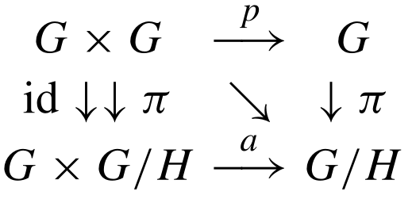
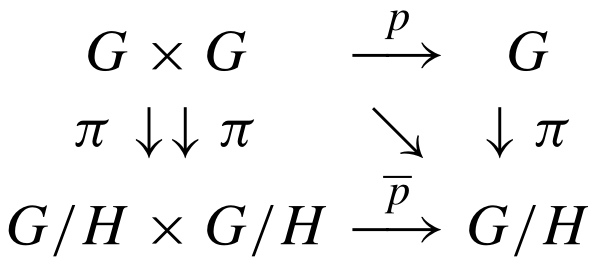

# ⚠️ AVISO

Este resumo foi feito durante o meu doutorado, como parte de um seminário da disciplina de Grupos de Lie, sobre Subgrupos de Lie. Trata-se de um roteiro da apresentação, e também um material sobre o tema, que depois foi disponibilizado para os colegas. Originalmente, este texto foi escrito em *latex*. A versão que estou apresentando aqui foi convertida automaticamente de latex para *markdown* pelo programa *pandoc*, e pode conter erros de formatação. 

As informações disponíveis aqui se baseiam no seguinte livro:

Martin, Luiz A. B. San. “Grupos de Lie.” (2012).

Qualquer informação que gere dúvidas, pareça estar errada ou imprecisa pode ser checada neste livro.

# Definição e exemplos

No curso de Variedades Diferenciáveis e Grupos de Lie, vemos que se $L$
é uma subvariedade quase-regular, a condição exigida em sua definição
ainda é verdadeira para o caso diferenciável, isto é, se
$\phi\ :\ V \to M$ for diferenciável, teremos $\phi\ :\ V \to L$
diferenciável, com respeito a estrutura intrínseca de $L$. Neste caso,
se um subgrupo $H$ de um grupo de Lie $G$ for quase-regular, então a
restrição do produto de $G$, $\rho\ :\ G \times G \to G$, ao subgrupo
$H$, dada por $\rho \vert_{H\times H}\ :\ H \times H \to H$ é
diferenciável com respeito a estrutura intrínseca de $H$. Logo, $H$ é um
subgrupo de Lie. Em particular, os subgrupos mergulhados de $G$ também
serão subgrupos de Lie, visto que toda subvariedade mergulhada é também
uma subvariedade quase-regular.

Nesta mesma linha de raciocínio, quando um subgrupo $H$ for dado pela
pré-imagem de um valor regular de uma aplicação diferenciável
$f\ :\ G \to M$, este subgrupo também será um subgrupo de Lie, visto que
subvariedades dadas dessa forma sempre são mergulhadas. Outra forma de
visualizar subgrupos de Lie, que será abordada mais adiante no Capítulo
7, é através de homomorfismos. Mais especificamente, dado um
homomorfismo diferenciável e injetor $\phi\ :\ L \to G$, onde $L$ e $G$
são grupos de Lie, temos que a imagem $\phi (L)$ é um subgrupo de Lie de
$G$.

# Álgebras de Lie e Subgrupos de Lie

Seja $G$ um grupo de Lie e $H$ um subgrupo de Lie de $G$. Por definição,
a inclusão $j\ :\ H \hookrightarrow G$ é diferenciável. Além disso, $j$
é um exemplo clássico de homomorfismo injetor (homomorfismo inclusão).
Vimos anteriormente que um homomorfismo de grupos de Lie induz um
homomorfismo de álgebras de Lie. Em nosso caso, o homomorfismo $j$ induz
o homomorfismo $d j_1\ :\ T_1 H \to T_1 G$. Tal homomorfismo também é
uma inclusão de $T_1 H$ em $T_1 G$. Deste modo, $T_1 H$ pode ser visto
como uma subálgebra de $\frak{g}$, ou seja, a álgebra de Lie de um
subgrupo de Lie de $G$ pode ser vista como uma subálgebra da álgebra de
Lie de $G$. As afirmações anteriores permanecem válidas para as álgebras
de Lie relativas a ambos os campos de vetores invariantes à esquerda e à
direita.

Se observarmos a álgebra de Lie $\frak{h}$ de $H$ como uma subálgebra da
álgebra de Lie de $G$, a aplicação exponencial em $H$ é simplesmente a
restrição da exponencial de $G$ à $H$. De fato, pela Proposição 5.15,
temos que para todo $X \in \frak{h}$, vale a fórmula
$$j (\exp_H (X)) = \exp_G (d j_1 (X)).$$ Como $j$ e $d j_1$ são
inclusões de um subconjunto em um conjunto maior, suas leis de formação
são as mesmas da aplicação identidade em $G$ e $\frak{g}$,
respectivamente, logo
$$\exp_G \vert_{H} (X) = \exp_G (X) = \exp_G (dj_1 (X)) = j (\exp_H (X)) = \exp_H (X),\ \forall X \in \frak{h}.$$

Nosso objetivo agora é obter, a partir de uma subálgebra de Lie
$\frak{h}$ da álgebra de Lie $\frak{g}$, um subgrupo de Lie $H$ de $G$
cuja álgebra de Lie coincide com $\frak{h}$. Para isto, vamos considerar
as distribuições $\Delta_{\frak{h}}^r (g) := d {(R_g)}_1 \frak{h}$ e
$\Delta_{\frak{h}}^l (g) := d {(L_g)}_1 \frak{h}$, para todo $g \in G$.
A seguir, será demonstrada a integrabilidade dessas distribuições.
Veremos de forma explícita quais são as subvariedades integrais dessas
distribuições.

*Proof.* Temos que $Ad(e^Y) X = e^{ad (Y) X}$. Lembremos que $ad (Y) X$
é uma transformação linear de $\frak{h}$ em $\frak{h}$, a qual podemos
identificar como uma matriz. Neste caso,
$e^{ad (Y) X} = \sum_{k \geq 0} \frac{1}{k!} ad(Y)^k X$, donde segue que
$$Ad(e^Y) X = \sum_{k \geq 0} \frac{1}{k!} ad(Y)^k X.$$ Uma vez que
$\frak{h}$ é uma subálgebra, cada termo do somatório pertence a
$\frak{h}$, de modo que $Ad(e^Y) \in \frak{h}X$, pois $\frak{h}$ é um
subespaço vetorial fechado (está implícito que todo subepaço vetorial é
automaticamente fechado, o que é intuitivamente fácil de ver, pelo menos
em $\mathbb{R}^n$). ◻

*Proof.* Lembremos que $L_g \circ R_h = R_h \circ L_g$, para todo
$g, h \in \frak{g}$. Dados $g, x \in G$ e $X \in \frak{g}$,
$$(d L_g)_x (X^r (x)) = (d L_g)_x \circ (d R_x)_1 (X) = d (L_g \circ R_x)_1 (X)$$
$$= d (R_x \circ L_g)_1 (X) = d(R_{g^{-1}} \circ R_g \circ R_x \circ L_g)_1 (X)$$
$$= d( R_{gx} \circ R_{g^{-1}} \circ L_g)_1 (X) = (d R_{gx})_1 \circ d (R_{g^{-1}} \circ L_g)_1 (X)$$
$$= (Ad (g) X)^r (gx).$$ No caso em que $X \in \frak{h}$ e $g = e^Y$,
com $Y \in \frak{h}$, podemos aplicar o Lema 6.2 sobre o lado direito da
equação acima e obter que $(Ad (e^Y) X)^r (e^Y x) \in \frak{h}$. Deste
modo, $(Ad (e^Y) X)^r (e^Y x) \in \Delta_{\frak{h}}^r (e^Y x)$, por
definição. Pela igualdade acima, segue que
$(d L_{e^Y})_x (X^r(x)) \in \Delta_{\frak{h}}^r (e^Y x)$. Em outras
palavras,
$$(d L_{e^Y})_x \left( \Delta_{\frak{h}}^r (x) \right) \subset \Delta_{\frak{h}}^r (e^Y x).$$
Como $(d L_{e^Y})_x$ é um isomorfismo e as dimensões de
$\Delta_{\frak{h}}^r (x)$ e $\Delta_{\frak{h}}^r (e^Y x)$ coincidem, a
inclusão acima é, na verdade, uma igualdade de conjuntos. ◻

*Proof.* Considere a distribuição invariante a direita
$\Delta_{\frak{h}}^r$ e tome uma base $\{X_1, X_2, \dots, X_k \}$ de
$\frak{h}$. Para cada $g \in G$, defina a seguinte aplicação:

$$
\begin{matrix}
        \rho\ :\ \mathbb{R}^k \to G \\
        \rho (t_1, t_2, \cdots, t_k) = e^{t_1 X_1} e^{t_2 X_2} \cdots e^{t_k X_k} g. \end{matrix}
$$
Se definirmos
$z_i = e^{t_i X_i} \cdots e^{t_k X_k} g$, podemos escrever as derivadas
parciais de $\rho$ da seguinte forma:
$$\frac{d \rho}{d t_i} (t_1, \dots, t_k) = \frac{d}{d t_i} \left( \left( L_{e^{t_1 X_1} \cdots e^{t_{i-1} X_{i-1}}}\right) \circ \left( e^{t_i X_i} \cdots e^{t_k X_k} g \right)\right)$$
$$= d (L_{e^{t_1 X_1} \cdots e^{t_{i-1} X_{i-1}}})_{z_i} (X_i z_i) = d (L_{e^{t_1 X_1} \cdots e^{t_{i-1} X_{i-1}}})_{z_i} (X_i^r (z_i)).$$
Aplicando o Lema 6.3 de forma recursiva sobre a igualdade acima,
concluímos que as derivadas parciais de $\rho$ pertencem a
$\Delta_{\frak{h}}^r (z_i)$. Deste modo, a imagem de $d \rho_t$ está
contida em $\Delta_{\frak{h}}^r (\rho (t))$, para todo
$t \in \mathbb{R}^{k}$ (para ver isto de forma mais clara, observe que
as colunas da matriz $d \rho_t$ coincidem com as derivadas parciais de
$\rho$ em $t$. Deste modo, a imagem de $d \rho_t$ deve ser uma
combinação linear das derivadas parciais, vistas como vetores colunas).
Ainda, $$\frac{d \rho}{d t_i}(0) = X_i^r (g),$$ implicando que
$d \rho_0$ é injetora em $t = 0$. Seguirá do teorema da Função Inversa
que existe uma vizinhança $U$ de $0$ tal que $d \rho_t$ é injetora. Como
as dimensões de $\mathbb{R}^k$ e $\Delta_{\frak{h}}^r (z_i)$ coincidem,
devemos ter que $d \rho_t (\mathbb{R}^k) = \Delta_{\frak{h}}^r (z_i)$,
para todo $t \in U$. Neste caso, a restrição de $\rho$ ao aberto $U$ é
uma subvariedade integral de $\Delta_{\frak{h}}^r$.

No caso da distribuição a esquerda $\Delta_{\frak{h}}^l$, podemos
definir $\rho (t_1, \dots, t_k) = g e^{t_1 X_1} \cdots e^{t_k X_k}$ e
demonstrar o resultado de forma análoga. ◻

É importante destacar que a aplicação $\rho$ do teorema anterior, a qual
está definida de forma global em $\mathbb{R}^k$ não é, de um modo geral,
uma imersão em qualquer $\mathbb{R}^k$.

Agora, vamos destacar alguns fatos importantes que constam no apêndice B
do livro:

1.  Para cada $g \in G$, existe uma única variedade integral maximal
    conexa em torno de $g$ de $\Delta_{\frak{h}}^r$ e
    $\Delta_{\frak{h}}^l$. Essas variedades serão denotadas por
    $I_{\frak{h}}^r (g)$ e $I_{\frak{h}}^l (g)$, respectivamente. (ver o
    Teorema B.19.)

2.  Se $N \subset G$ é uma variedade integral conexa de $\Delta_{h}^r$
    (respectivamente de $\Delta_{h}^l$) com $g \in N$, então $N$ é uma
    subvariedade aberta de $I_{\frak{h}}^r (g)$ (respectivamente
    $I_{\frak{h}}^l (g)$). (ver Teorema B.19.)

3.  As variedades integrais maximais conexas são subvariedades
    quasi-regulares. (Ver a Proposição B.24. Neste caso, a hipótese de
    que G é uma variedade paracompacta é necessária.)

A translação de uma variedade integral maximal conexa ainda é uma
variedade integral maximal conexa. De fato, considere $H$ uma variedade
integral maximal conexa. Dado $g \in G$, temos que $R_g\ :\ G \to G$ é
um difeomorfismo. Uma vez que $H$ é uma subvariedade imersa de $G$,
temos que a inclusão $i\ :\ H\hookrightarrow G$ é uma imersão. Deste
modo, a restrição $$R_g \vert_H = R_g \circ i\ :\ H \to G$$ é uma
imersão injetiva, e portanto $Im \left(R_g \vert_H\right) = Hg$ é uma
subvariedade imersa de $G$. Além disso, $Hg$ é conexa, pois $R_g$ é
contínua. Agora, para todo $h \in H$, a aplicação
$d (R_g)_h\ :\ T_hH \to T_{hg} (Hg)$ é tal que
$$d (R_g)_h (T_h H) = d (R_g)_h (\Delta_{\frak{h}}^r (h)) = d (R_g)_h ( d (R_h)_1 \frak{h} ) = d (R_g \circ R_h)_1 \frak{h}$$
$$= d (R_{hg})_1 \frak{h} = \Delta_{\frak{h}}^r (hg) = \Delta_{\frak{h}}^r (R_g (h)).$$
Sendo assim, $Hg$ é também uma subvariedade integral de $G$. Por fim,
observe que $(Hg)g^{-1} = H$, logo, se existisse uma subvariedade
integral conexa $K$ tal que $H \subsetneq K$, então $Kg^{-1}$ seria uma
subvariedade integral conexa contendo propriamente $H$, o que é um
absurdo, pois $H$ é subvariedade integral maximal conexa. Neste caso,
$Hg$ precisa ser uma subvariedade integral maximal conexa de $G$.

Se $H = I_{\frak{h}}^r (g)$, com $g \in H$, então dado $h \in H$, temos
que $I_{\frak{h}}^r (g) h$ é uma subvariedade integral maximal conexa de
$G$ contendo $gh$. Neste caso, pela unicidade da subvariedade integral
maximal conexa contendo $gh$, temos que
$$I_{\frak{h}}^r (g) h = I_{\frak{h}}^r (gh).$$ Em particular, se
$h = g^{-1}$ na equação acima, temos que
$I_{\frak{h}}^r (g) g^{-1} = I_{\frak{h}}^r (1)$, de onde segue que
$$I_{\frak{h}}^r (g) = I_{\frak{h}}^r (1) g.$$ De forma análoga, temos
que $I_{\frak{h}}^l (g) = I_{\frak{h}}^l (1) g$, para todo $g \in H$.

*Proof.* É suficiente provar a equação
([\[eq1\]](#eq1){reference-type="ref" reference="eq1"}). Para isso,
vamos definir a seguinte relação de equivalência em
$I_{\frak{h}}^r (1)$: $g \sim h$ se existem
$Y_1, \dots, Y_s \in \frak{h}$ tais que
$$g = e^{Y_1} \cdots e^{Y_s} h.$$ Não é difícil ver que a relação acima
é, de fato, uma relação de equivalência. As classes de equivalência
dadas por essa relação de equivalência são abertos em
$I_{\frak{h}}^r (1)$. De fato, dado $g \in I_{\frak{h}}^r (1)$ e uma
base $\{X_1, \dots, X_k\}$ de $\frak{h}$. De modo análogo a demonstração
do Teorema 6.4, a aplicação
$\rho (t_1, \dots, t_k) = e^{t_1 X_1} \cdots e^{t_k X_k} g$ define uma
variedade integral $N = \rho (U)$, para algum aberto
$U \subset \mathbb{R}^k$, com $g \in N$. Por definição, se $h \in N$,
então $h \sim g$ e, como $N \subset I_{\frak{h}}^r (1)$ é aberto (ver
item 2 das observações do apêndice B, logo acima), segue que $g$
pertence ao interior de sua classe de equivalência. Como $g$ é um ponto
arbitrário de $I_{\frak{h}}^r (1)$, temos que cada uma de suas classes
de equivalência são abertas em $I_{\frak{h}}^r (1)$. Neste caso, como o
complementar de uma classe de equivalência é a união das classes de
equivalência restantes, também temos que as classes de equivalência de
$I_{\frak{h}}^r (1)$ são fechadas em $I_{\frak{h}}^r (1)$. Pela
conexidade de $I_{\frak{h}}^r (1)$, tal conjunto só pode admitir uma
classe de equivalência, e consequentemente, $g \sim h$ se
$g, h \in I_{\frak{h}}^r (1)$. Consequentemente,
$$I_{\frak{h}}^r (1) = \{ e^{Y_1} \cdots e^{Y_s}\ :\ s \geq 0,\ Y_i \in \frak{h} \},$$
já que qualquer $g \in I_{\frak{h}}^r (1)$ é tal que $g \sim 1$. De modo
análogo, prova-se o caso $I_{\frak{h}}^l (1)$ por meio da aplicação
$(t_1, \dots, t_k) \mapsto g e^{t_1 X_1} \cdots e^{t_k X_k}$,
$g \in I_{\frak{h}}^l (1)$.

Agora, a expressão ([\[eq1\]](#eq1){reference-type="ref"
reference="eq1"}) nos dá de forma imediata que
$I_{\frak{h}}^r (1) = I_{\frak{h}}^l (1) = \langle \exp \frak{h} \rangle$
é um subgrupo de $G$. Uma vez que as variedades integrais maximais
conexas são quase-regulares, segue que o produto de $G$ restrito a elas
será diferenciável com respeito a sua estrutura intrínseca, e
consequentemente, $I_{\frak{h}}^r (1) = I_{\frak{h}}^l (1)$ é um
subgrupo de Lie. ◻

*Proof.* De fato, se $H$ é um subgrupo de Lie com álgebra de Lie
$\frak{h}$, então $H$ é gerado pelas exponenciais $\exp_H X$,
$X \in \frak{h}$. Uma vez que a aplicação exponencial em $H$ é a
restrição da exponencial de $G$, então $H$ é dada por
([\[eq1\]](#eq1){reference-type="ref" reference="eq1"}), o que garante a
unicidade de $H$. ◻

O resultado acima mostra que cada subgrupo de Lie conexo de um grupo de
Lie $G$ é uma subvariedade integral de uma distribuição, e
consequentemente, é uma subvariedade quase-regular. Em geral,
distribuições integráveis admitem cartas adaptadas (ver Apêndice B,
Seção B.4).

*Proof.* A aplicação $\psi\ :\ \frak{h} \times \frak{e} \to G$ está bem
definida. Além disso, sua diferencial no ponto $(0, 0)$ é a aplicação
identidade, e portanto um isomorfismo. Pelo Teorema da Função Inversa,
existem vizinhanças $U, V$ e $W$ nas condições do enunciado tais que
$\psi\ :\ V \times U \to W$ é um difeomorfismo local. Ainda, para todo
$Y \in \frak{e}$ fixado, a fibra $\{Y\} \times \frak{h}$ satisfaz
$$\psi (\{Y\} \times \frak{h}) \subset (\exp Y) \langle \exp \frak{h}\rangle,$$
a qual é uma subvariedade integral de $\Delta_{\frak{h}}$. Em
particular, para $Y = 0$, a inclusão acima é uma igualdade. Logo, $\psi$
é uma carta adaptada. ◻

# Ideais e Subgrupos Normais

Seja $\frak{g}$ uma álgebra de Lie e $\frak{v}$ um subespaço de
$\frak{g}$. O **normalizador** de $\frak{v}$ em $\frak{g}$, denotado por
$\frak{n (v)}$, é definido por
$$\frak{n (v)} = \{ X \in \frak{g}\ :\ \textnormal{ad}(X) \frak{v} \subset \frak{v} \}.$$
Segue da identidade de Jacobi que $\frak{n(v)}$ é uma subálgebra de
$\frak{g}$. De fato, dados $X,Y \in \frak{n (v)}$ e $Z \in \frak{v}$,
$$\textnormal{ad}([X,Y]) Z = [[X,Y], Z] = - [[Z, X], Y] - [[Y, Z], X]$$
$$= - [Y, [X, Z]] + [X, [Y, Z]] \in \textnormal{ad}(X) (\textnormal{ad}(Y) \frak{v}) - \textnormal{ad}(Y) (\textnormal{ad}(X) \frak{v})$$
$$\subset \textnormal{ad}(X) (\frak{v}) - \textnormal{ad}(Y) (\frak{v}) \subset \frak{v} - \frak{v} = \frak{v}.$$
Claramente, $\frak{v}$ é uma subálgebra se, e somente se,
$\frak{v} \subset \frak{n(v)}$ e $\frak{v}$ é um **ideal** de $\frak{g}$
se $\frak{n (v) = g}$, isto é, $[X, \frak{v}] \subset \frak{v}$, para
todo $X \in \frak{g}$.

Seja $G$ um grupo de Lie com álgebra de Lie $\frak{g}$ e tome um
subespaço $\frak{v} \subset \frak{g}$. O normalizador de $\frak{v}$ em
$G$, denotado por $N (\frak{v})$, é definido por
$$N (\frak{v}) = \{ g \in G\ :\ \textnormal{Ad}(g) \frak{v} = \frak{v} \}.$$
Como $\textnormal{Ad}$ é um homomorfismo, o normalizador $N (\frak{v})$
é um subgrupo de G.

*Proof.* Para todo $X \in \frak{h}$, vale que
$$g e^{tX} g^{-1} = e^{t \textnormal{Ad}(g)X},$$ para todo
$t \in \mathbb{R}$. Como $g$ normaliza $H$, temos que
$\textnormal{Ad}(g) X \subset \frak{h}$. Deste modo, $g e^{tX} g^{-1}$
pertence a $H$, para todo $t \in \mathbb{R}$. Assim,
$e^{t \textnormal{Ad}(g)X}$ é uma curva inteiramente contida em $H$.
Esta curva é diferenciável com respeito a estrutura de $H$. Ainda, sua
derivada em $t = 0$ é $\textnormal{Ad}(g) X$. Consequentemente,
$\textnormal{Ad}(g) X \in T_1 H \subset T_1 G$, ou ainda,
$\textnormal{Ad}(g) X \in \frak{h}$. Isto mostra que a inclusão
$\textnormal{Ad}(g) \frak{h} \subset \frak{h}$ é verdadeira. Como
$\textnormal{Ad}(g)$ é um isomorfismo, a inclusão anterior é, na
verdade, uma igualdade. ◻

*Proof.* Dado $X \in \frak{g}$, a proposição anterior garante que
$\textnormal{Ad}(e^{tX}) \frak{h} = \frak{h}$, para todo
$t \in \mathbb{R}$. Em particular, se $Y \in \frak{h}$, a curva
$\textnormal{Ad}(e^{tX})Y \subset \frak{h}$ e isto implica que sua
derivada em $t = 0$ está em $\frak{h}$. Mas,
$$\frac{d}{d t}\textnormal{Ad}(e^{tX}) Y \vert_{t = 0} := [X, Y]_l,$$
concluindo a demonstração. ◻

Já que $H$ é produto de exponenciais de elementos de $\frak{h}$, é
suficiente mostrar que $g (e^X)g^{-1} \in H$ se $g \in G$ e
$X \in \frak{h}$. Mas, $$g(e^X)g^{-1} = e^{\textnormal{Ad}(g) X}.$$
Consequentemente, basta mostrar que
$\textnormal{Ad}(g) \frak{h} = \frak{h}$, para todo $g \in G$. Seja
$Y \in \frak{g}$. Então, $\textnormal{ad}(Y) \frak{h} \subset \frak{h}$,
já que $\frak{h}$ é um ideal. Assim,
$$\textnormal{Ad}(e^Y) \frak{h} = e^{\textnormal{ad}(Y)} \frak{h} \subset \frak{h},$$
e de modo análogo a Proposição 6.8, temos que a última inclusão na
verdade é uma igualdade. Por fim, como $G$ é conexo, cada elemento
$g \in G$ é escrito como produto de exponenciais, digamos,
$g = e^{X_1} \cdots e^{X_k}$, para algum $k \in \mathbb{N}$. Lembrando
que a aplicação $\textnormal{Ad}$ é um homomorfismo, temos que
$$\textnormal{Ad}(g) \frak{h} = \textnormal{Ad}(e^{X_1} \cdots e^{X_k}) \frak{h} = \textnormal{Ad}(e^{X_1}) \cdots \textnormal{Ad}(e^{X_k}) \frak{h} = \frak{h}.$$

No caso de um homomorfismo diferenciável $\phi\ :\ G \to H$, vimos
anteriormente que $\ker \phi$ é um subgrupo de Lie. Ainda, $\ker \phi$ é
um subgrupo normal. Consequentemente, sua álgebra de Lie deve ser um
ideal da álgebra de Lie de $G$. Mais precisamente, sua álgebra é
$\ker (d \varphi)_1$ (para ver isso, lembre-se que
$\ker \phi = {\phi}^{-1} (\{1\})$ é a pré-imagem do valor regular $1$, e
por um resultado apresentado no curso de Variedades Diferenciáveis e
Grupos de Lie, temos que seu espaço tangente em 1 é exatamente o
$ker (d \phi)_1$).

# Limites de Produtos de Exponenciais

Seja um grupo de Lie $G$ e $\frak{g}$ sua álgebra de Lie. Ao longo desta
seção, $U$ e $W$ serão vizinhanças fixadas de $0 \in \frak{g}$ e
$1 \in G$, respectivamente, de modo que $\exp\ :\ U \to W$ é um
difeomorfismo.

Dados $X, Y \in \frak{g}$, considere a curva
$\alpha (t) = e^{tX} e^{tY}$, com $\alpha (0) = 1$. Se $t$ for pequeno o
suficiente, então $\alpha (t) \in W$ e consequentemente, podemos definir
a uma curva $\beta (t) \in U$ tal que $\exp \beta (t) = \alpha (t)$.
Note que $$\alpha' (0) = X + Y.$$ Como $d (\exp)_1 = \text{id}$, segue
que $\beta'(0) = \alpha'(0) = X + Y$. Isso garante que para algum
intervalo contendo $0 \in R$, $$\beta(t) = t(X+Y) + o(t),$$ com
$\lim_{t \to 0} \frac{o(t)}{t} = 0$. Em outras palavras, {eq2}
$$
\exp(tX)\exp(tY) = \alpha (t) = \exp \beta(t) = \exp (t(X+Y) + o(t)).
$$
A proposição a seguir nos dá uma fórmula, conhecida como a **fórmula do
produto de Lie**.

*Proof.* Fazendo $t = \frac{1}{n}$ em
([\[eq2\]](#eq2){reference-type="ref" reference="eq2"}),
$$\exp \left( \frac{X}{n} \right) \exp \left( \frac{Y}{n} \right) = \exp \left( \frac{1}{n} (X+Y) + o\left( \frac{1}{n}\right) \right).$$
Como $\lim_{n \to \infty} \frac{o (1/n)}{1/n} = 0$, temos que
$$\lim_{n \to \infty}  \exp \left( \frac{1}{n} (X+Y) + o\left( \frac{1}{n}\right) \right)^n = \lim_{n \to \infty} \exp \left( (X+Y) + n\ o\left( \frac{1}{n}\right) \right)$$
$$= \lim_{n \to \infty} \exp \left( (X+Y) + \frac{o\left( \frac{1}{n}\right)}{ \frac{1}{n}} \right) =  \exp \left(\lim_{n \to \infty}\left((X+Y) + \frac{o\left( \frac{1}{n}\right)}{ \frac{1}{n}} \right) \right)$$
$$= \exp (X + Y).$$ ◻

Dados $X, Y \in \frak{g}$, considere a curva
$$\alpha (t) = e^{tX} e^{tY} e^{-tX} e^{-tY},$$ a qual satisfaz
$\alpha (0) = 0$. Se $t$ for pequeno o suficiente, então
$\alpha (t) \in W$, onde $\exp\ :\ U \to W$ é um difeomorfismo. Para
estes valores de $t$, temos uma curva diferenciável $\beta$ tal que
$$\alpha (t) = e^{\beta (t)},$$ $\beta (t) \in U \subset \frak{g}$. Esta
curva $\beta$ pode ser escrita em termos de fluxos de campos de vetores
em $U$. De fato, denote por $\log\ :\ W \to U$ a inversa de $\exp$ e
seja $\widehat{X} = \log_* X^r$ o campo de vetor em $U$ que está
relacionado pela aplicação $\log$ ao campo $X$. Então, as imagens das
trajetórias de $\widehat{X}$ pela $\exp$ são trajetórias de $X$. Deste
modo, definindo $\widehat{Y}$ de mesmo modo e levando em consideração
que o fluxo de um campo de vetores invariante a direita $X^r$ é dado por
$X_t^r (g) = \exp (tX) g$, a curva $\beta$ é definida por
$$\beta (t) = \widehat{X}_t \circ \widehat{Y}_t \circ \widehat{X}_{-t} \circ \widehat{Y}_{-t} (0).$$
As duas primeiras derivadas em $t = 0$ de uma curva definida pela
composição de fluxos de campos de vetores em um espaço vetorial podem
ser calculadas por meio das propriedades de fluxo (ver o Apêndice A,
Proposição A.6). Por meio desses cálculos, temos que $$\begin{matrix}
    \beta'(0) = 0 & \text{e} & \beta''(0) = -2 [\widehat{X}, \widehat{Y}] (0).
\end{matrix}$$ Mas, $[X, Y]_r := [\widehat{X}, \widehat{Y}] (0)$.
Consequentemente, em uma vizinhança de $0 \in \mathbb{R}$,
$\beta (t) = -t^2 [X, Y]_r + o (t)$, com
$\lim_{t \to 0} \frac{o (t)}{t^2} = 0$. Analogamente ao que foi feito
antes, temos a seguinte relação: {eq4}
$$
    e^{tX} e^{tY} e^{-tX} e^{-tY} = \exp \left( -t^2 [X, Y]_r + o (t) \right).
$$

*Proof.* A demonstração dessa proposição é análoga à demonstração da
Proposição 6.11. ◻

# Subgrupos Fechados

Seja $H \subset G$ um subgrupo fechado do grupo de Lie $G$. Defina o
seguinte conjunto: {eq5}
$$
\frak{h}_{H} = \{ X \in \frak{g}\ :\ \forall t \in \mathbb{R},\ \exp tX \in H \}.
$$
Não é difícil ver que $\frak{h}_{H}$ é um subespaço da álgebra de $G$.
Além disso, segue da fórmula dada pela proposição 6.12 e do fato de que
$H$ é fechado que $\frak{h}_{H}$ é, na verdade, uma subálgebra de Lie.
Com isso, temos a seguinte proposição:

*Proof.* Por definição, $\langle \exp \frak{h}_{H} \rangle \subset H$, e
consequentemente, $e^U \subset H \cap W$. Ainda,
$$H \cap W = e^U \left( H \cap e^V \right),$$ já que para todo $X \in U$
e $Y \in V$, temos que $e^X e^Y \in H$ se, e somente se,
$e^Y = e^{-X} e^X e^Y \in H$. Observe que se $H \cap e^V = \{1\}$, então
o resultado segue da igualdade acima.

Suponha, por absurdo, que não exista um aberto $V$ tal que
$H \cap e^V = \{1\}$. Então, existe uma sequência $Y_n \in \frak{e}$ tal
que $Y_n \neq 0$ e $y_n = e^{Y_n} \in H$, e
$\lim_{n \to \infty} Y_n = 0$, isto é, $\lim_{n \to \infty} y_n = 1$.
Tome vizinhanças compactas de $0 \in V'' \subset V' \subset \frak{e}$
tais que $2V'' = V'' + V'' \subset V'$ (por exemplo, $V' = B[0, \delta]$
e $V'' = B [0, \delta/10]$, com respeito a alguma norma). Se $n$ for
grande o suficiente, então $Y_n \in V''$, e por compacidade (mais
especificamente a limitação de $V''$), existirá $N(n) \geq 1$ tal que
$N(n) Y_n \notin V''$. Seja $k_n$ o menor inteiro positivo tal que
$k_n Y_n \notin V''$. Então, $(k_n- 1) Y_n \in V''$, e segue que
$$k_n Y_n = (k_n - 1) Y_n + Y_n \in V'' + V'' \subset V'.$$ Por
compacidade, podemos assumir que $k_n Y_n$ converge para $Y \in V'$.
Como $k_n Y_n \notin V''$, segue que $Y$ não pertence ao interior de
$V''$, e consequentemente, $Y \neq 0$. Exponenciando, temos
$y_n^{k_n} = e^{k_n Y_n} \in H$ e $y_n^{k_n} \to y = e^Y \neq 1$. Sendo
assim, $y \in H$, já que $H$ é fechado.

Agora, suponha que $t = p/q$ é racional ($p, q \in Z,\ q > 0$). Se $a_n$
é o quociente da divisão de $p k_n$ por $q$, então
$p k_n = a_n q + b_n$, com $0 \leq b_n < q$. Dividindo esta equação por
$q$, e multiplicando por $Y_n$, obtém-se
$$t k_n Y_n = a_n Y_n + (b_n / q) Y_n.$$ Tomando os limites, o lado
esquerdo da equação acima converge para $tY$, enquanto que
$(b_n / q) Y_n \to 0$, uma vez que $b_n < q$ e $Y_n \to 0$. Assim,
$\lim_{n \to \infty} a_n Y_n = t Y$. Consequentemente,
$$e^{tY} = \lim_{n \to \infty} e^{a_n Y_n} = \lim_{n \to \infty} \left( e^{Y_n} \right)^{a_n} \in H,$$
já que $\left( e^{Y_n} \right)^{a_n} \in H$ e $H$ é fechado. Isto prova
que $e^{tY} \in H$, se $t$ for racional. Usando novamente o fato de que
$H$ é fechado e que $\exp$ é continua, podemos concluir que
$e^{tY} \in H$, para todo $t \in \mathbb{R}$, ou seja,
$Y \in \frak{h}_H$. Mas isso contradiz a definição de $\frak{h}_H$, pois
$Y \in \frak{e}$, onde $\frak{e}$ é o espaço complementar de
$\frak{h}_H$, e $Y \neq 0$, concluindo a prova. ◻

O teorema a seguir é também conhecido como o **Teorema do subgrupo
fechado de Cartan**.

*Proof.* Seja $\psi\ :\ V \times U \to W$, $\psi (X, Y) = e^X e^Y$ a
carta adaptada em torno da identidade proveniente do Lema $6.14$, com
$H \cap W = e^U$. Então, para cada $h \in H$, o conjunto
$W h = e^V e^U h$ é uma vizinhança de $h$ em $G$. Essas vizinhanças
satisfazem $$H \cap W h = (H h^{-1} \cap W) h = (H \cap W) h = e^U h.$$
Consequentemente, o difeomorfismo
$R_{h} \circ \psi\ :\ V \times U \to W$ satisfaz
$R_h \circ \psi (\{0\} \times U) = e^{0} e^U h = e^U h = H \cap Wh$.
Como $h \in H$ é arbitrário, isto mostra que $H$ é uma subvariedade
mergulhada de $G$ (veja a Proposição B.1). Em particular, $H$ é
quase-regular, e portanto um subgrupo de Lie. Aplicando o Lema 6.14
novamente, encontramos que o espaço tangente a $H$ na identidade é
$\frak{h}_H$, e consequentemente, esta é a álgebra de Lie de $H$. ◻

O teorema do subgrupo fechado de Cartan admite a seguinte recíproca:

*Proof.* Como $H$ é uma subvariedade mergulhada, temos que a inclusão
$i\ :\ H \to G$ é uma imersão. Pelo Teorema da Forma Local das Imersões,
temos que existe uma parametrização $X\ :\ U \to H$ de $H$ em torno de
$1$ e um difeomorfismo $Y\ :\ U \times V \to W$, onde $W = X(U)$, com
$0 \in U$, $0 \in V$, $U, V, W$ abertos e $1 \in W$, de modo que
$$Z := Y^{-1} \circ i \circ X (u) = (u, 0),\ \forall u \in U.$$ Note que
$Y(U \times \{0\}) = Y (Z (U)) = i (X (U)) \subset H$, e ainda,
$Y (U \times \{0\}) = X (U) = W = W \cap H$, pois $W = X(U) \subset H$.
Como o difeomorfismo $Y$ proveniente do teorema da Forma Local das
Imersões é uma carta de $G$ em torno de $1$, temos que existe uma carta
$\psi := Y\ :\ U \times V \to W$ satisfazendo $(0, 0) \in U \times V$,
$1 \in W$, $\psi (0,0) = 1$ e $H \cap W = \psi (U \times \{0\})$. Neste
caso, $H \cap W$ é fechado em $W$, pois $U \times \{0\}$ é fechado em
$U \times V$ (basta notar que $\{0\}$ é fechado, logo seu complementar é
aberto, e que $(U \times \{0\})^c = U \times \{0\}^c$ é aberto).

Isto implica que $\overline{H} \cap W = H \cap W$. Mas $\overline{H}$ é
também uma subvariedade mergulhada, pelo Teorema 6.15, pois é um
subgrupo fechado de $G$. De fato, dados $a, b \in \overline{H}$
quaisquer, considere duas sequências $a_n \to a$ e $b_n \to b$, tais que
$a_n, b_n \in H$, para todo $n \in \mathbb{N}$. Temos que a sequência
$a_n {b_n}^{-1}$ converge para $ab^{-1}$, e cada um de seus termos
pertence a $H$, pois $H$ é subgrupo. Sendo assim,
$ab^{-1} \in \overline{H}$, e portanto $\overline{H}$ é um subgrupo
fechado de $G$.

Neste caso, segue de $\overline{H} \cap W = H \cap W$ que
$T_1 H = T_1 \overline{H}$ e que $H$ tem interior não vazio em
$\overline{H}$, visto que $1 \in \overline{H} \cap W \subset H$, onde
$\overline{H} \cap W$ é um aberto de $\overline{H}$. Logo, $H$ é aberto
em $\overline{H}$, e consequentemente, fechado em $\overline{H}$. Por
transitividade, $H$ é fechado em $G$. ◻

Os resultados dessa seção mostram que um subgrupo de Lie $H \subset G$ é
fechado se, e somente se, a subvariedade $H$ é uma subvariedade
mergulhada. Contudo, a demonstração do teorema do subgrupo fechado vai
mais além. Ela mostra que $H$ é um subgrupo de Lie mergulhado se $H$ for
**localmente fechado**, no sentido de que cada $h \in H$ admite uma
vizinhança $W$ tal que $H \cap W$ é fechada em $W$. Isto é verdade, pois
o Lema 6.14 permanece válido com a hipótese de que $H$ é localmente
fechado em torno de 1.

Um caso em que um subgrupo $\Gamma \subset G$ é localmente fechado é
quando ele é um **subgrupo discreto**, no sentido de que existe uma
vizinhança $U$ da identidade tal que $U \cap \Gamma = \{1\}$ (por meio
de translações, desta vizinhança, temos que o conjunto é localmente
fechado). Então, o subgrupo $\Gamma$ é fechado e $\dim \Gamma = 0$,
visto que $U \cap \Gamma$ é uma subvariedade aberta de $\Gamma$ de
dimensão nula. Por outro lado, se $\Gamma$ é um subgrupo fechado com
$\dim \Gamma = 0$, então $\Gamma$ é discreto, pois neste caso a
subálgebra $\frak{h}_{\Gamma} = \{0\}$ e o aberto $W = e^V e^U$
proveniente do Lema 6.14 se reduz a $e^V$, e satisfaz
$\Gamma \cap e^V = \{1\}$.

# Subgrupos Conexos por Caminhos

A condição do teorema é equivalente a dizer que $H$ seja conexo por
caminhos diferenciáveis, uma vez que um caminho ligando dois elementos
arbitrários $g$ e $h$ pode ser obtido ao transladar o caminho que liga
$1$ e $g^{-1} h$. Considere o subconjunto
$\frak{h}_H \subset \frak{g} = T_1 G$, formado pelas derivadas
$\dot{x}_0$ das curvas $x_t \in H$, de classe $C^1$, com $x_0 = 1$.

*Proof.* A curva constante $x_t = 1$ está em $H$, logo
$0 \in \frak{h}_H$. Sejam $x_t$ e $y_t$ duas curvas $C^1$ contidas em
$H$, com $x_0 = y_0 = 1$, e denote por $X = \dot{x}_0$ e $Y = \dot{y}_0$
suas derivadas na origem. Se $r \in \mathbb{R}$, então a derivada em
$t = 0$ de $x_{rt}$ é igual a $rX$, mostrando que $\frak{h}_H$ é fechado
para a multiplicação por escalar. Por outro lado, a derivada em $t = 0$
da curva $x_t y_t \in H$ é igual a $X+Y$. Consequentemente, $\frak{h}_H$
é um subespaço vetorial.

Para mostrar que o colchete é fechado, considere, para cada $t$, a curva
$s \mapsto C_{x_t} (y_s) = x_t y_s x_t^{-1} \in H$. Derivando em
$s = 0$, $$(d C_{x_t})_1 (Y) = \textnormal{Ad}(x_t) (Y),$$ e
consequentemente, a curva $t \mapsto z_t = \textnormal{Ad}(x_t) (Y)$
está em $\frak{h}_H$, bem como a sua derivada
$$\dot{z}_0 = d (\textnormal{Ad})_1 (\dot{x}_0) (Y) = \textnormal{ad}(\dot{x}_0) (Y) = [X, Y],$$
mostrando que $[X, Y] \in \frak{h}_H$. ◻

Agora, para provar o Teorema 6.19, é suficiente verificar que
$H = \langle \exp \frak{h}_H \rangle$. Tome $h \in H$ e uma curva
$x_t \in H$ conectando a identidade a $h$. Então
$x_{t+s} x_t^{-1} \in H$, e assim,
$$\dot{x}_t x_t^{-1} = \frac{d}{ds}\left( x_{t+s} x_t^{-1} \right) \vert_{s = 0} \in \frak{h}.$$
Isto significa que a curva $x_t$ é tangente a distribuição
$\Delta_{\frak{h}_H}^r (x) = (d R_x)_1 \frak{h}_H$. Consequentemente,
$x_t$ está inteiramente contida em uma subvariedade integral $I$ de
$\Delta_{\frak{h}_H}^r$ (ver Proposição B.22). Como $x_0 = 1$, a
variedade integral $I$ contendo $x_t$ precisa ser
$\langle \exp \frak{h} \rangle$, significando que
$H \subset \langle \exp \frak{h} \rangle$.

Para a inclusão contrária, vamos mostrar que $H$ tem interior não vazio
em $\langle \exp \frak{h}_H \rangle$. Considere uma base
$\{X_1, \dots, X_n \}$ de $\frak{h}_{H}$ e tome curvas
$x_t^1, \cdots, x_t^n$ em $H$ tais que $\dot{x}_0^i = X_i$. Defina a
aplicação
$$\psi\ :\ (t_1, \dots t_n) \mapsto x_{t_1}^1 \cdots x_{t_n}^n \in H \subset \langle \exp \frak{h}_H \rangle,$$
cujo domínio é um aberto de $\mathbb{R}^n$ contendo a origem. Esta
aplicação é $C^1$ e suas derivadas parciais na origem são dadas por
$$\frac{d \psi}{d t_i}(0) = X_i.$$ Aplicando o Teorema da Função Inversa
sobre a aplicação
$\psi\ :\ \mathbb{R}^{n} \to \langle \exp \frak{h}_H \rangle$, a imagem
de $\psi$ possui interior não vazio em
$\langle \exp \frak{h}_H \rangle$. Como a imagem de $\psi$ está contida
em $H$, segue que $H$ é um subgrupo aberto de
$\langle \exp \frak{h}_H \rangle$. Consequentemente, $H$ também é
fechado em $\langle \exp \frak{h}_H \rangle$. Como
$\langle \exp \frak{h}_H \rangle$ é conexo, temos que
$H = \langle \exp \frak{h}_H \rangle$, concluindo a demonstração do
Teorema 6.19.

*Proof.* De fato, $H_0$ é uma subvariedade conexa, e portanto, é conexa
por caminhos. Então, o Teorema 6.19 garante que $H_0$ é um subgrupo de
Lie e uma subvariedade quase-regular. Por outro lado, seja $g$ um
elemento de uma componente conexa $H_1$. Então, $gH_0 = L_g (H_0)$ é um
conexo contendo $g$, e portanto, $g H_0 \subset H_1$. Segue que
$H_0 = g^{-1} (g H_0) \subset g^{-1} H_1$, mostrando que $H_1 = g H_0$.
Consequentemente, as componentes conexas de $H$ são classes laterais de
$H_0$ e subvariedades integrais de $\Delta_{\frak{h}}$ (lembre-se que
$H_0$ é exatamente o único subgrupo de Lie conexo cuja álgebra de Lie é
$\frak{h}$, isto é, $\langle \exp \frak{h} \rangle$, o qual é exatamente
a subvariedade integral maximal contendo $1$, e suas translações também
são subvariedades integrais maximais). Pelo Corolário B.25, $H$ é uma
subvariedade quase-regular e portanto, um grupo de Lie. ◻

# Estrutura de Variedade em $G / H$, com $H$ Fechado

Seja $G$ um grupo de Lie e $H$ um subgrupo fechado de $G$. No Capítulo
2, vimos que a topologia quociente em $G/H$ é Hausdorff quando $H$ é
fechado. Nesta Seção, vamos estudar a estrutura diferenciável de $G/H$.

A estrutura diferenciável definida neste teorema é chamada **estrutura
diferenciável quociente**.

Vamos denotar por $\frak{g}$ e $\frak{h}$ as álgebras de Lie de $G$ e
$H$, respectivamente. Seja $\frak{e} \subset \frak{g}$ um subespaço
vetorial tal que $\frak{g} = \frak{e} \oplus \frak{h}$. Pelo Lema 6.14,
existem $V, U$ e $W$ abertos tais que $0 \in V \subset \frak{e}$,
$0 \in U \subset \frak{h}$ e $1 \in W \subset G$, de modo que a
aplicação $\psi\ :\ V \times U \to W$, definida por
$$\psi (Y, X) = e^Y e^X,$$ é um difeomorfismo. Ainda, $W = e^V e^U$
satisfaz $W \cap H = e^U$, o que é equivalente a $e^V \cap H = \{1\}$
(vale a pena mencionar que a ordem dos fatores $e^Y e^X$ foi trocada em
relação ao Lema 6.14, para que tivéssemos $\psi (Y, X) \in e^Y H$).

No que segue, será conveniente supor que $W$ está contida em um aberto
similar $W_1 = e^{V_1}e^{U_1}$, com
$0 \in V \subset V_1 \subset \frak{e}$,
$0 \in U_1 \subset U \subset \frak{h}$, e $W_1 \cap H = e^{U_1}$, e
satisfazendo as condições

-   $W^2 \subset W_1$ e $W^{-1}W \subset W_1$.

Neste caso, a carta adaptada $\psi\ :\ V \times U \to W$ é a restrição
de $\psi_1\ :\ V_1 \times U_1 \to W_1$. Esta situação pode ser obtida ao
reduzir os abertos $V_1$ e $U_1$ e restringir $\psi_1$.

A construção do atlas em $G/H$ será feita com a ajuda de uma extensão de
$\psi$ para $V \times H$, definida por $\Psi\ :\ V \times H \to G$,
$$\Psi (Y, h) = e^Y h.$$ Esta aplicação é diferenciável, pois é a
composição de aplicações diferenciáveis. Sua diferencial, calculada em
$A \in \frak{e}$ e $B^r (h)$, $B \in \frak{h}$, é dada por
$$d \Psi_{(Y, h)} ( A, B^r (h) ) = \frac{d}{dt } \Psi \left( Y + t A, e^{tB} h \right)\vert_{t = 0} = \frac{d}{dt } \left( e^{Y + t A} e^{tB} h \right) \vert_{t = 0}$$
$$= \frac{d}{dt } R_h \left( e^{Y + t A} e^{tB} \right) \vert_{t = 0} = \frac{d}{dt } R_h \left( \psi \left(Y + t A, tB \right) \right) \vert_{t = 0}$$
$$= (d R_h)_{e^Y} \left( d \psi_{(Y, 0)} ( (A, B) ) \right),$$ ou seja,
$$d \Psi_{(Y, h)} ( A, B^r (h) ) = d (R_h \circ \psi)_{(Y, 0)} (A, B).$$

*Proof.* Primeiramente, $\Psi$ é injetora. De fato, suponha que
$e^{Y_1} h_1 = e^{Y_2} h_2$. Então, $e^{-Y_2} e^{Y_1} = h_2 h_1^{-1}$.
Observe que $e^{Y_1}, e^{Y_2} \in Im(\psi) = W$, logo
$e^{-Y_2} e^{Y_1} \in W^{-1} W \subset W_1$, isto é, o lado direito da
ultima equação pertence a $W_1$. Quanto ao lado direito dessa equação,
temos que ele pertence ao subgrupo $H$, e assim,
$$e^{- Y_2} e^{Y_1} \in W_{1} \cap H = e^{U_1},$$ isto é,
$e^{Y_1} = e^{Y_2} e^{X_1}$, para algum $X_1 \in U_1$. Isto implica que
$\psi_1 (Y_1, 0) = \psi_1 (Y_2, X_1)$, e consequentemente, $X_1 = 0$ e
$Y_1 = Y_2$, visto que $\psi_1\ :\ V_1 \times U_1 \to W_1$ é um
difeomorfismo. Consequentemente, $h_1 = h_2$, e a aplicação $\Psi$ é
injetora, como afirmado. Além disso, $\Psi$ é sobrejetora, pois
$Im (\Psi) = e^{V} H$.

Como $d \Psi_{(Y, h)} = d (R_h \circ \psi)_{(Y, 0)}$, para todo
$Y \in V$ e $h \in H$, então $d \Psi_{(Y, h)}$ é um isomorfismo (pois
$R_h$ e $\psi$ são difeomorfismos). Pelo Teorema da Função Inversa,
$\Psi$ é um difeomorfismo local (isto é, em cada ponto de seu domínio,
podemos encontrar vizinhanças nas quais a restrição dessa aplicação a
elas é um difeomorfismo). Sendo assim, para todo ponto pertencente a
$e^{V} H$, existe um aberto contendo este ponto e contido em $e^{V} H$
(este aberto é obtido pelo Teorema da Função Inversa), e
consequentemente, $e^{V} H$ é aberto.

Por fim, como $\Psi$ é um difeomorfismo local e bijetor, segue que
$\Psi$ é um difeomorfismo global. ◻

As aplicações $\sigma_g$, com $g \in G$, formam um atlas da estrutura
diferenciável de $G/H$. A demonstração deste fato decorre das seguintes
etapas:

1.  $\sigma_g = g \circ \sigma_1$, o que segue de forma imediata da
    definição, visto que
    $\sigma_1 = \pi \circ \Psi \vert_{V \times \{1\}}$.

2.  A imagem $\sigma_g (V)$ é um aberto de $G/H$ com respeito a
    topologia quociente. De fato,
    $\sigma_1 (V) = \pi \left( e^V \right) = e^V H = \pi \left( e^V H \right)$
    é aberto, pois $e^V H$ é aberto e a aplicação $\pi$ é aberta.
    Consequentemente, $\sigma_g (V) = g (\sigma_1 (V))$ também é aberto,
    já que $g\ :\ G/H \to G/H$ é um homeomorfismo.

3.  $\sigma_g\ :\ V \to \sigma_g (V)$ é bijetora. É suficiente verificar
    que $\sigma_g$ é injetora: se $\sigma_g (Y_1) = \sigma_g (Y_2)$,
    então $\pi (g e^{Y_1}) = \pi (g e^{Y_2})$, ou seja,
    $g e^{Y_1} H = g e^{Y_2} H$, implicando que $e^{Y_1} H = e^{Y_2} H$.
    Assim, existem $h_1, h_2 \in H$ tais que
    $e^{Y_1} h_1 = e^{Y_2} h_2$, e dessa forma,
    $\Psi (Y_1, h_1) = \Psi (Y_2, h_2)$. Como $\Psi$ é injetora, temos
    que $Y_1 = Y_2$.

4.  $\sigma_g\ :\ V \sigma_g (V)$ é um homeomorfismo. A continuidade de
    $\sigma_g$ decorre de sua definição. Para verificar que $\sigma_g$ é
    aberta, seja $A \subset V$ um aberto. Então,
    $\sigma_g (A) = g \pi (e^A) = g e^A H = g \pi (e^A H)$. Como
    $e^A H = \Psi (A \times H)$ e $\Psi$ é um difeomorfismo, temos que
    $e^A H$ é aberto em $G$. Assim, visto que $\pi$ é uma aplicação
    aberta e $g$ é um homeomorfismo, segue que
    $\sigma_g (A) = g \pi (e^A H) = g \circ \pi (e^A H)$ é aberto em
    $G/H$.

5.  Para cada $g_1, g_2 \in G$, as mudanças de coordenadas
    $\sigma_{g_2}^{-1} \circ \sigma_{g_1}$ são dadas por {eq7}
    $$
                    \sigma_{g_2}^{-1} \circ \sigma_{g_1} (Y) = p \left( \Psi^{-1} \left( g_2^{-1} g_1 \Psi (Y, 1) \right) \right)
    $$
    $$= p \left( \Psi^{-1} \left( g_2^{-1} g_1 e^Y \right) \right),$$
    onde $p\ :\ V \times H \to V$ é a projeção na primeira coordenada.
    De fato, dado $Y \in V$, defina
    $Z = \sigma_{g_2}^{-1} \circ \sigma_{g_1} (Y)$. Assim,
    $\sigma_{g_1} (Y) = \sigma_{g_2} (Z)$. Isso significa que $g_1 e^Y$
    pertence a mesma classe lateral de $g_2 e^Z$, e consequentemente,
    existe $h \in H$ tal que
    $$g_1 \Psi (Y, 1) = g_1 e^{Y} = g_2 e^Z h = g_2 \Psi (Z, h).$$ Segue
    da igualdade acima que
    $\Psi (Z, h) = g_2^{-1} g_1 \Psi (Y, 1) = g_2^{-1} g_1 e^Y$.
    Aplicando $\Psi^{-1}$ em cada igualdade, segue que
    $$(Z, h) = \Psi^{-1} \left( g_2^{-1} g_1 \Psi (Y, 1) \right) = \Psi^{-1} \left( g_2^{-1} g_1 e^Y \right),$$
    de onde podemos perceber que aplicando a projeção na primeira
    coordenada, $p$, obtemos a expressão
    ([\[eq7\]](#eq7){reference-type="ref" reference="eq7"}).

As afirmações acima mostram que as aplicações $\sigma_g$ são as cartas
de um atlas diferenciável em $G/H = \cup_{g \in G} \sigma_g (V)$. O item
(4) garante que $\sigma_g$ é um sistema de coordenadas para um aberto em
torno de $gH$, enquanto que o item (5) garante que as aplicações mudança
de coordenadas são diferenciáveis, pois são a composição de aplicações
diferenciáveis, isto é,
$\sigma_{g_2}^{-1} \circ \sigma_{g_1} = p \circ \Psi^{-1} \circ L_{g_2^{-1} g_1} \circ \exp$.

Isso conclui a demonstração da primeira parte do Teorema 6.22. As
propriedades restantes do enunciado do Teorema 6.22 são obtidas da
seguinte forma:

1.  $\dim G/H = \dim G - \dim H$, pois
    $\dim G/H = \dim V = \dim \frak{e} = \dim \frak{g} - \frak{h} = \dim G - \dim H$.

2.  A projeção canônica $\pi\ :\ G \to G/H$ é uma submersão. De fato,
    dado $g \in G$, a aplicação $\psi_g = L_g \circ \psi$ e $\sigma_g$
    são cartas em torno de $g$ e $gH$, respectivamente. Em termos dessas
    cartas, a expressão local de $\pi$ é dada por
    $$\sigma_g^{-1} \circ \pi \circ \psi_g (X, Y) = \sigma_g^{-1} \left( \pi \left( g e^Y e^X \right) \right).$$
    Mas $e^X \in H$, e assim,
    $\pi (ge^Y e^X) = g e^Y e^X H = g e^Y H = \pi (g e^Y) = \sigma_g (Y)$.
    Logo, $\sigma_g^{-1} \circ \pi \circ \psi_g (X, Y) = Y$ é a projeção
    na segunda coordenada. Isso também mostra que $\pi$ é diferenciável
    e é uma submersão.

3.  O critério de diferenciabilidade para uma função $f\ :\ G/H \to M$ é
    uma consequência imediata do fato de que $\pi\ :\ G \to G/H$ é uma
    submersão. De qualquer modo, considerando as cartas do item
    anterior, vale que
    $$f \circ \pi \circ \psi_g (X, Y) = f \circ \sigma_g (Y),$$ o que
    mostra que $f$ é diferenciável se, e somente se, $f \circ \pi$ é
    diferenciável.

4.  A ação canônica $a\ :\ G \times G/H \to G/H$ nos fornece o seguinte
    diagrama:

    <figure>
    

    
    

    </figure>

    Pelo diagrama acima e o critério de diferenciabilidade para funções
    definidas em $G/H$, segue imediatamente que $a$ é diferenciável, já
    que $\pi \circ p$ é diferenciável (por um resultado visto no curso
    de Variedades Diferenciáveis e Grupos de Lie relacionado a
    submersões).

5.  Dado $g \in G$, a aplicação $xH \mapsto gxH$ é diferenciável, pois é
    uma aplicação parcial de $a$ (é a aplicação $a$ com um de seus
    argumentos fixados). Sua inversa é dada por $xH \mapsto g^{-1} x H$,
    a qual também é diferenciável, e portanto, ambas as aplicações são
    difeomorfismos.

Finalmente, se $H$ é um subgrupo normal fechado de $G$, então $G/H$ é um
grupo cujo produto $\overline{p}\ :\ G/H \times G/H \to G/H$ é
diferenciável, pois é definido pelo seguinte diagrama, onde $p$ denota o
produto em $G$:

<figure>

</figure>

(compare com a Proposição 2.27). Neste caso, $\pi$ é um homomorfismo
diferenciável. Sua diferencial $d \pi_1$ é um homomorfismo sobrejetor de
álgebras de Lie cujo kernel é $\frak{h}$, o qual é um ideal de
$\frak{g}$. Consequentemente, a álgebra de Lie de $G/H$, sendo a imagem
de $d \pi_1$, é isomorfa a $\frak{g}/\ker d\pi_1 = \frak{g}/ \frak{h}$.
