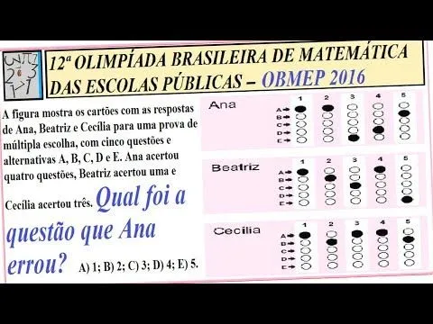

# ⚠️ AVISO

Essa aula é bem mais difícil que as [anteriores](./porcentagens), pois aborda um assunto
que pode parecer completamente novo: lógica matemática. Eu vou
apresentar os conectivos lógicos, e explicá-los de forma bem resumida
através de exemplos. Um estudo mais aprofundado desse tema geralmente é
feito apenas no ensino superior, então iremos ver apenas aquilo que pode
nos ajudar a deduzir coisas por meio da lógica matemática, que é o que
provavelmente vai aparecer nos exercícios de inferência lógica.

Dito isto, não precisa ficar decorando tudo sobre os conectivos, meu
objetivo aqui é apenas apresentá-los pra você. Foque sim na parte de
negação (conectivo "não"), implicações, equivalências, e contradições,
pois isso é quase obrigatório, se quiser deduzir coisas usando lógica.

Minha dica para esta parte: resolva exercícios de lógica da OBMEP (eu
selecionei alguns, mas você pode procurar por mais no Google Imagens).
Eles vão te preparar muito bem para enfrentar exercícios de lógica.

# Lógica Matemática

Na matemática, estamos interessados em saber quando uma afirmação é
verdadeira ou não. Dizemos que uma afirmação $P$ é uma proposição quando
podemos atribuir **um único** valor lógico à ela, isto é, dizer se ela é
**verdadeira** ou **falsa**.

Exemplos de afirmações que são proposições:

-   A lua é quadrada.

-   A neve é branca.

-   5 é maior que 3.

OBS 1: Uma proposição não pode ser verdadeira e falsa ao mesmo tempo.

OBS 2: Toda proposição obrigatoriamente é verdadeira ou é falsa.

# Conectivos Lógicos: "e", "ou", "não", "se\..., então\...", "\...se, e somente se,\..."

Podemos utilizar conectivos lógicos para construir novas proposições.
Considere duas proposições $P$ e $Q$. Podemos construir uma proposição
$R$ da seguinte forma: 

$$
R:\ P\ \text{e}\ Q.
$$

A proposição $R$ também
tem seu valor lógico, que dependerá do valor lógico de $P$ e de $Q$. Se
$P$ e $Q$ forem ambas verdadeiras, então nossa proposição $R$ será
verdadeira. Por outro lado, se $P$ ou $Q$ for falsa, então $R$ será
falsa. Vamos ver isso através de um exemplo: 

$$
\begin{matrix}
P & : & \text{7 é maior que 3} \\
Q & : & \text{5 é a metade de 10}
\end{matrix}
$$

Perceba que $P$ e $Q$ são ambas verdadeiras. Agora leia a
proposição $R$:

$$
R\ :\ \text{7 é maior que 3 {\bf e} 5 é a metade de 10}.
$$

É fácil de
ver que $R$ é uma afirmação verdadeira. No entanto, se trocarmos $Q$ por
"5 é o triplo de 10", $Q$ será falsa, e $R$ ficará da seguinte forma:

$$
R\ :\ \text{7 é maior que 3 {\bf e} 5 é o triplo de 10}.
$$

Com uma
simples leitura, constatamos que $R$ é uma afirmação **mentirosa**
(falsa).

Outro conectivo que temos a nossa disposição é o "ou". Considere agora

$$
R\ :\ P\ \text{ou}\ Q.
$$

Novamente, o valor lógico de $R$ depende de
$P$ e $Q$. Para que $R$ seja verdadeira, basta que uma das afirmações
$P$ ou $Q$ seja verdadeira. Além disso, o único caso em que $R$ será
falsa é quando ambas as afirmações $P$ e $Q$ forem falsas.

Por exemplo, considere: 

$$
\begin{matrix}
P & : & \text{2 $\times$ 3 = 6} \\
Q & : & \text{-7 é positivo}
\end{matrix}
$$

Sendo assim, construímos $R$ da seguinte forma:

$$
R\ :\ \text{2 $\times$ 3 = 6}\ \text{\bf ou}\ \text{-7 é positivo}.
$$

Podemos facilmente entender que $R$ é verdadeira, pois uma das duas
possíveis afirmações foi verdadeira. Se, por exemplo, $R$ fosse da
seguinte forma:

$$
R\ :\ \text{2 $\times$ 3 = 9}\ \text{\bf ou}\ \text{-7 é positivo}.
$$

então $R$ seria uma afirmação falsa, pois nenhuma das duas possíveis
afirmações é verdadeira.

O conectivo "não" serve para negar uma afirmação $P$, isto é, dizer o
contrário daquilo que é dito por $P$. Desse modo, o conectivo "não"
simplesmente inverte o valor lógico de uma proposição, isto é, se $P$
for verdadeira, então 

$$
R\ :\ \text{não}\ P
$$

é falsa. Por outro lado,
se $P$ fosse falsa, então $R$ seria verdadeira. Exemplo:

$$
P\ :\ \text{Todo planeta é redondo.}
$$

Negar a afirmação $P$ significa
dizer que tem algum planeta que não é redondo, logo:

$$
R\ :\ \text{Existe um planeta que não é redondo.}
$$

Outro exemplo:

$$
P\ :\ \text{Existe uma bola quadrada.}
$$

Negar a afirmação $P$ é a
mesma coisa que dizer que, na verdade, todas as bolas não são quadradas,
logo: 

$$
R\ :\ \text{Todas as bolas não são quadradas.}
$$

Quanto aos conectivos "se\..., então\..." e "\...se, e somente se,\...",
não vamos abordá-los profundamente. Vamos apenas utilizar uma forma mais
"forte" deles: as **implicações** ($\Rightarrow$) e **equivalências**
($\Leftrightarrow$).

Dizemos que uma proposição $P$ implica uma proposição $Q$, e escrevemos
$P \Rightarrow Q$, quando a validade de $P$ causar a validade de $Q$. Em
outras palavras, se $P$ for verdadeira, então $Q$ é verdadeira.

Exemplo: 

$$
\begin{matrix}
P & : & \text{x é par} \\
Q & : & \text{x não é ímpar}
\end{matrix}
$$

Veja que se $P$ é verdadeira, então $x$ é par. Logo, $x$
não pode ser ímpar. Portanto $Q$ precisa ser verdadeira. Neste caso,
$P \Rightarrow Q$.

Por fim, dizemos que $P$ e $Q$ são equivalentes, e escrevemos
$P \Leftrightarrow Q$, quando $P \Rightarrow Q$ e $Q \Rightarrow P$. Se
você observar, $P$ e $Q$ dadas no exemplo acima são equivalentes (é só
ver que $Q$ também implica $P$).

# Algumas Estratégias de Dedução em Lógica Matemática

Podemos concluir coisas de forma direta. Por exemplo, suponha que
"$A \Rightarrow B$" e "$B \Rightarrow C$" sejam afirmações verdadeiras.
Então, 

$$
A \Rightarrow B \Rightarrow C.
$$

Em outras palavras, se $A$ é
verdadeiro significa que $B$ é verdadeiro. Sendo $B$ verdadeiro, então
$C$ é verdadeiro. Ou seja, se $A$ é verdadeiro, então $C$ é verdadeiro.
Ou simplesmente, $A \Rightarrow C$.

Outra forma de concluir coisas é demonstrar por absurdo. Para provar a
veracidade de uma afirmação, uma demonstração por absurdo mostra que a
falsidade da afirmação produziria um absurdo. Por exemplo:

Vamos mostrar que $x = 2$ não resolve a equação $3x^2 + 2x + 5 = 0$.
Suponha, por absurdo, que a afirmação "2 resolve a equação
$3x^2 + 2x + 5 = 0$" seja verdadeira. Isso significa que

$$
3\cdot 2^2 + 2\cdot 2 + 5 = 0 \Leftrightarrow 3 \cdot 4 + 4 + 5 = 0 \Leftrightarrow 21 = 0,
$$

o que é um absurdo, pois $21 \neq 0$. Viu? Ao tentar forçar a barra e
dizer que 2 resolvia a equação, chegamos a conclusões contraditórias. Em
lógica, isso significa que a suposição feita anteriormente está errada.
Ou seja, a afirmação "2 resolve a equação $3x^2 + 2x + 5 = 0$" na
verdade é falsa.

Em muitos exercícios de lógica você vai se deparar com algumas
afirmações, e você terá que dizer quais são verdadeiras e quais são
falsas. Brinque de supor que alguma delas é verdadeira, e vá testando as
possibilidades. Às vezes, você chegará em absurdos, e concluirá que sua
suposição estava errada, permitindo concluir o verdadeiro valor lógico
da proposição escolhida.

Em outros casos, pode ser que você não encontre contradição nenhuma, o
que pode ser um forte indicativo de que você supôs certo desde o começo
(acertou o valor lógico da proposição).

Como cada exercício de lógica é de um jeito, não existe uma receita de
bolo para resolvê-los. O ideal é que você pratique, resolvendo o máximo
de exercícios possível, até se acostumar com essas estratégias.

# Exercícios

1.  Exercício retirado da OBMEP.

    

2.  Exercício retirado da OBMEP.

    

3.  Exercício retirado da OBMEP.

    

4.  Exercício retirado da OBMEP.

    

5.  Exercício retirado da OBMEP.

    

Gabarito:\
1 - B\
2 - C\
3 - A\
4 - D\
5 - C
